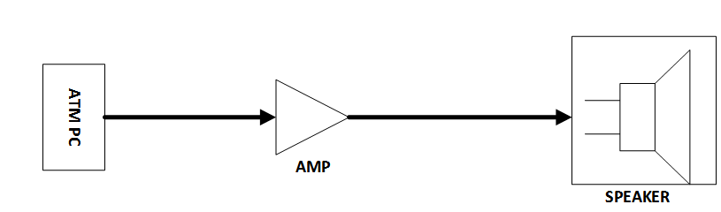
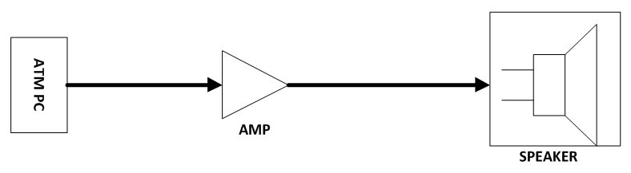
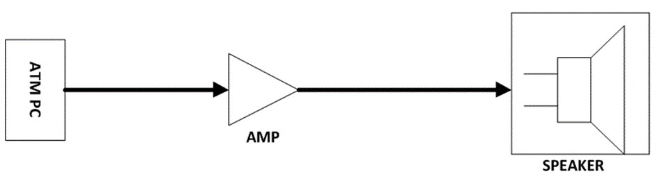

# Document metadata

- **Title:** سیستم صوتی دستگاه های خودپرداز
- **Author:** Arash Tighbor
- **Last Modified By:** Arash Tighbor
- **Created:** 2014-05-28T10:52:00Z
- **Modified:** 2016-02-02T11:20:00Z
- **Document Name:** 2-IT9411-138-00_AudioSystem.docx
- **Source File:** C:\Users\asus\Desktop\test_chunkStudio_revision_08022026\input\2-IT9411-138-00_AudioSystem.docx

---


**Image analysis**

```json
{
 "image_name": "image1.jpg",
 "rId": "rId8",
 "image_path": "img_folder/image_001_image1.jpg",
 "caption": "جلد مستندات سیستم صوتی در دستگاه های خودپرداز آدونیس، نسخه و تاریخ بهمن ۱۳۹۴",
 "ocr_text": "مستندات\nسیستم صوتی\nدر دستگاههای خودپرداز\nشماره نسخه : 2-179411-138-00\nبهمن 1394\nشرکت توسعه خدمات الکترونیکی آدونیس (سهامی خاص)",
 "visual_description": [
 "صفحه جلد سند فارسی با عنوان «سیستم صوتی در دستگاههای خودپرداز»",
 "در پایین صفحه شماره نسخه «2-179411-138-00» و تاریخ «بهمن 1394» درج شده است",
 "لوگوی شرکت و عبارت «شرکت توسعه خدمات الکترونیکی آدونیس (سهامی خاص)» در پایین قرار دارد",
 "طرح خطی دستگاه خودپرداز در گوشه پایین چپ دیده می شود",
 "نوار/حاشیه موج دار تیره در سمت راست صفحه وجود دارد"
 ],
 "image_type": "scan"
}
```

**مستندات**

**سیستم صوتی**

**در دستگاه های خودپرداز**

**شماره نسخه: 2-IT9411-138-00**

**بهمن 1394**


**Image analysis**

```json
{
 "image_name": "image2.png",
 "rId": "rId9",
 "image_path": "img_folder/image_002_image2.png",
 "caption": "لوگوی شرکت توسعه خدمات الکترونیکی ادونیس",
 "ocr_text": "ادونیس\nشرکت توسعه خدمات الکترونیکی",
 "visual_description": [
 "تصویر شامل لوگوتایپ فارسی «ادونیس» و عبارت «شرکت توسعه خدمات الکترونیکی» است.",
 "یک نماد گرافیکی شبیه حرف A خاکستری با دو قوس آبی در سمت راست دیده می شود."
 ],
 "image_type": "diagram"
}
```

این سند با عنوان «مستندات سیستم صوتی در دستگاه های خودپرداز» در واحد پشتیبانی فنی تعمیرات شرکت توسعه خدمات الکترونیکی آدونیس تهیه و تنظیم شده است.

سند جاری در بهمن ماه 1394 در واحد آموزش امور فناوری اطلاعات تجمیع و شماره گذاری گردید؛
شماره نسخه : 2-IT9411-138-00 .

سابقه ویرایش:

<!-- TABLE_START -->
| | | |
| --- | --- | --- |
| **نام** **ویرایشگر** | **تاریخ** | **نام / سمت تاییدکننده** |
| | | |
| | | |
| | | |
| | | |
| | | |
<!-- TABLE_END -->

<!-- TABLE_OF_CONTENTS_START -->
فهرست

[راه اندازی سیستم صوتی در خودپرداز](#_Toc442175808) *[NCR](#_Toc442175808)**[5875](#_Toc442175808)* [1](#_Toc442175808)

[راه اندازی سیستم صوتی در خودپرداز](#_Toc442175815) *[NCR](#_Toc442175815)**[5886](#_Toc442175815)* [3](#_Toc442175815)

[راه اندازی سیستم صوتی در خودپرداز](#_Toc442175823) *[ProCash 2150/2050](#_Toc442175823)* [5](#_Toc442175823)

[راه اندازی سیستم صوتی در خودپرداز](#_Toc442175831) *[1500](#_Toc442175831)* [6](#_Toc442175831)

[راه اندازی سیستم صوتی در خودپرداز](#_Toc442175839) *[285](#_Toc442175839)* [7](#_Toc442175839)
<!-- TABLE_OF_CONTENTS_END -->


**Image analysis**

```json
{
 "image_name": "image5.png",
 "rId": "rId18",
 "image_path": "img_folder/image_003_image5.png",
 "caption": "عبارت «بنام خدا» با خط خوشنویسی",
 "ocr_text": "بنام خدا",
 "visual_description": [
 "متن فارسی سیاه رنگ روی پس زمینه سفید",
 "سبک نوشتار خوشنویسی با حروف کشیده و منحنی"
 ],
 "image_type": "scan"
}
```

# راه اندازی سیستم صوتی در خودپرداز NCR 5875

## اطلاعات عمومی

این ماژول باید دارای درگاه ورود اطلاعات از نرم افزار کنترل خودپرداز، درگاه تامین توان الکتریکی موردنیاز، سیستم مبدل صوتی، راه انداز و کنترل سخت افزاری آن (اسپیکر و آمپلی فایر) باشد.

در ذیل اجزای این ماژول به صورت شماتیک نشان داده شده اند:



**Image analysis**

```json
{
 "image_name": "image6.tmp",
 "rId": "rId19",
 "image_path": "img_folder/image_004_image6.png",
 "caption": "نمودار بلوکی اتصال ATM PC به آمپلی فایر و سپس بلندگو",
 "ocr_text": "ATM PC\nAMP\nSPEAKER",
 "visual_description": [
 "یک بلوک با برچسب ATM PC در سمت چپ قرار دارد",
 "پیکان از ATM PC به یک بلوک مثلثی با برچسب AMP اشاره می کند",
 "پیکان خروجی از AMP به بلوک بلندگو با برچسب SPEAKER در سمت راست وصل است",
 "در بلوک SPEAKER یک نماد بلندگو با خطوط ورودی در سمت چپ نشان داده شده است"
 ],
 "image_type": "diagram"
}
```

## اطلاعات تخصصی

### PC

در نمونه طراحی شده جهت این پروژه اطلاعات ورودی به طبقه تقویت کننده (AMP) از طریق خروجی کارت صدای ATM تهیه می گردد. برای انتقال این داده، از کابل 3 رشته مخصوص انتقال صوت استریو (با حداقل توان موجود) درحالی که به دو سر آن جک استریو نری صدا {1/8" tip –ring-sleeve (TRS) 3.5mm} وصل شده استفاده می گردد.

### AMPLIFIRE

طبقه تقویت کننده تهیه شده علاوه بر ورودی اطلاعات از PC باید دارای اتصال به شبکه توان خودپرداز با ولتاژ 5VDC نیز باشد. این طبقه دارای توان خروجی 3W به صورت استریو و مناسب برای بلندگوهای با مقاومت ورودی 4Ω است.

### SPEAKER

بلندگو با مقاومت ورودی 4Ω و حداقل با توان 3W با اندازه 90mm×50mm تهیه شده است. ارتباط بلندگو و طبقه تقویت کننده از طریق کابل 2 رشته (با حداقل توان موجود) ترجیحاً سیم افشان درحالی که به یک سر آن فیش نری مونو {1/8" tip –ring- (RS) 3.5mm} و سر دیگر 2 عدد فیش تخت 3mm نصب گردیده میسر می گردد.

## جریان انجام فرآیند ساخت و نصب

این مستند با این روش که ماژول مذکور در محل سازمان تولید گردد، تهیه شده است. در محل شعبه براکت بلندگو به همراه باقی اجزای ماژول به روی دستگاه خودپرداز نصب می گردد و ارتباطات الکتریکی موردنیاز وصل می شوند. براکت موجود روی دستگاه بازمی گردد و جهت تجهیز به شرکت عودت می گردد . این روش با این رویکرد که حداقل زمان ممکن در محل شعبه صرف گردد انتخاب شده است.

# راه اندازی سیستم صوتی در خودپرداز NCR 5886

## اطلاعات عمومی

این ماژول باید دارای درگاه ورود اطلاعات از نرم افزار کنترل خودپرداز، درگاه تامین توان الکتریکی موردنیاز، سیستم مبدل صوتی، راه انداز و کنترل سخت افزاری آن (اسپیکر و آمپلی فایر) باشد.

در ذیل اجزای این ماژول به صورت شماتیک نشان داده شده اند:



**Image analysis**

```json
{
 "image_name": "image12.tmp",
 "rId": "rId25",
 "image_path": "img_folder/image_005_image12.png",
 "caption": "نمودار بلوکی اتصال ATM PC به آمپلی فایر و سپس بلندگو",
 "ocr_text": "ATM PC\nAMP\nSPEAKER",
 "visual_description": [
 "یک بلوک با برچسب «ATM PC» در سمت چپ قرار دارد.",
 "یک فلش ضخیم از «ATM PC» به یک نماد تقویت کننده مثلثی می رود.",
 "زیر نماد مثلثی متن «AMP» نوشته شده است.",
 "یک فلش ضخیم از خروجی AMP به سمت راست به بلوک «SPEAKER» می رود.",
 "در بلوک «SPEAKER» نماد بلندگو با سه خط ورودی در سمت چپ آن دیده می شود."
 ],
 "image_type": "diagram"
}
```

## اطلاعات تخصصی

### ATM PC

در نمونه طراحی شده جهت این پروژه اطلاعات ورودی به طبقه تقویت کننده (AMP) از طریق خروجی کارت صدای ATM تهیه می گردد. برای انتقال این داده، از کابل 3 رشته مخصوص انتقال صوت استریو (با حداقل توان موجود) درحالی که به دو سر آن جک استریو نری صدا { 1/8" tip –ring-sleeve (TRS) 3.5mm } وصل شده استفاده می گردد.

### AMPLIFIRE

طبقه تقویت کننده تهیه شده علاوه بر ورودی اطلاعات از PC باید دارای اتصال به شبکه توان خودپرداز با ولتاژ 5VDC باشد. این طبقه دارای توان خروجی 3W به صورت استریو و مناسب برای بلندگوهای با مقاومت ورودی 4Ω می باشد.

### SPEAKER

بلندگو با مقاومت ورودی 4Ω و حداقل با توان 3W با اندازه 4 اینچ تهیه شده است. ارتباط بلندگو و طبقه
تقویت کننده از طریق کابل 2 رشته (با حداقل توان موجود) ترجیحاً سیم افشان درحالی که به یک سر آن فیش نری مونو { 1/8" tip –ring- (RS) 3.5mm } و سر دیگر 2 عدد فیش تخت 3mm نصب گردیده میسر می گردد.

### SPEAKER

بلندگو با مقاومت ورودی 4Ω و حداقل با توان 3W با اندازه 4 اینچ تهیه شده است. ارتباط بلندگو و طبقه تقویت کننده از طریق کابل 2 رشته (با حداقل توان موجود) ترجیحاً سیم افشان درحالی که به یک سر آن فیش نری مونو { 1/8" tip –ring- (RS) 3.5mm } و سر دیگر 2 عدد فیش تخت 3mm نصب گردیده میسر می گردد.

## جریان انجام فرآیند ساخت و نصب

این مستند با این روش که ماژول مذکور در محل سازمان تولید گردد، تهیه شده است. در محل شعبه براکت بلندگو به همراه باقی اجزای ماژول به روی دستگاه خودپرداز نصب می گردد و ارتباطات الکتریکی موردنیاز وصل می شوند. این روش با این رویکرد که حداقل زمان ممکن در محل شعبه صرف گردد انتخاب شده است.

# راه اندازی سیستم صوتی در خودپردازProCash

# 2050و 2150

## اطلاعات عمومی

این ماژول باید دارای درگاه ورود اطلاعات از نرم افزار کنترل خودپرداز، درگاه تامین توان الکتریکی موردنیاز، سیستم مبدل صوتی، راه انداز و کنترل سخت افزاری آن (اسپیکر و آمپلی فایر) باشد.

در ذیل اجزای این ماژول به صورت شماتیک نشان داده شده اند:


**Image analysis**

```json
{
 "image_name": "image13.png",
 "rId": "rId26",
 "image_path": "img_folder/image_006_image13.png",
 "caption": "بلوک دیاگرام اتصال ATM PC به آمپلی فایر و بلندگو",
 "ocr_text": "ATM PC\nAMP\nSPEAKER",
 "visual_description": [
 "نمودار بلوکی با سه بخش: ATM PC، AMP و SPEAKER",
 "یک فلش جهت دار از ATM PC به سمت AMP",
 "یک فلش جهت دار از AMP به سمت SPEAKER",
 "نماد AMP به شکل مثلث تقویت کننده رسم شده است",
 "نماد SPEAKER شامل شکل بلندگو داخل یک کادر است"
 ],
 "image_type": "diagram"
}
```

## اطلاعات تخصصی

### ATM PC

در نمونه طراحی شده جهت این پروژه اطلاعات ورودی به طبقه تقویت کننده (AMP) از طریق خروجی کارت صدای ATM تهیه می گردد. برای انتقال این داده، از کابل 3 رشته مخصوص انتقال صوت استریو (با حداقل توان موجود) درحالی که به دو سر آن جک استریو نری صدا { 1/8" tip –ring-sleeve (TRS) 3.5mm } وصل شده استفاده می گردد.

### AMPLIFIRE

طبقه تقویت کننده تهیه شده علاوه بر ورودی اطلاعات از PC باید دارای اتصال به شبکه توان خودپرداز با ولتاژ 5VDC باشد. این طبقه دارای توان خروجی 3W به صورت استریو و مناسب برای بلندگوهای با مقاومت ورودی 4Ω می باشد.

### SPEAKER

بلندگو با مقاومت ورودی 4Ω و حداقل با توان 3W با اندازه 4 اینچ تهیه شده است. ارتباط بلندگو و طبقه تقویت کننده از طریق کابل 2 رشته (با حداقل توان موجود) ترجیحاً سیم افشان درحالی که به یک سر آن فیش نری مونو { 1/8" tip –ring- (RS) 3.5mm } و سر دیگر 2 عدد فیش تخت 3mm نصب گردیده میسر می گردد.

## جریان انجام فرآیند ساخت و نصب

این مستند با این روش که ماژول مذکور در محل سازمان تولید و روی پلیت بلندگو FASCIA نصب گردد تهیه شده است. در محل شعبه پلیت بلندگو FASCIA خودپرداز بازشده و با پلیت بلندگو FASCIA تجهیز شده تعویض
می گردد و ارتباطات الکتریکی موردنیاز وصل می شوند. این روش با این رویکرد که حداقل زمان ممکن در محل شعبه صرف گردد انتخاب شده است.

# راه اندازی سیستم صوتی در خودپرداز1500

# اطلاعات عمومی

این ماژول باید دارای درگاه ورود اطلاعات از نرم افزار کنترل خودپرداز، درگاه تامین توان الکتریکی موردنیاز، سیستم مبدل صوتی، راه انداز و کنترل سخت افزاری آن (اسپیکر و آمپلی فایر) باشد.

در ذیل اجزای این ماژول به صورت شماتیک نشان داده شده اند:


**Image analysis**

```json
{
 "image_name": "image13.png",
 "rId": "rId26",
 "image_path": "img_folder/image_006_image13.png",
 "caption": "بلوک دیاگرام اتصال ATM PC به آمپلی فایر و بلندگو",
 "ocr_text": "ATM PC\nAMP\nSPEAKER",
 "visual_description": [
 "نمودار بلوکی با سه بخش: ATM PC، AMP و SPEAKER",
 "یک فلش جهت دار از ATM PC به سمت AMP",
 "یک فلش جهت دار از AMP به سمت SPEAKER",
 "نماد AMP به شکل مثلث تقویت کننده رسم شده است",
 "نماد SPEAKER شامل شکل بلندگو داخل یک کادر است"
 ],
 "image_type": "diagram"
}
```

## اطلاعات تخصصی

### ATM PC

در نمونه طراحی شده جهت این پروژه اطلاعات ورودی به طبقه تقویت کننده (AMP) از طریق خروجی کارت صدای ATM تهیه می گردد. برای انتقال این داده از کابل 3 رشته مخصوص انتقال صوت استریو (با حداقل توان موجود) درحالی که دو سر آن جک استریو نری صدا { 1/8" tip –ring-sleeve (TRS) 3.5mm } وصل شده استفاده می گردد.

### AMPLIFIRE

طبقه تقویت کننده تهیه شده علاوه بر ورودی اطلاعات از PC باید دارای اتصال به شبکه توان خودپرداز با ولتاژ 5VDC باشد. این طبقه دارای توان خروجی 3W به صورت استریو و مناسب برای بلندگوهای با مقاومت ورودی 4Ω می باشد.

### SPEAKER

بلندگو با مقاومت ورودی 4Ω و حداقل با توان 3W با اندازه بلندگو 70mm× 40mm تهیه شده است. ارتباط بلندگو و طبقه تقویت کننده از طریق کابل 2 رشته (با حداقل توان موجود) ترجیحاً سیم افشان درحالی که به یک سر آن فیش نری مونو { 1/8" tip –ring- (RS) 3.5mm } و سر دیگر 2 عدد فیش تخت 3mm نصب گردیده میسر می گردد.

## جریان انجام فرآیند ساخت و نصب

این مستند با این روش که ماژول مذکور در محل سازمان تولید گردد، تهیه شده است. در محل شعبه 2 عدد بلندگو روی خودپرداز نصب می گردد و ارتباطات الکتریکی موردنیاز وصل می شوند. این روش با این رویکرد که حداقل زمان ممکن در محل شعبه صرف گردد انتخاب شده است.

# راه اندازی سیستم صوتی در خودپرداز 285

## اطلاعات عمومی

این ماژول باید دارای درگاه ورود اطلاعات از نرم افزار کنترل خودپرداز، درگاه تامین توان الکتریکی موردنیاز، سیستم مبدل صوتی، راه انداز و کنترل سخت افزاری آن (اسپیکر و آمپلی فایر) باشد.

در ذیل اجزای این ماژول به صورت شماتیک نشان داده شده اند:



**Image analysis**

```json
{
 "image_name": "image14.png",
 "rId": "rId27",
 "image_path": "img_folder/image_007_image14.png",
 "caption": "نمودار اتصال ATM PC به آمپلی فایر و سپس بلندگو",
 "ocr_text": "ATM PC\nAMP\nSPEAKER",
 "visual_description": [
 "یک دیاگرام بلوکی با سه بخش: ATM PC، AMP و SPEAKER",
 "پیکان جهت دار از ATM PC به سمت AMP",
 "پیکان جهت دار از AMP به سمت SPEAKER",
 "نماد مثلثی برای AMP و نماد بلندگو در بلوک SPEAKER نمایش داده شده است"
 ],
 "image_type": "diagram"
}
```

## اطلاعات تخصصی

### ATM PC

در نمونه طراحی شده جهت این پروژه اطلاعات ورودی به طبقه تقویت کننده (AMP) از طریق خروجی کارت صدای ATM تهیه می گردد. برای انتقال این داده از کابل 3 رشته مخصوص انتقال صوت استریو (با حداقل توان موجود) درحالی که به دو سر آن جک استریو نری صدا { 1/8" tip –ring-sleeve (TRS) 3.5mm } وصل شده استفاده می گردد.

### AMPLIFIRE

طبقه تقویت کننده تهیه شده علاوه بر ورودی اطلاعات از PC باید دارای اتصال به شبکه توان خودپرداز با ولتاژ 5VDC باشد . این طبقه دارای توان خروجی 3W به صورت استریو و مناسب برای بلندگوهای با مقاومت ورودی 4Ω می باشد .

### SPEAKER

بلندگو با مقاومت ورودی 4Ω و حداقل با توان 3W با اندازه 2 اینچ تهیه شده است . ارتباط بلندها گو و طبقه تقویت کننده از طریق کابل 2 رشته ( با حداقل توان موجود ) ترجیحاً سیم افشان درحالی که به یک سر آن فیش نری مونو { 1/8" tip –ring- (RS) 3.5mm } و سر دیگر 2 عدد فیش تخت 3mm نصب گردیده میسر می گردد .

## جریان انجام فرآیند ساخت و نصب

این مستند با این روش که ماژول مذکور در محل سازمان تولید گردد تهیه شده است. در محل براکت های نصب به همراه 2 عدد بلندگو روی دستگاه خودپرداز نصب و ارتباطات الکتریکی موردنیاز وصل می شوند. این روش با این رویکرد که حداقل زمان ممکن در محل شعبه صرف گردد انتخاب شده است.