# Document metadata

- **Author:** Arash Tighbor
- **Last Modified By:** Arash Tighbor
- **Created:** 2023-05-29T11:30:00Z
- **Modified:** 2025-09-23T06:05:00Z
- **Document Name:** 1-IT0403-506-01_RefahSoft_EastcomWin10.docx
- **Source File:** C:\Users\aa.eskandari\Desktop\problematic_input\1-IT0403-506-01_RefahSoft_EastcomWin10.docx

---

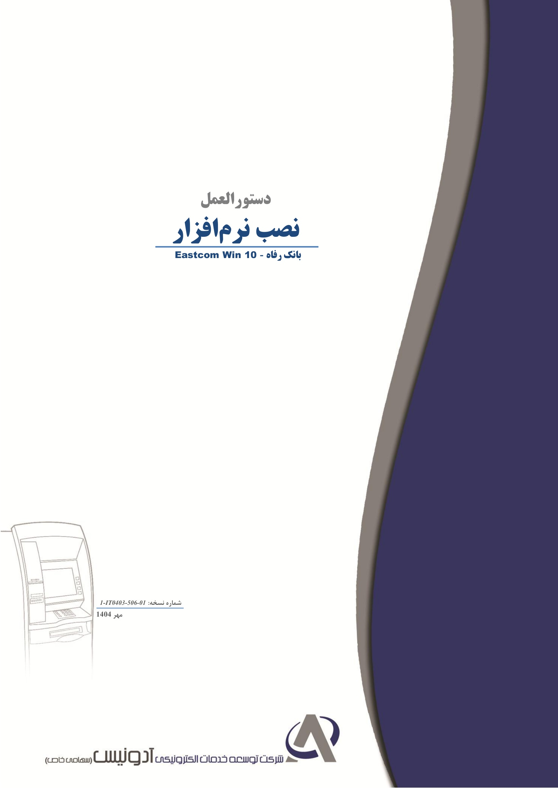

**Image analysis**

```json
{
 "image_name": "image1.jpg",
 "rId": "rId8",
 "image_path": "img_folder/image_001_image1.jpg",
 "caption": "جلد دستورالعمل نصب نرم افزار Eastcom Win 10 برای بانک رفاه",
 "ocr_text": "دستورالعمل\nنصب نرم افزار\nEastcom Win 10 - بانک رفاه\nشماره نسخه: 01-5.506.01 -1-ITD403\nمهر 1404\nشرکت توسعه خدمات الکترونیکی آدونیس (سهامی خاص)",
 "visual_description": [
 "صفحه عنوان فارسی با تیتر «دستورالعمل نصب نرم افزار»",
 "ذکر نام محصول «Eastcom Win 10» و عبارت «بانک رفاه»",
 "نمایش شماره نسخه «01-5.506.01 -1-ITD403» و تاریخ «مهر 1404»",
 "لوگوی شرکت و نام «شرکت توسعه خدمات الکترونیکی آدونیس (سهامی خاص)» در پایین",
 "طرح خطی یک دستگاه خودپرداز در گوشه پایین چپ"
 ],
 "image_type": "scan"
}
```

**دستورالعمل**

**نصب نرم افزار**

**بانک رفاه - Eastcom Win 10**

**شماره نسخه: 1-IT0403-506-01**

**مهر 1404**


**Image analysis**

```json
{
 "image_name": "image2.png",
 "rId": "rId9",
 "image_path": "img_folder/image_002_image2.png",
 "caption": "لوگوی آدونیس و عبارت شرکت توسعه خدمات الکترونیکی",
 "ocr_text": "آدونیس شرکت توسعه خدمات الکترونیکی",
 "visual_description": [
 "لوگوی گرافیکی شامل حرف A خاکستری با دو قوس آبی پیرامون آن",
 "متن فارسی در سمت چپ لوگو با دو رنگ خاکستری و آبی"
 ],
 "image_type": "diagram"
}
```

این سند با عنوان «دستورالعمل نصب نرم افزار/ بانک رفاه / EastCom Win 10» در خرداد ماه 1404 در واحد پشتیبانی عملیات شرکت توسعه خدمات الکترونیکی آدونیس توسط آقای رضا اشرفی تهیه و تنظیم شده است.

این دستورالعمل در واحد آموزش، توسط آرش تیغ بر ویرایش و آماده ی انتشار گردید.

سابقه ویرایش :

<!-- TABLE_START -->
| | | | |
| --- | --- | --- | --- |
| **نام** **ویرایشگر** | **تاریخ** | **نام / سمت تاییدکننده** | **شماره نسخه قبلی**\* |
| آرش تیغ بر | مهر 1404 | رضا اشرفی-محمدرضا آزاده/واحد پشتیبانی عملیات | 1-IT0403-506-00 |
| | | |
| | | |
<!-- TABLE_END -->

\* با انتشار نسخه ی جدید، نسخه ی قبلی سند مذکور فاقد اعتبار خواهد شد.

<!-- TABLE_OF_CONTENTS_START -->
**فهرست**

[اقلام موردنیاز 1](#_Toc207707385)

[بررسی سخت افزار موردنیاز 1](#_Toc207707386)

[جمع آوری اطلاعات موردنیاز قبل از نصب نرم افزار 2](#_Toc207707387)

[نصب پکیج با استفاده از نرم افزار آکرونیس 3](#_Toc207707388)

[تنظیمات نرم افزاری در راه اندازی اولیه 12](#_Toc207707389)

[اطلاعات حساب کاربری در ویندوز 19](#_Toc207707390)

[تنظیم مانیتور در دستگاه285DY و 285DZ 19](#_Toc207707391)

[راه اندازی صفحه کلید (EPP) 21](#_Toc207707392)

[نصب درایور EPP SUNSON 21](#_Toc207707393)

[تنظیم Computer Name 22](#_Toc207707394)

[بررسی تاریخ و ساعت 23](#_Toc207707395)

[ساخت درایو D 23](#_Toc207707396)

[نصب SP دوربین 26](#_Toc207707397)

[اجرای فایل های KMS 26](#_Toc207707398)

[تنظیمات NDCSecure 27](#_Toc207707399)

[بررسی و اعمال تنظیمات ارزش گذاری کاست 28](#_Toc207707400)

[نصب آنتی ویروس Kaspersky 28](#_Toc207707401)

[الف) مراحل انجام عملیات نصب 28](#_Toc207707402)

[ب) اطمینان از برقراری ارتباط پایانه بانکی با سرور 30](#_Toc207707403)

[کپی کردن Screen ها 31](#_Toc207707404)

[تنظیم پارامترهای شبکه بانکی 32](#_Toc207707405)

[تنظیمات دیسپنسر 34](#_Toc207707406)

[پیوست 1 : چک لیست نصب نرم افزار 42](#_Toc207707407)

[واحد مانیتورینگ بانک رفاه 43](#_Toc207707408)
<!-- TABLE_OF_CONTENTS_END -->


**Image analysis**

```json
{
 "image_name": "image4.png",
 "rId": "rId17",
 "image_path": "img_folder/image_003_image4.png",
 "caption": "متن فارسی خوشنویسی شده «بنام خدا» روی زمینه سفید",
 "ocr_text": "بنام خدا",
 "visual_description": [
 "عبارت فارسی «بنام خدا» با خط خوشنویسی مشکی روی پس زمینه سفید نمایش داده شده است."
 ],
 "image_type": "scan"
}
```

به منظور تسهیل فرایند نصب نرم افزار پیشنهاد می شود عملیات مذکور را با ترتیبی که در چک لیست موجود در پیوست 1 – واقع در انتهای سند – آمده است، انجام دهید.

مراحلی که در زیر گفته می شوند کلی هستند و بسته به شرایط، ممکن است برخی از آنها لازم الاجرا نباشند.

قبل از شروع به نصب نرم افزار در دستگاه های خودپرداز این بانک، مطلع بودن از برخی اطلاعات ضروری می باشد.

این اطلاعات در حین نصب نرم افزار مورداستفاده قرار می گیرد و توسط بخش پشتیبانی فنی شرکت و یا انفورماتیک بانک در اختیار کارشناس نصب گذاشته می شود. همچنین برخی پارامترهای دستگاه خودپرداز باید قبل از شروع به نصب نرم افزار توسط خود کارشناس بررسی و مشخص گردد.

# اقلام موردنیاز

جهت انجام عملیات نصب نرم افزار، اقلام زیر موردنیاز خواهند بود:

* کیبورد
* موس
* فلش یا هارد حاوی پکیج و نرم افزارهای موردنیاز

# بررسی سخت افزار موردنیاز

با توجه به اینکه نصب ویندوز ۱۰ روی خودپردازهای ایستکام نیازمند سخت افزار مناسبی می باشد، ازاین رو لازم است قبل از شروع کار موارد زیر را بررسی و پس از حصول اطمینان از فراهم بودن شرایط، اقدامات بعدی را انجام دهید:

1. وجود هارد 250G یا با ظرفیت بیشتر
2. وجود یک عدد RAM 4G روی دستگاه

# جمع آوری اطلاعات موردنیاز قبل از نصب نرم افزار

اقدامات زیر را انجام دهید:

* گرفتن پرینت از موجودی دستگاه
* اطلاعات مربوط به پارامترهای شبکه بانکی شامل شماره ترمینال و IP

اطلاعات IP را با مراجعه به Control Panel و قسمت Network & Sharing Center استخراج نمایید.

* **شماره پورت:** شماره پورت اعلام شده توسط بانک رفاه برای دستگاه های خودپرداز ایستکام، 9600 می باشد.

فایل PooyaForwardServer.properties که در فولدر NDCSecure در درایوC قرار دارد را با استفاده از نرم افزارNoepad باز کنید و همانند شکل زیر اطلاعات Port و سریال NDCSecure دستگاه را از آن استخراج نمایید؛ پس از نصب نرم افزار، در صورت استفاده از پورتی به غیراز پورت اعلام شده، اطلاعاتPort برداشته شده را اعمال نمایید:

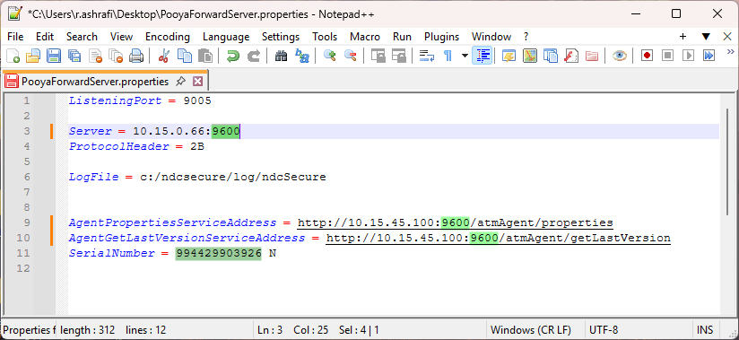

**Image analysis**

```json
{
 "image_name": "image5.png",
 "rId": "rId18",
 "image_path": "img_folder/image_004_image5.png",
 "caption": "نمایش فایل تنظیمات PooyaForwardServer با پورت ها، آدرس سرور و مسیر لاگ",
 "ocr_text": "ListenerPort = 9005\n\nServer = 10.15.0.66:9600\nProtocolHeader = 2B\n\nLogFile = c:/ndcsecure/log/ndcSecure\n\nAgentPropertiesServiceAddress = http://10.15.45.100:9600/atmAgent/properties\nAgentGetLastVersionServiceAddress = http://10.15.45.100:9600/atmAgent/getLastVersion\nSerialNumber = 994429903926 N",
 "visual_description": [
 "اسکرین شات Notepad++ از فایل PooyaForwardServer.properties با 12 خط",
 "پارامتر ListenerPort برابر 9005 تنظیم شده است",
 "پارامتر Server برابر 10.15.0.66:9600 است",
 "ProtocolHeader مقدار 2B دارد",
 "مسیر LogFile برابر c:/ndcsecure/log/ndcSecure است",
 "دو URL سرویس Agent با آدرس 10.15.45.100:9600 مشخص شده اند",
 "SerialNumber مقدار 994429903926 N دارد"
 ],
 "image_type": "screenshot"
}
```

* ذخیره تصاویر: قبل از شروع عملیات از فایل های تصویر کپی بگیرید و پس از پایان عملیات، فایل های مذکور را به آدرس اولیه برگردانید.

نکته خیلی مهم: درصورتی که امکان بازیابی تصاویر در شعبه مقدور نیست، لازم است پس از عودت هارد به شرکت، آن را جهت بازیابی فایل تصاویر به واحد تعمیرات ارسال کنید. پس از انجام پیگیری های لازم در خصوص بازیابی فایل ها، فایل های حاصله را در درایو D دستگاه مستقر در شعبه کپی نمایید.

* ذخیره سازی لاگ فایل دستگاه: برای این منظور پوشه ژورنال را از روت درایو C در فلش مموری کپی کنید.

پس از اتمام مراحل نصب نرم افزار، مجدداً باید فایلی که در این مرحله در فلش کپی کرده اید را در همان آدرس، روی هارد دستگاه کپی نمایید.

# نصب پکیج با استفاده از نرم افزار آکرونیس

به منظور نصب پکیج با استفاده از نرم افزار Acronis 2017 مراحل زیر را به ترتیب انجام دهید:

1. فلش یا هارد اکسترنال حاوی Acronis 2017 را به دستگاه متصل نمایید.
2. دستگاه را ریستارت کنید و سپس بلافاصله با فشار دکمه Delete یا F2 روی کیبورد (با توجه به نوع PC) به صفحه حاوی تنظیمات BIOS بروید.
3. تنظیمات Boot را به نوعی تغییر دهید تا فلش یا هارد اکسترنال در اولویت باشند.
4. پس از Restart شدن PC و انتخاب Acronis 2017 در صفحه ای که نمایش داده می شود، گزینه ی Acronis True Image را انتخاب نمایید.

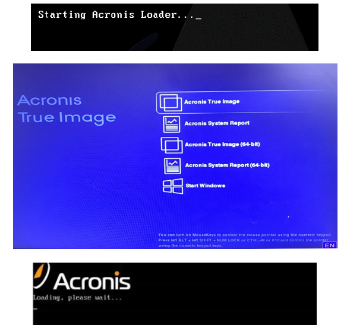

**Image analysis**

```json
{
 "image_name": "image6.tmp",
 "rId": "rId19",
 "image_path": "img_folder/image_005_image6.png",
 "caption": "منوی بوت Acronis True Image با گزینه های اجرای برنامه، گزارش سیستم و شروع ویندوز",
 "ocr_text": "Starting Acronis Loader..._\nAcronis\nTrue Image\nAcronis True Image\nAcronis System Report\nAcronis True Image (64-bit)\nAcronis System Report (64-bit)\nStart Windows\nYou can turn on MouseKeys to control the mouse pointer using the numeric keypad.\nPress ALT + left SHIFT + NUM LOCK or CTRL+ALT+M for F10 and control the pointer\nusing the numeric keypad.\nEN\nAcronis\nLoading, please wait...",
 "visual_description": [
 "صفحه منوی بوت Acronis True Image با پنج گزینه قابل انتخاب نمایش داده شده است",
 "گزینه ها شامل Acronis True Image، Acronis System Report، نسخه های 64-bit و Start Windows هستند",
 "بالای تصویر پیام «Starting Acronis Loader...» و پایین پیام «Loading, please wait...» دیده می شود",
 "راهنمای فعال سازی MouseKeys و زبان «EN» در پایین صفحه موجود است"
 ],
 "image_type": "screenshot"
}
```

در صورت تعویض هارد دستگاه (تعویض کلی PC) قبل از نصب نرم افزار حتماً باید با انجام مراحل زیر هارد جدید را فرمت کنید:

در قسمت مربوط به Tools & Utilities بر روی Add New Disk کلیک کنید:

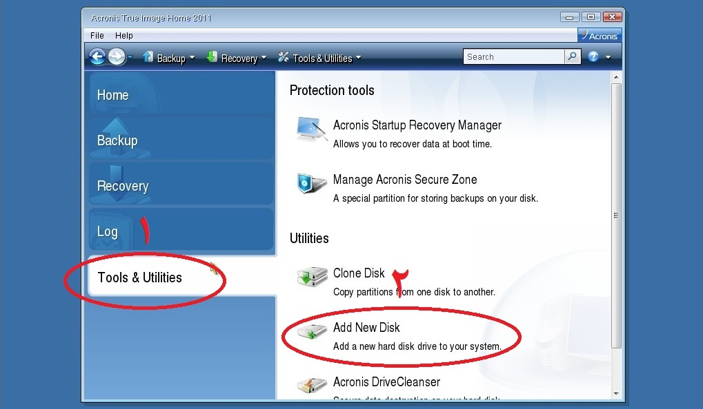

**Image analysis**

```json
{
 "image_name": "image7.jpeg",
 "rId": "rId20",
 "image_path": "img_folder/image_006_image7.jpg",
 "caption": "اسکرین شات برنامه Acronis با گزینه های Tools & Utilities و Add New Disk مشخص شده.",
 "ocr_text": "Acronis True Image Home 2011\nFile Help\nBackup\nRecovery\nTools & Utilities\nSearch\nHome\nBackup\nRecovery\nLog\nTools & Utilities\nProtection tools\nAcronis Startup Recovery Manager\nAllows you to recover data at boot time.\nManage Acronis Secure Zone\nA special partition for storing backups on your disk.\nUtilities\nClone Disk\nCopy partitions from one disk to another.\nAdd New Disk\nAdd a new hard disk drive to your system.\nAcronis DriveCleanser",
 "visual_description": [
 "پنجره نرم افزار Acronis True Image Home 2011 نمایش داده شده است.",
 "منوی بالایی شامل گزینه های Backup، Recovery و Tools & Utilities و کادر Search است.",
 "در نوار کناری گزینه های Home، Backup، Recovery، Log و Tools & Utilities دیده می شود.",
 "در بخش Protection tools گزینه های Acronis Startup Recovery Manager و Manage Acronis Secure Zone فهرست شده اند.",
 "در بخش Utilities گزینه های Clone Disk، Add New Disk و Acronis DriveCleanser نمایش داده شده اند.",
 "دو بیضی قرمز دور «Tools & Utilities» و «Add New Disk» کشیده شده است.",
 "یک فلش قرمز به گزینه Clone Disk اشاره می کند."
 ],
 "image_type": "screenshot"
}
```

در مرحله ی زیر گزینه Initalize disk in MBR layout را انتخاب و روی دکمه ی Next کلیک کنید:

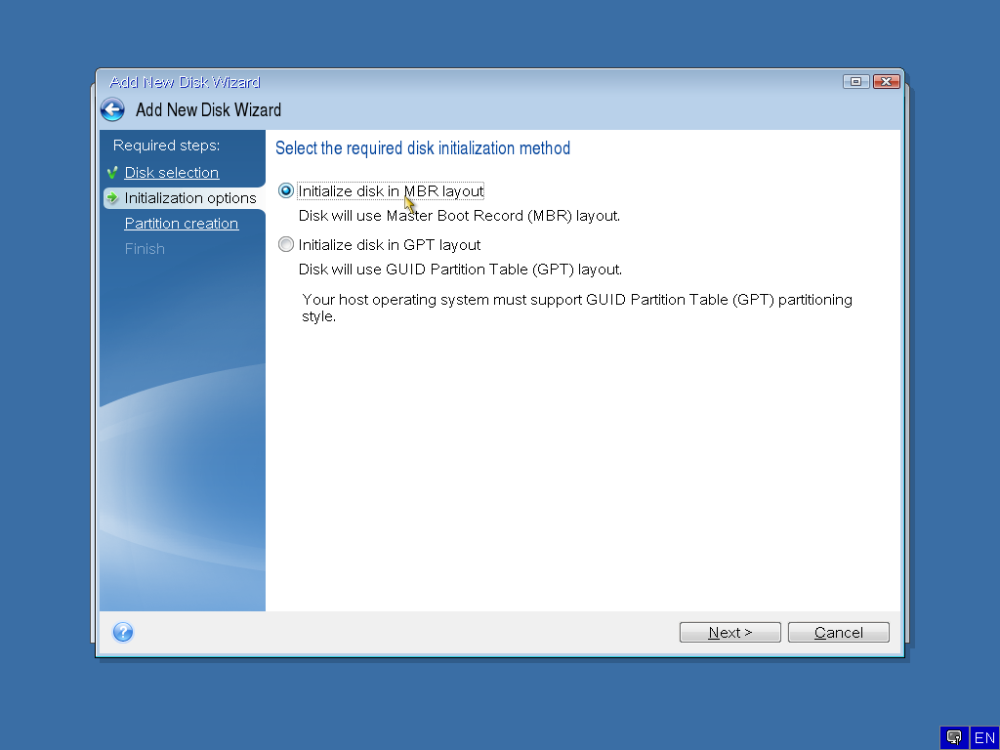

**Image analysis**

```json
{
 "image_name": "image8.png",
 "rId": "rId21",
 "image_path": "img_folder/image_007_image8.png",
 "caption": "پنجره Add New Disk Wizard برای انتخاب روش مقداردهی دیسک بین MBR و GPT",
 "ocr_text": "Add New Disk Wizard\nAdd New Disk Wizard\nRequired steps:\nDisk selection\nInitialization options\nPartition creation\nFinish\nSelect the required disk initialization method\nInitialize disk in MBR layout\nDisk will use Master Boot Record (MBR) layout.\nInitialize disk in GPT layout\nDisk will use GUID Partition Table (GPT) layout.\nYour host operating system must support GUID Partition Table (GPT) partitioning style.\nNext >\nCancel\nEN",
 "visual_description": [
 "اسکرین شات یک ویزارد با عنوان Add New Disk Wizard",
 "منوی مراحل در ستون چپ: Disk selection، Initialization options، Partition creation، Finish",
 "بخش اصلی گزینه های رادیویی مقداردهی دیسک: Initialize disk in MBR layout و Initialize disk in GPT layout",
 "توضیح متنی درباره استفاده از Master Boot Record (MBR) و GUID Partition Table (GPT)",
 "دکمه های پایین پنجره: Next > و Cancel",
 "آیکون زبان/ورودی با متن EN در گوشه پایین راست"
 ],
 "image_type": "screenshot"
}
```

در پنجره زیر، روی هارد دستگاه کلیک و سپس دکمه ی Next کلیک نمایید:

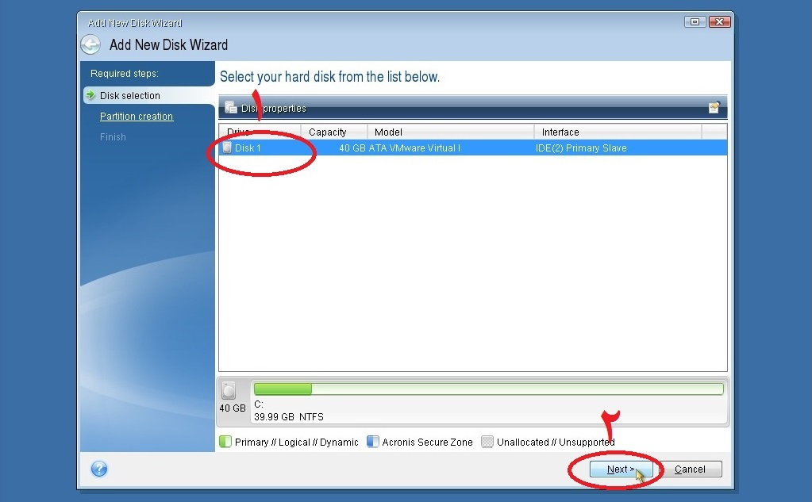

**Image analysis**

```json
{
 "image_name": "image9.jpeg",
 "rId": "rId22",
 "image_path": "img_folder/image_008_image9.jpg",
 "caption": "صفحه انتخاب دیسک در Add New Disk Wizard با دیسک 1 و دکمه Next مشخص شده",
 "ocr_text": "Add New Disk Wizard\nRequired steps\nDisk selection\nPartition creation\nFinish\nSelect your hard disk from the list below.\nDisk properties\nDrive\nCapacity\nModel\nInterface\nDisk 1\n40 GB\nATA VMware Virtual I\nIDE(2) Primary Slave\n40 GB\nC:\n39.99 GB NTFS\nPrimary // Logical // Dynamic\nAcronis Secure Zone\nUnallocated // Unsupported\nNext >\nCancel",
 "visual_description": [
 "اسکرین شات ویزارد Add New Disk Wizard با مراحل Disk selection، Partition creation و Finish در ستون چپ",
 "جدول Disk properties شامل ستون های Drive، Capacity، Model و Interface",
 "ردیف انتخاب شده: Disk 1 با ظرفیت 40 GB، مدل ATA VMware Virtual I و رابط IDE(2) Primary Slave",
 "نمای پایین شامل درایو C: با 39.99 GB NTFS و نوار ظرفیت 40 GB",
 "دکمه های Next > و Cancel در پایین راست",
 "دایره های قرمز روی Disk 1 و دکمه Next > و یک فلش قرمز به سمت ناحیه انتخاب دیسک"
 ],
 "image_type": "screenshot"
}
```
 بقیه در صفحه بعد

با انجام این کار پیغامی همانند شکل زیر روی صفحه ظاهر می گردد. روی OK کلیک کنید تا به مرحله بعد بروید؛ توجه داشته باشید پس از انجام این کار هارد دستگاه فرمت خواهد شد:

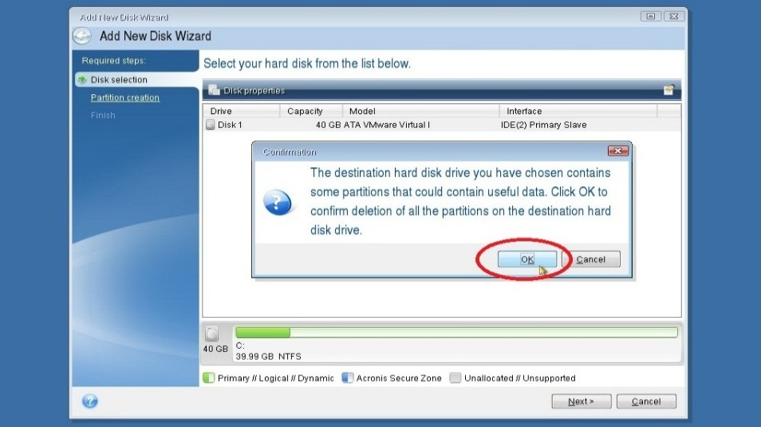

**Image analysis**

```json
{
 "image_name": "image10.jpeg",
 "rId": "rId23",
 "image_path": "img_folder/image_009_image10.jpg",
 "caption": "پنجره Add New Disk Wizard با پیام تایید حذف پارتیشن ها و دکمه OK مشخص شده",
 "ocr_text": "Add New Disk Wizard\nRequired steps:\nDisk selection\nPartition creation\nFinish\nSelect your hard disk from the list below.\nDisk properties\nDrive\nCapacity\nModel\nInterface\nDisk 1\n40 GB ATA VMware Virtual I\nIDE(2) Primary Slave\nConfirmation\nThe destination hard disk drive you have chosen contains\nsome partitions that could contain useful data. Click OK to\nconfirm deletion of all the partitions on the destination hard\ndisk drive.\nOK\nCancel\n40 GB\nC:\n39.99 GB NTFS\nPrimary // Logical // Dynamic\nAcronis Secure Zone\nUnallocated // Unsupported\nNext >\nCancel",
 "visual_description": [
 "پنجره نرم افزاری «Add New Disk Wizard» با مراحل Disk selection، Partition creation و Finish نمایش داده شده است.",
 "جدول Disk properties شامل Disk 1 با ظرفیت 40 GB، مدل «ATA VMware Virtual I» و رابط «IDE(2) Primary Slave» است.",
 "پنجره Confirmation هشدار می دهد که دیسک مقصد دارای پارتیشن است و با OK حذف همه پارتیشن ها تایید می شود.",
 "دکمه OK با دایره قرمز مشخص شده و دکمه Cancel در کنار آن وجود دارد.",
 "در پایین، پارتیشن C: با اندازه 39.99 GB و فایل سیستم NTFS نمایش داده شده است.",
 "راهنمای رنگ/برچسب ها شامل Primary // Logical // Dynamic، Acronis Secure Zone و Unallocated // Unsupported است.",
 "دکمه های «Next >» و «Cancel» در پایین پنجره دیده می شوند."
 ],
 "image_type": "screenshot"
}
```

در پنجره ی زیر، روی دکمه ی Next کلیک کنید:

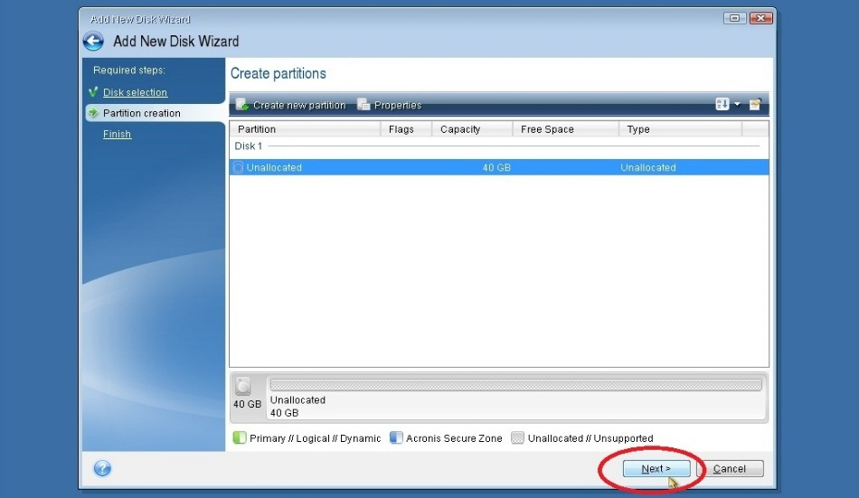

**Image analysis**

```json
{
 "image_name": "image11.jpeg",
 "rId": "rId24",
 "image_path": "img_folder/image_010_image11.jpg",
 "caption": "پنجره Add New Disk Wizard برای ایجاد پارتیشن و نمایش فضای Unallocated دیسک ۱",
 "ocr_text": "Add New Disk Wizard\nAdd New Disk Wizard\nRequired steps:\nDisk selection\nPartition creation\nFinish\nCreate partitions\nCreate new partition\nProperties\nPartition\nFlags\nCapacity\nFree Space\nType\nDisk 1\nUnallocated\n40 GB\nUnallocated\n40 GB\nUnallocated\n40 GB\nPrimary // Logical // Dynamic\nAcronis Secure Zone\nUnallocated // Unsupported\nNext >\nCancel",
 "visual_description": [
 "اسکرین شات از ویزارد «Add New Disk Wizard» در مرحله «Create partitions»",
 "در بخش Required steps گزینه های Disk selection و Partition creation و Finish دیده می شوند",
 "جدول پارتیشن ها ستون های Partition، Flags، Capacity، Free Space، Type را نشان می دهد",
 "برای Disk 1 یک ردیف Unallocated با ظرفیت 40 GB نمایش داده شده است",
 "دکمه «Next >» در پایین سمت راست با دایره قرمز مشخص شده است",
 "راهنمای رنگی پایین شامل Primary // Logical // Dynamic، Acronis Secure Zone و Unallocated // Unsupported است"
 ],
 "image_type": "screenshot"
}
```

درنهایت روی دکمه ی Proceed کلیک نمایید:

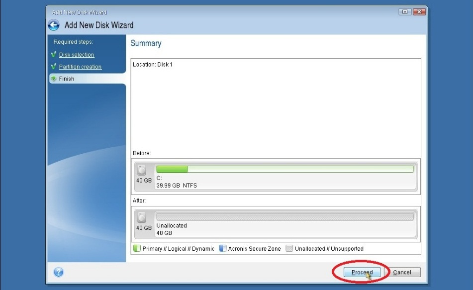

**Image analysis**

```json
{
 "image_name": "image12.jpeg",
 "rId": "rId25",
 "image_path": "img_folder/image_011_image12.jpg",
 "caption": "پنجره Add New Disk Wizard با خلاصه دیسک و دکمه Proceed مشخص شده",
 "ocr_text": "Add New Disk Wizard\nRequired steps:\nDisk selection\nPartition creation\nFinish\nSummary\nLocation: Disk 1\nBefore:\n40 GB\nC:\n39.99 GB NTFS\nAfter:\n40 GB\nUnallocated\n40 GB\nPrimary // Logical // Dynamic\nAcronis Secure Zone\nUnallocated // Unsupported\nProceed\nCancel",
 "visual_description": [
 "اسکرین شات از پنجره Add New Disk Wizard با مراحل سمت چپ: Disk selection، Partition creation، Finish",
 "بخش Summary شامل Location: Disk 1",
 "نمایش وضعیت Before: پارتیشن C: با 39.99 GB و فایل سیستم NTFS روی دیسک 40 GB",
 "نمایش وضعیت After: کل دیسک 40 GB به صورت Unallocated",
 "راهنمای رنگ/نماد برای Primary/Logical/Dynamic، Acronis Secure Zone، Unallocated/Unsupported",
 "دکمه Proceed با یک بیضی قرمز در پایین سمت راست مشخص شده و کنار آن Cancel"
 ],
 "image_type": "screenshot"
}
```

با انجام این عملیات تمام اطلاعات پاک می شود.

5. در پنجره ی برنامه Acronis 2017، از منوی Recovery گزینه ی Disk & Partition Recovery را انتخاب کنید:

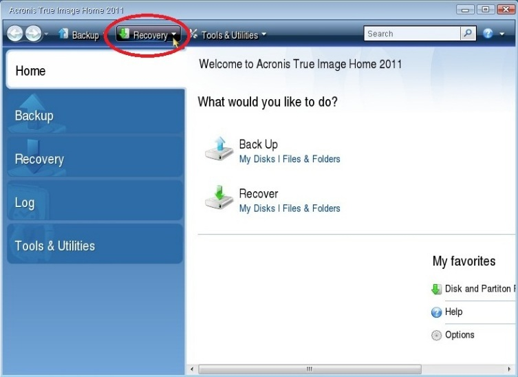

**Image analysis**

```json
{
 "image_name": "image13.jpeg",
 "rId": "rId26",
 "image_path": "img_folder/image_012_image13.jpg",
 "caption": "نمای اصلی Acronis True Image Home 2011 با تب Recovery مشخص شده",
 "ocr_text": "Acronis True Image Home 2011\nBackup\nRecovery\nTools & Utilities\nSearch\nHome\nBackup\nRecovery\nLog\nTools & Utilities\nWelcome to Acronis True Image Home 2011\nWhat would you like to do?\nBack Up\nMy Disks | Files & Folders\nRecover\nMy Disks | Files & Folders\nMy favorites\nHelp\nOptions",
 "visual_description": [
 "اسکرین شات نرم افزار Acronis True Image Home 2011 با نوار بالایی شامل Backup، Recovery و Tools & Utilities",
 "دکمه/تب Recovery با یک بیضی قرمز مشخص شده است",
 "ستون کناری شامل Home، Backup، Recovery، Log و Tools & Utilities است",
 "بخش مرکزی گزینه های Back Up و Recover با زیرنویس My Disks | Files & Folders را نشان می دهد",
 "سمت راست بخش My favorites شامل Help و Options دیده می شود",
 "کادر Search در بالا سمت راست موجود است"
 ],
 "image_type": "screenshot"
}
```

6. در پنجره ای که گشوده می شود، روی دکمه ی Browse کلید کنید تا امکان انتخاب Image موردنظر از روی فلش یا هارد اکسترنال فراهم آید:

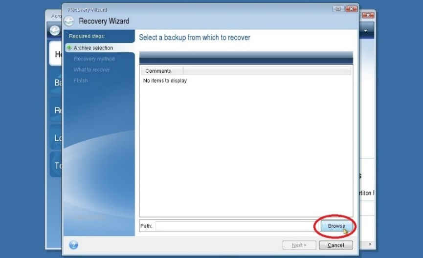

**Image analysis**

```json
{
 "image_name": "image14.jpeg",
 "rId": "rId27",
 "image_path": "img_folder/image_013_image14.jpg",
 "caption": "پنجره Recovery Wizard برای انتخاب آرشیو بکاپ و دکمه Browse مشخص شده است.",
 "ocr_text": "Recovery Wizard\nRequired steps:\nArchive selection\nRecovery method\nWhat to recover\nFinish\nSelect a backup from which to recover\nComments\nNo items to display\nPath:\nBrowse\nNext >\nCancel",
 "visual_description": [
 "اسکرین شات یک پنجره نرم افزاری با عنوان Recovery Wizard",
 "نوار کناری شامل مراحل: Archive selection، Recovery method، What to recover، Finish",
 "عنوان بخش اصلی: Select a backup from which to recover",
 "جدول/لیست با ستون Comments و پیام No items to display",
 "فیلد Path در پایین و دکمه Browse در سمت راست (دایره قرمز دور آن)",
 "دکمه های Next > و Cancel در پایین پنجره"
 ],
 "image_type": "screenshot"
}
```

7. پس از انتخاب Image موردنظر، روی دکمه ی Next کلیک کنید:

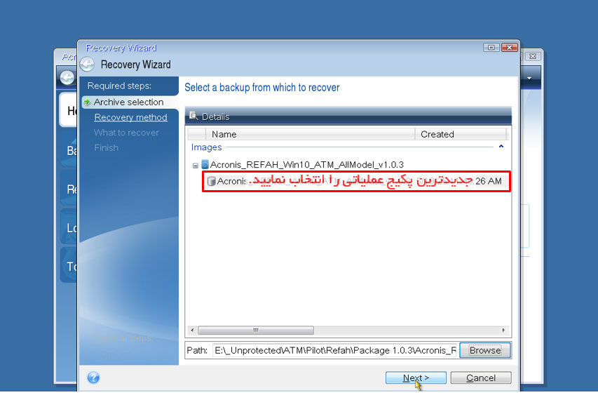

**Image analysis**

```json
{
 "image_name": "image15.jpg",
 "rId": "rId28",
 "image_path": "img_folder/image_014_image15.jpg",
 "caption": "پنجره Recovery Wizard برای انتخاب فایل بکاپ Acronis و مسیر آرشیو",
 "ocr_text": "Recovery Wizard\nRequired steps:\nArchive selection\nRecovery method\nWhat to recover\nFinish\nSelect a backup from which to recover\nDetails\nName\nCreated\nImages\nAcronis_REFAH_Win10_ATM_AllModel_v1.0.3\nAcronis : مجدداً کنترل پکیج عملیاتی را انتخاب نمایید.\nPath: E:\\_Unprotected\\ATM\\Pilot\\Refah\\Package 1.0.3\\Acronis_F\nBrowse\nNext >\nCancel",
 "visual_description": [
 "اسکرین شات از پنجره Acronis Recovery Wizard با مرحله Archive selection فعال",
 "لیست Details شامل ستون های Name و Created و یک گروه Images نمایش داده شده است",
 "یک آیتم با نام Acronis_REFAH_Win10_ATM_AllModel_v1.0.3 در لیست وجود دارد",
 "یک آیتم با متن فارسی در لیست با کادر قرمز هایلایت شده است",
 "کادر Path مسیر E:\\_Unprotected\\ATM\\Pilot\\Refah\\Package 1.0.3\\Acronis_F را نشان می دهد",
 "دکمه های Browse، Next > و Cancel در پایین پنجره دیده می شوند"
 ],
 "image_type": "screenshot"
}
```

8. در پنجره ی زیر، روی دکمه ی Next کلیک کنید:

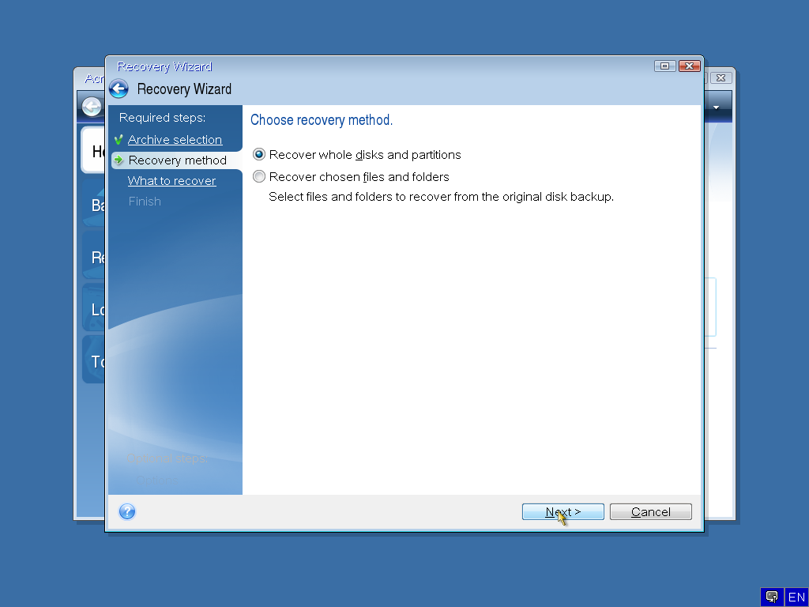

**Image analysis**

```json
{
 "image_name": "image16.png",
 "rId": "rId29",
 "image_path": "img_folder/image_015_image16.png",
 "caption": "پنجره Recovery Wizard برای انتخاب روش بازیابی دیسک یا فایل ها",
 "ocr_text": "Recovery Wizard\nRecovery Wizard\nRequired steps:\nArchive selection\nRecovery method\nWhat to recover\nFinish\nChoose recovery method.\nRecover whole disks and partitions\nRecover chosen files and folders\nSelect files and folders to recover from the original disk backup.\nNext >\nCancel",
 "visual_description": [
 "اسکرین شات یک ویزارد با عنوان Recovery Wizard و نوار مراحل سمت چپ",
 "مرحله فعال «What to recover» و نمایش گزینه های رادیویی برای انتخاب روش بازیابی",
 "دو گزینه: بازیابی کل دیسک ها و پارتیشن ها یا بازیابی فایل ها و پوشه های انتخابی",
 "دکمه های «Next >» و «Cancel» در پایین پنجره"
 ],
 "image_type": "screenshot"
}
```

9. در صورت نصب اولیه نرم افزار، رویDisk 1 کلیک کنید تا علامت 🗸 در کنار آن به نمایش درآید؛ با انجام این کار سه گزینه ای که در زیر آن قرار دارند نیز فعال خواهد شد (علامت 🗸 همانند شکل، در کنارشان به نمایش گذاشته خواهد شد). سپس روی دکمه ی Next کلیک نمایید:

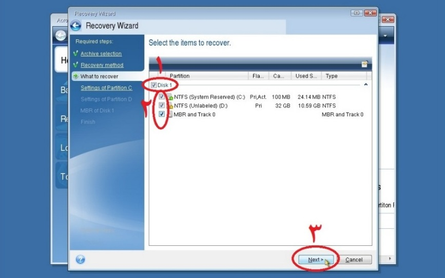

**Image analysis**

```json
{
 "image_name": "image17.jpeg",
 "rId": "rId30",
 "image_path": "img_folder/image_016_image17.jpg",
 "caption": "نمای پنجره Recovery Wizard برای انتخاب پارتیشن های بازیابی و دکمه Next",
 "ocr_text": "Recovery Wizard\nRequired steps:\nArchive selection\nRecovery method\nWhat to recover\nSettings of Partition C\nSettings of Partition D\nSettings of Disk 1\nFinish\nSelect the items to recover.\nPartition\nFla...\nCa...\nUsed S...\nType\nDisk 1\nNTFS (System Reserved) (C:)\nNTFS (Unlabeled) (D:)\nMBR and Track 0\nPri, Act\n100 MB\n24.14 MB\nNTFS\nPri\n32 GB\n10.59 GB\nNTFS\nMBR and Track 0\nNext >\nCancel\n3",
 "visual_description": [
 "پنجره نرم افزار Recovery Wizard با مراحل سمت چپ و مرحله «What to recover» هایلایت شده",
 "جدول انتخاب آیتم های بازیابی شامل «Disk 1» و ردیف های پارتیشن",
 "دو چک باکس در کنار پارتیشن ها و یک چک باکس برای «MBR and Track 0» نمایش داده شده",
 "ردیف ها شامل «NTFS (System Reserved) (C:)» و «NTFS (Unlabeled) (D:)» با مقادیر 100 MB و 32 GB",
 "فلش ها و خط کشی قرمز اطراف گزینه های انتخاب و یک دایره قرمز دور دکمه «Next >»",
 "دکمه های پایین سمت راست: «Next >» و «Cancel»"
 ],
 "image_type": "screenshot"
}
```

در صورت نصب مجدد نرم افزار، لازم است همانند تصویر زیر تیک گزینه ی
MBR and Track 0 را بردارید و سپس ادامه مراحل را ادامه دهید:

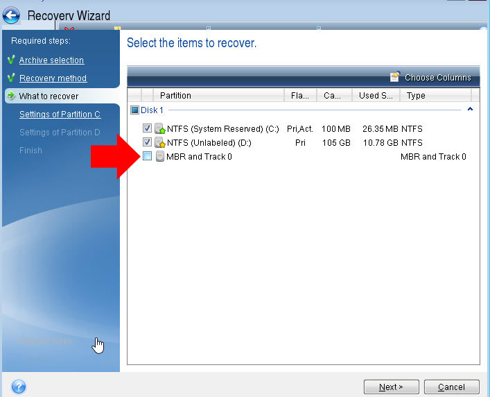

**Image analysis**

```json
{
 "image_name": "image18.jpg",
 "rId": "rId31",
 "image_path": "img_folder/image_017_image18.jpg",
 "caption": "پنجره Recovery Wizard برای انتخاب آیتم های بازیابی از دیسک و پارتیشن ها",
 "ocr_text": "Recovery Wizard\nRequired steps:\nArchive selection\nRecovery method\nWhat to recover\nSettings of Partition C\nSettings of Partition D\nFinish\nSelect the items to recover.\nChoose Columns\nPartition\nFla...\nCa...\nUsed S...\nType\nDisk 1\nNTFS (System Reserved) (C:)\nNTFS (Unlabeled) (D:)\nMBR and Track 0\nPri,Act.\n100 MB\n26.35 MB\nNTFS\nPri\n105 GB\n10.78 GB\nNTFS\nMBR and Track 0\nNext >\nCancel",
 "visual_description": [
 "اسکرین شات نرم افزار Recovery Wizard با مرحله «What to recover» در منوی سمت چپ",
 "جدول انتخاب آیتم های بازیابی شامل Disk 1 و ردیف های NTFS (System Reserved) (C:)، NTFS (Unlabeled) (D:) و «MBR and Track 0»",
 "ستون های جدول شامل Partition، Fla...، Ca...، Used S... و Type",
 "چک باکس ها کنار هر پارتیشن/آیتم برای انتخاب",
 "فلش قرمز بزرگ به سمت لیست آیتم ها اشاره می کند",
 "دکمه های «Next >» و «Cancel» در پایین پنجره"
 ],
 "image_type": "screenshot"
}
```

10. این قسمت مخصوص انجام تنظیمات درایو Reserved Partitionمی باشد؛ ابتدا روی لینک New Location کلیک کنید

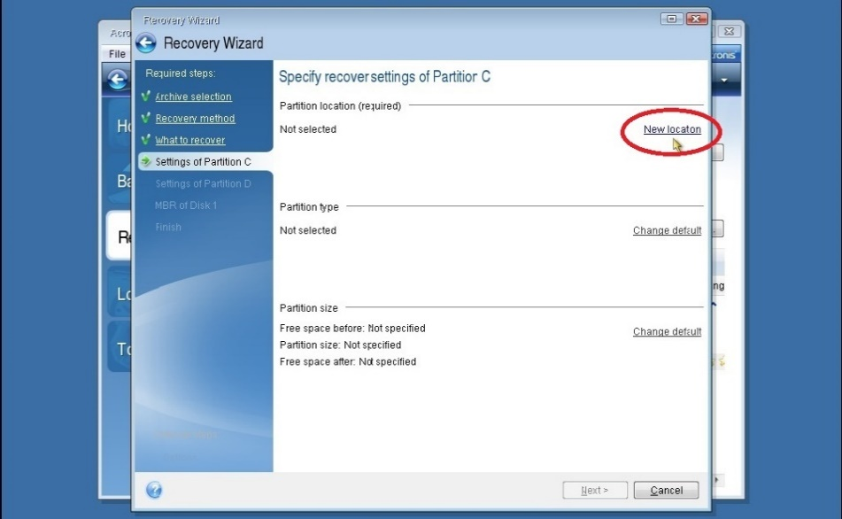

**Image analysis**

```json
{
 "image_name": "image19.jpeg",
 "rId": "rId32",
 "image_path": "img_folder/image_018_image19.jpg",
 "caption": "پنجره Recovery Wizard برای تنظیمات بازیابی پارتیشن C و انتخاب مسیر جدید",
 "ocr_text": "Recovery Wizard\nRequired steps:\nArchive selection\nRecovery method\nWhat to recover\nSettings of Partition C\nSettings of Partition D\nMBR of Disk 1\nFinish\nSpecify recover settings of Partition C\nPartition location (required)\nNot selected\nNew location\nPartition type\nNot selected\nChange default\nPartition size\nFree space before: Not specified\nPartition size: Not specified\nFree space after: Not specified\nChange default\nNext >\nCancel",
 "visual_description": [
 "اسکرین شات از پنجره نرم افزار Recovery Wizard با عنوان «Specify recover settings of Partition C».",
 "نوار کناری مراحل شامل Archive selection، Recovery method و What to recover با تیک سبز است.",
 "گزینه «New location» با یک بیضی قرمز هایلایت شده است.",
 "فیلدهای Partition location و Partition type هر دو مقدار «Not selected» دارند.",
 "بخش Partition size مقادیر Free space before/after و Partition size را «Not specified» نشان می دهد.",
 "دکمه های پایین پنجره «Next >» (غیرفعال) و «Cancel» قابل مشاهده اند."
 ],
 "image_type": "screenshot"
}
```

11. در پنجره ی زیر، ابتدا پارتیشن Reserved را انتخاب و سپس روی دکمه ی Accept کلیک کنید:

در صورت نمایش درایوهای دیگر، مطابق شکل، فقط می باید درایو C را انتخاب نمایید.

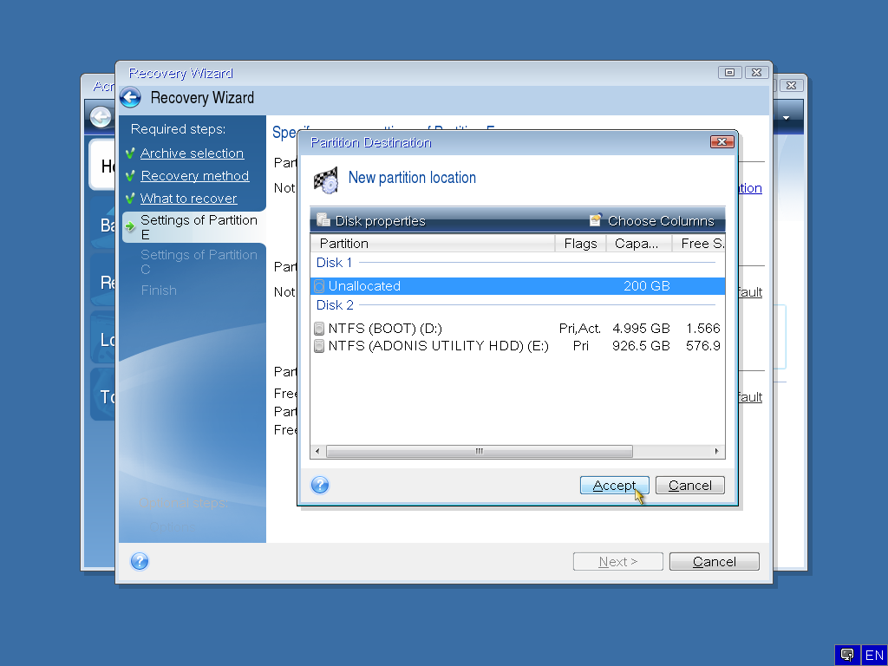

**Image analysis**

```json
{
 "image_name": "image20.png",
 "rId": "rId33",
 "image_path": "img_folder/image_019_image20.png",
 "caption": "پنجره Recovery Wizard برای انتخاب مقصد پارتیشن و نمایش دیسک ها و فضای تخصیص نیافته",
 "ocr_text": "Recovery Wizard\nRecovery Wizard\nRequired steps:\nArchive selection\nRecovery method\nWhat to recover\nSettings of Partition\nE\nSettings of Partition\nC\nFinish\nPartition Destination\nNew partition location\nDisk properties\nChoose Columns\nPartition\nFlags\nCapa...\nFree S...\nDisk 1\nUnallocated\n200 GB\nDisk 2\nNTFS (BOOT) (D:)\nPri,Act\n4.995 GB\n1.566\nNTFS (ADONIS UTILITY HDD) (E:)\nPri\n926.5 GB\n576.9\nAccept\nCancel\nNext >\nCancel\nEN",
 "visual_description": [
 "اسکرین شات محیط ویندوز با پنجره Recovery Wizard و مرحله Settings of Partition",
 "دیالوگ Partition Destination برای انتخاب محل پارتیشن جدید نمایش داده شده است",
 "لیست دیسک ها شامل Disk 1 با فضای Unallocated برابر 200 GB",
 "Disk 2 شامل دو پارتیشن NTFS: (BOOT) (D:) و (ADONIS UTILITY HDD) (E:)",
 "ستون های جدول شامل Partition، Flags، Capa... و Free S... است",
 "دکمه های Accept و Cancel در دیالوگ مقصد پارتیشن قابل مشاهده اند",
 "دکمه Next > در پنجره اصلی غیرفعال (خاکستری) است"
 ],
 "image_type": "screenshot"
}
```

12. پس انجام اقدامات فوق و انتخاب Reserved Partition پنجره زیر نمایش داده می شود. همانند تصویر زیر، مقدار Partition Size باید معادل 100MB باشد. در این صورت روی دکمه ی Next کلیک کنید تا به مرحله ی 14 بعد بروید. (ولی اگر مقدار Partition Size، معادل 100MB نیست لازم است جهت اعمال تغییرات، روی گزینه Change Default کلیک نمایید.)

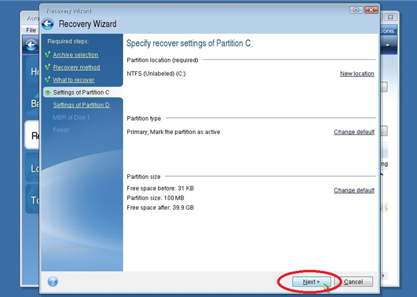

**Image analysis**

```json
{
 "image_name": "image21.png",
 "rId": "rId34",
 "image_path": "img_folder/image_020_image21.png",
 "caption": "پنجره Recovery Wizard برای تنظیمات بازیابی پارتیشن C و دکمه Next",
 "ocr_text": "Recovery Wizard\nRequired steps:\nArchive selection\nRecovery method\nWhat to recover\nSettings of Partition C\nSettings of Partition D\nMBR of Disk 1\nFinish\nSpecify recover settings of Partition C\nPartition location (required)\nNTFS (Unlabeled) (C:)\nNew location\nPartition type\nPrimary, Mark the partition as active\nChange default\nPartition size\nFree space before: 31 KB\nPartition size: 100 MB\nFree space after: 39.9 GB\nChange default\nNext >\nCancel",
 "visual_description": [
 "اسکرین شات نرم افزار Recovery Wizard با مرحله «Settings of Partition C» انتخاب شده در نوار کناری",
 "نمایش نوع فایل سیستم پارتیشن: NTFS (Unlabeled) (C:)",
 "بخش Partition type شامل گزینه Primary و فعال بودن پارتیشن (Mark the partition as active)",
 "بخش Partition size شامل Free space before: 31 KB، Partition size: 100 MB، Free space after: 39.9 GB",
 "دکمه های پایین پنجره: Next > و Cancel؛ دکمه Next با دایره قرمز مشخص شده است"
 ],
 "image_type": "screenshot"
}
```

13. در پنجره زیر حجم درایو مربوطه را به 100MB تغییر داده و روی دکمه ی Accept و سپس Next کلیک نمایید:

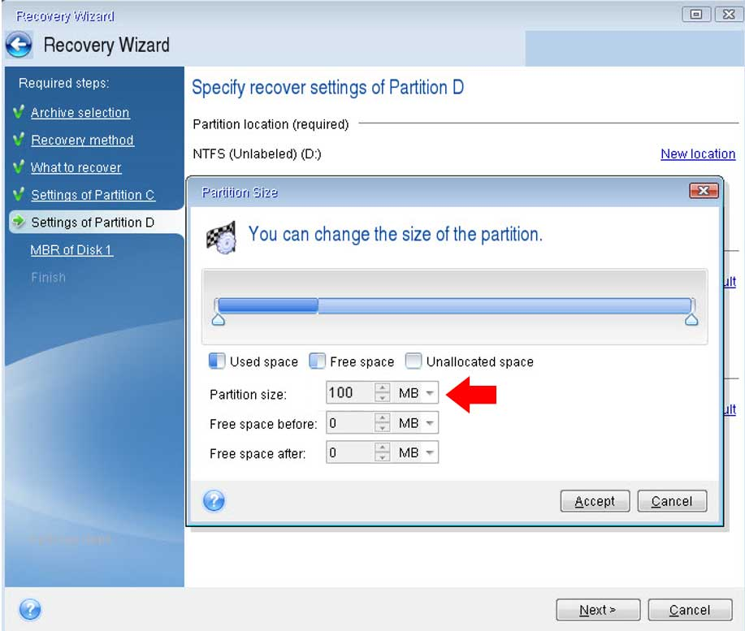

**Image analysis**

```json
{
 "image_name": "image22.jpg",
 "rId": "rId35",
 "image_path": "img_folder/image_021_image22.jpg",
 "caption": "پنجره Recovery Wizard برای تغییر اندازه پارتیشن و تنظیمات بازیابی پارتیشن D",
 "ocr_text": "Recovery Wizard\nRecovery Wizard\nRequired steps:\nArchive selection\nRecovery method\nWhat to recover\nSettings of Partition C\nSettings of Partition D\nMBR of Disk 1\nFinish\nSpecify recover settings of Partition D\nPartition location (required)\nNTFS (Unlabeled) (D:)\nNew location\nPartition Size\nYou can change the size of the partition.\nUsed space\nFree space\nUnallocated space\nPartition size:\n100\nMB\nFree space before:\n0\nMB\nFree space after:\n0\nMB\nAccept\nCancel\nNext >\nCancel",
 "visual_description": [
 "نرم افزار Recovery Wizard مراحل لازم را در پنل سمت چپ نمایش می دهد و مرحله Settings of Partition D انتخاب شده است",
 "پنجره Partition Size شامل نوار لغزنده تغییر اندازه پارتیشن است",
 "سه گزینه Used space، Free space و Unallocated space برای نمایش وضعیت فضا وجود دارد",
 "مقدار Partition size برابر 100 MB و Free space before/after هر دو 0 MB نمایش داده شده اند",
 "یک فلش قرمز به فیلد Partition size اشاره می کند",
 "دکمه های Accept و Cancel در پنجره Partition Size و دکمه های Next > و Cancel در پایین صفحه دیده می شوند",
 "در بخش Partition location عبارت NTFS (Unlabeled) (D:) و لینک New location نمایش داده شده است"
 ],
 "image_type": "screenshot"
}
```

14. روی New Location کلیک، پارتیشن حاوی ویندوز را انتخاب (Accept) و درنهایت روی گزینه ی Next کلیک کنید:

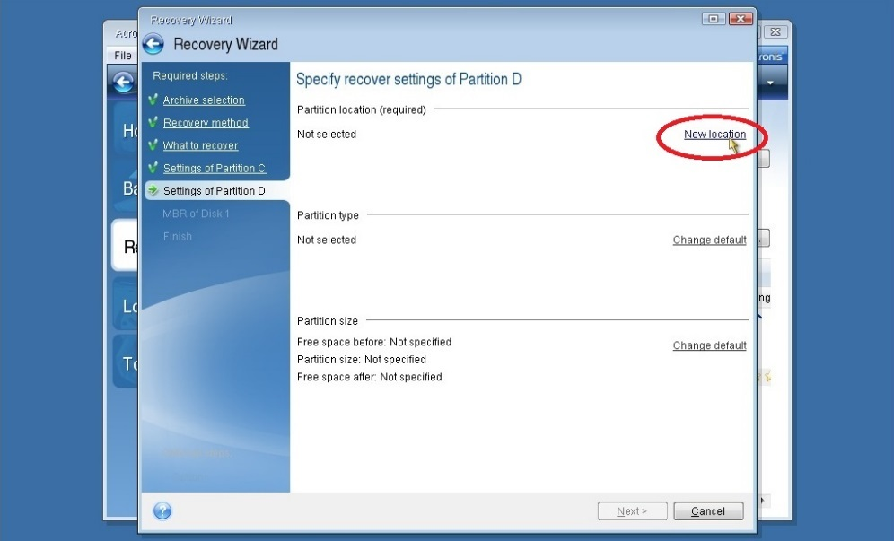

**Image analysis**

```json
{
 "image_name": "image23.jpeg",
 "rId": "rId36",
 "image_path": "img_folder/image_022_image23.jpg",
 "caption": "پنجره Recovery Wizard برای تنظیمات بازیابی پارتیشن D و انتخاب محل جدید",
 "ocr_text": "Recovery Wizard\nRecovery Wizard\nRequired steps:\nArchive selection\nRecovery method\nWhat to recover\nSettings of Partition C\nSettings of Partition D\nMBR of Disk 1\nFinish\nSpecify recover settings of Partition D\nPartition location (required)\nNot selected\nNew location\nPartition type\nNot selected\nChange default\nPartition size\nFree space before: Not specified\nPartition size: Not specified\nFree space after: Not specified\nChange default\nNext >\nCancel",
 "visual_description": [
 "اسکرین شات پنجره نرم افزار با عنوان Recovery Wizard",
 "نوار مراحل سمت چپ شامل Archive selection تا Finish با انتخاب Settings of Partition D",
 "بخش Partition location (required) مقدار Not selected و گزینه New location دارد",
 "بخش Partition type مقدار Not selected و لینک Change default دارد",
 "بخش Partition size شامل Free space before/after و Partition size با مقدار Not specified",
 "دکمه های پایین پنجره شامل Next > و Cancel"
 ],
 "image_type": "screenshot"
}
```

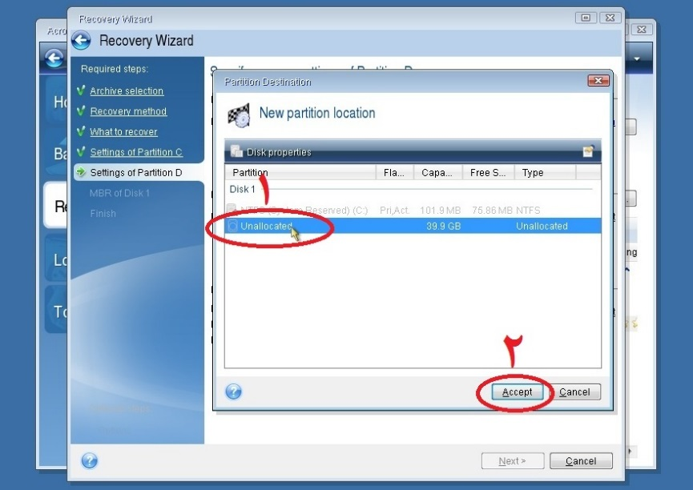

**Image analysis**

```json
{
 "image_name": "image24.jpeg",
 "rId": "rId37",
 "image_path": "img_folder/image_023_image24.jpg",
 "caption": "پنجره انتخاب مقصد پارتیشن با گزینه Unallocated و دکمه Accept مشخص شده است.",
 "ocr_text": "Recovery Wizard\nRequired steps:\nArchive selection\nRecovery method\nWhat to recover\nSettings of Partition C\nSettings of Partition D\nMBR of Disk 1\nFinish\nPartition Destination\nNew partition location\nDisk properties\nPartition\nDisk 1\nFla...\nCapa...\nFree S...\nType\nSystem Reserved (C)\nPri,Act\n101.9 MB\n75.86 MB\nNTFS\nUnallocated\n39.9 GB\nUnallocated\nAccept\nCancel\nNext >\nCancel",
 "visual_description": [
 "اسکرین شات نرم افزار Recovery Wizard با مراحل سمت چپ نمایش داده شده است.",
 "پنجره Partition Destination باز است و عنوان New partition location دارد.",
 "در جدول Disk properties برای Disk 1، ردیف Unallocated با ظرفیت 39.9 GB انتخاب شده است.",
 "ردیف System Reserved (C) با فایل سیستم NTFS و وضعیت Pri,Act نمایش داده شده است.",
 "دکمه Accept در پایین پنجره با علامت گذاری قرمز مشخص شده است."
 ],
 "image_type": "screenshot"
}
```

15. همانند تصویر زیر، مقدار Partition Size باید معادل 105GB باشد. در این صورت روی دکمه ی Next کلیک کنید تا به مرحله ی 17 بروید. (ولی اگر مقدار Partition Size، معادل 105GB نیست لازم است جهت اعمال تغییرات، روی گزینه Change Default کلیک نمایید.)

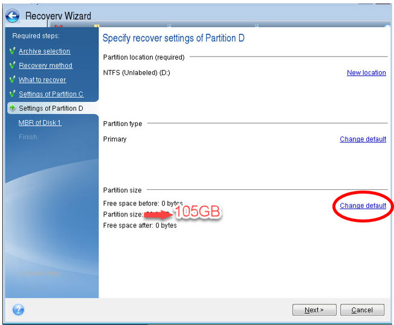

**Image analysis**

```json
{
 "image_name": "image25.jpg",
 "rId": "rId38",
 "image_path": "img_folder/image_024_image25.jpg",
 "caption": "تنظیمات بازیابی پارتیشن D در Recovery Wizard با گزینه Change default و دکمه Next",
 "ocr_text": "Recovery Wizard\nRequired steps:\nArchive selection\nRecovery method\nWhat to recover\nSettings of Partition C\nSettings of Partition D\nMBR of Disk 1\nFinish\nSpecify recover settings of Partition D\nPartition location (required)\nNTFS (Unlabeled) (D:)\nNew location\nPartition type\nPrimary\nChange default\nPartition size\nFree space before: 0 bytes\nPartition size:\nFree space after: 0 bytes\nChange default\nNext >\nCancel",
 "visual_description": [
 "پنجره نرم افزار Recovery Wizard نمایش داده شده است.",
 "مرحله انتخاب شده در نوار کناری: Settings of Partition D.",
 "بخش Partition location مقدار NTFS (Unlabeled) (D:) را نشان می دهد و لینک New location دارد.",
 "نوع پارتیشن (Partition type) برابر Primary است و لینک Change default کنار آن وجود دارد.",
 "در بخش Partition size مقادیر Free space before و Free space after هر دو 0 bytes هستند.",
 "یک لینک Change default با دایره قرمز در سمت راست مشخص شده است.",
 "دکمه های پایین پنجره: Next > و Cancel."
 ],
 "image_type": "screenshot"
}
```

16. در پنجره ای که گشوده می شود ظرفیت درایو حاوی ویندوز را به 105 گیگابایت تغییر دهید و سپس به ترتیب روی Accept و Next کلیک نمایید:

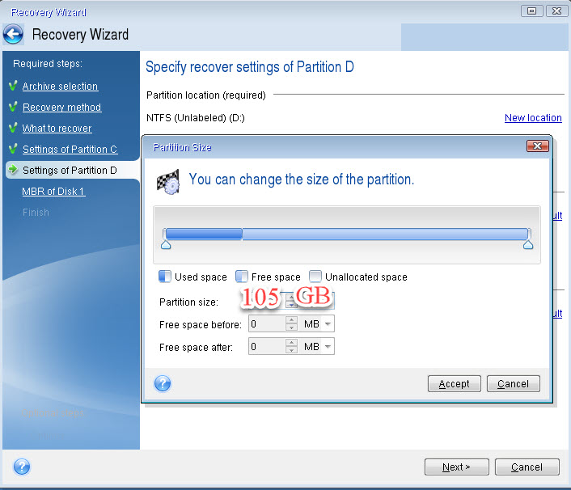

**Image analysis**

```json
{
 "image_name": "image26.jpg",
 "rId": "rId39",
 "image_path": "img_folder/image_025_image26.jpg",
 "caption": "پنجره تغییر اندازه پارتیشن در Recovery Wizard برای درایو D با اندازه ۱۰۵ گیگابایت",
 "ocr_text": "Recovery Wizard\nRecovery Wizard\nRequired steps:\nArchive selection\nRecovery method\nWhat to recover\nSettings of Partition C\nSettings of Partition D\nMBR of Disk1\nFinish\nSpecify recover settings of Partition D\nPartition location (required)\nNTFS (Unlabeled) (D:)\nNew location\nPartition Size\nYou can change the size of the partition.\nUsed space\nFree space\nUnallocated space\nPartition size:\n105 GB\nFree space before:\n0\nMB\nFree space after:\n0\nMB\nAccept\nCancel\nNext >\nCancel",
 "visual_description": [
 "اسکرین شات نرم افزار Recovery Wizard با مراحل سمت چپ و مرحله فعال Settings of Partition D",
 "در بخش Partition location مقدار NTFS (Unlabeled) (D:) نمایش داده شده است",
 "پنجره Partition Size دارای اسلایدر تغییر اندازه و گزینه های Used space، Free space، Unallocated space است",
 "اندازه پارتیشن روی 105 GB تنظیم شده و فیلدهای Free space before/after برابر 0 MB هستند",
 "دکمه های Accept و Cancel در پنجره تنظیمات و دکمه های Next > و Cancel در پایین صفحه دیده می شوند"
 ],
 "image_type": "screenshot"
}
```

17. در این مرحله، همانند شکل زیر، روی دکمه ی Next کلیک کنید:

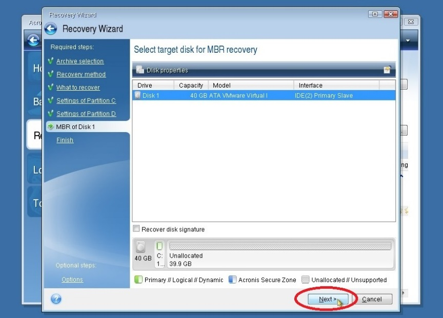

**Image analysis**

```json
{
 "image_name": "image27.jpeg",
 "rId": "rId40",
 "image_path": "img_folder/image_026_image27.jpg",
 "caption": "پنجره Recovery Wizard برای انتخاب دیسک مقصد جهت بازیابی MBR",
 "ocr_text": "Recovery Wizard\nRequired steps:\nArchive selection\nRecovery method\nWhat to recover\nSettings of Partition C\nSettings of Partition D\nMBR of Disk 1\nFinish\nOptional steps:\nOptions\nSelect target disk for MBR recovery\nDisk properties\nDrive\nCapacity\nModel\nInterface\nDisk 1\n40 GB\nATA VMware Virtual I\nIDE(2) Primary Slave\nRecover disk signature\n40 GB\nC:\nUnallocated\n39.9 GB\nPrimary // Logical // Dynamic\nAcronis Secure Zone\nUnallocated // Unsupported\nNext >\nCancel",
 "visual_description": [
 "اسکرین شات نرم افزار با عنوان Recovery Wizard و مرحله «Select target disk for MBR recovery» نمایش داده شده است.",
 "فهرست مراحل در ستون چپ شامل Archive selection، Recovery method، What to recover، Settings of Partition C، Settings of Partition D، MBR of Disk 1 و Finish است.",
 "جدول Disk properties یک دیسک با نام Disk 1 و ظرفیت 40 GB و مدل ATA VMware Virtual I و رابط IDE(2) Primary Slave را نشان می دهد.",
 "گزینه Recover disk signature به صورت چک باکس قابل انتخاب نمایش داده شده است.",
 "نقشه دیسک پایین پنجره وضعیت C: و Unallocated 39.9 GB را نمایش می دهد.",
 "دکمه Next > با یک بیضی قرمز مشخص شده و دکمه Cancel در کنار آن است."
 ],
 "image_type": "screenshot"
}
```

18. در مرحله آخر، روی دکمه ی Proceed کلیک کنید تا عملیات نصب Image شروع شود.

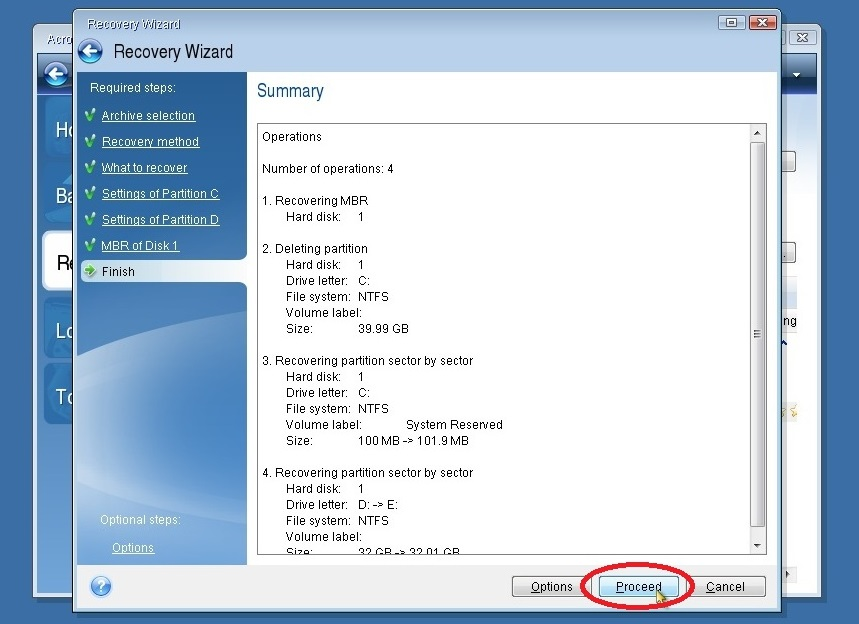

**Image analysis**

```json
{
 "image_name": "image28.jpeg",
 "rId": "rId41",
 "image_path": "img_folder/image_027_image28.jpg",
 "caption": "صفحه Summary در Recovery Wizard با دکمه Proceed مشخص شده برای ادامه عملیات بازیابی",
 "ocr_text": "Recovery Wizard\nRequired steps:\nArchive selection\nRecovery method\nWhat to recover\nSettings of Partition C\nSettings of Partition D\nMBR of Disk 1\nFinish\nSummary\nOperations\nNumber of operations: 4\n1. Recovering MBR\nHard disk: 1\n2. Deleting partition\nHard disk: 1\nDrive letter: C:\nFile system: NTFS\nVolume label:\nSize: 39.99 GB\n3. Recovering partition sector by sector\nHard disk: 1\nDrive letter: C:\nFile system: NTFS\nVolume label: System Reserved\nSize: 100 MB -> 101.9 MB\n4. Recovering partition sector by sector\nHard disk: 1\nDrive letter: D: -> E:\nFile system: NTFS\nVolume label:\nSize: 32 GB -> 32.01 GB\nOptional steps:\nOptions\nOptions\nProceed\nCancel",
 "visual_description": [
 "پنجره نرم افزار Recovery Wizard با نوار مراحل در سمت چپ و تیک سبز کنار مراحل",
 "صفحه Summary فهرست 4 عملیات را نشان می دهد: Recovering MBR، Deleting partition، و دو مورد Recovering partition sector by sector",
 "جزئیات قابل مشاهده شامل Hard disk: 1، درایو C: با NTFS و اندازه 39.99 GB",
 "پارتیشن System Reserved با اندازه 100 MB -> 101.9 MB نمایش داده شده است",
 "تغییر حرف درایو D: -> E: برای یک عملیات بازیابی نمایش داده شده است",
 "دکمه Proceed در پایین با دایره قرمز مشخص شده و کنار آن Options و Cancel دیده می شود"
 ],
 "image_type": "screenshot"
}
```

19. نمایش پیغام Recover operation succeeded بیانگر پایان موفقیت آمیز عملیات خواهد بود، روی دکمه OK کلیک نمایید. و درنهایت از قسمت File گزینه Exit را انتخاب کنید تا از برنامه Acronis خارج شوید.

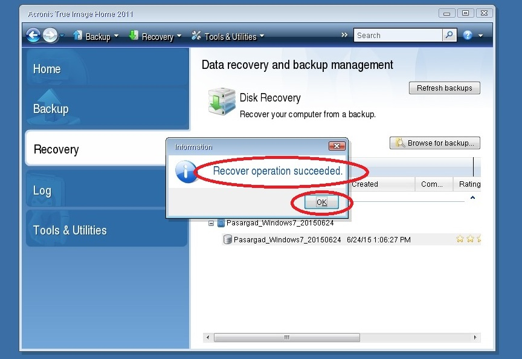

**Image analysis**

```json
{
 "image_name": "image29.jpeg",
 "rId": "rId42",
 "image_path": "img_folder/image_028_image29.jpg",
 "caption": "پیغام موفقیت عملیات بازیابی در Acronis True Image Home 2011",
 "ocr_text": "Acronis True Image Home 2011\nBackup\nRecovery\nTools & Utilities\nSearch\nHome\nBackup\nRecovery\nLog\nTools & Utilities\nData recovery and backup management\nDisk Recovery\nRecover your computer from a backup.\nRefresh backups\nBrowse for backup...\nInformation\nRecover operation succeeded.\nOK\nPasargad_Windows7_20150624\nPasargad_Windows7_20150624 6/24/15 1:06:27 PM\nCreated\nCom...\nRating",
 "visual_description": [
 "اسکرین شات نرم افزار Acronis True Image Home 2011 در بخش Recovery",
 "پنجره Information با متن «Recover operation succeeded.» نمایش داده شده است",
 "دکمه «OK» در پنجره پیام قابل مشاهده است",
 "صفحه اصلی شامل عنوان «Data recovery and backup management» و گزینه «Disk Recovery» است",
 "فهرست پشتیبان ها شامل مورد «Pasargad_Windows7_20150624» با زمان «6/24/15 1:06:27 PM» دیده می شود"
 ],
 "image_type": "screenshot"
}
```

20. با بسته شدن برنامه Acronis، صفحه ی زیرنمایان خواهد شد؛ با فشار کلیدهای Ctrl+Alt+Delete دستگاه را Restart نمایید:

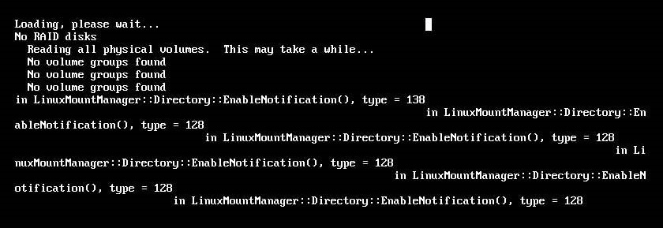

**Image analysis**

```json
{
 "image_name": "image30.jpeg",
 "rId": "rId43",
 "image_path": "img_folder/image_029_image30.jpg",
 "caption": "نمایش پیام های بوت/عیب یابی درباره RAID، LVM و خطاهای LinuxMountManager",
 "ocr_text": "Loading, please wait...\nNo RAID disks\nReading all physical volumes. This may take a while...\nNo volume groups found\nNo volume groups found\nNo volume groups found\nin LinuxMountManager::Directory::EnableNotification(), type = 138\nin LinuxMountManager::Directory::En\nableNotification(), type = 128\nin LinuxMountManager::Directory::EnableNotification(), type = 128\nmuxMountManager::Directory::EnableNotification(), type = 128\notification(), type = 128\nin LinuxMountManager::Directory::EnableN\nin LinuxMountManager::Directory::EnableNotification(), type = 128",
 "visual_description": [
 "صفحه کنسول با متن سفید روی پس زمینه سیاه",
 "پیام «No RAID disks» نمایش داده شده است",
 "پیام «Reading all physical volumes...» مربوط به اسکن LVM دیده می شود",
 "چندین بار پیام «No volume groups found» نمایش داده شده است",
 "چند خط لاگ شامل «LinuxMountManager::Directory::EnableNotification()» با type=128 و یک مورد type=138 دیده می شود"
 ],
 "image_type": "screenshot"
}
```

21. تنظیمات BIOS را به حالت اولیه برگردانید به نحوی که دستگاه از روی هارد بوت گردد.
22. پس از نصب ایمیج، فلش یا هارد اکسترنال را از دستگاه جدا کنید.
23. دستگاه را Restart نمایید.

# *تنظیمات نرم افزاری در راه اندازی اولیه*

1. **مجوز نصب و راه اندازی:** برای تایید مجوز راه اندازی پکیج، در پنجره ی زیر، ID و Verification Code که قبلاً در اختیارتان قرار داده شده است را وارد و روی گزینه Login کلیک نمایید:

حتماً لازم است ساعت و تاریخ را از طریق مراجعه به صفحه تنظیمات بایوس تنظیم کرده باشید.

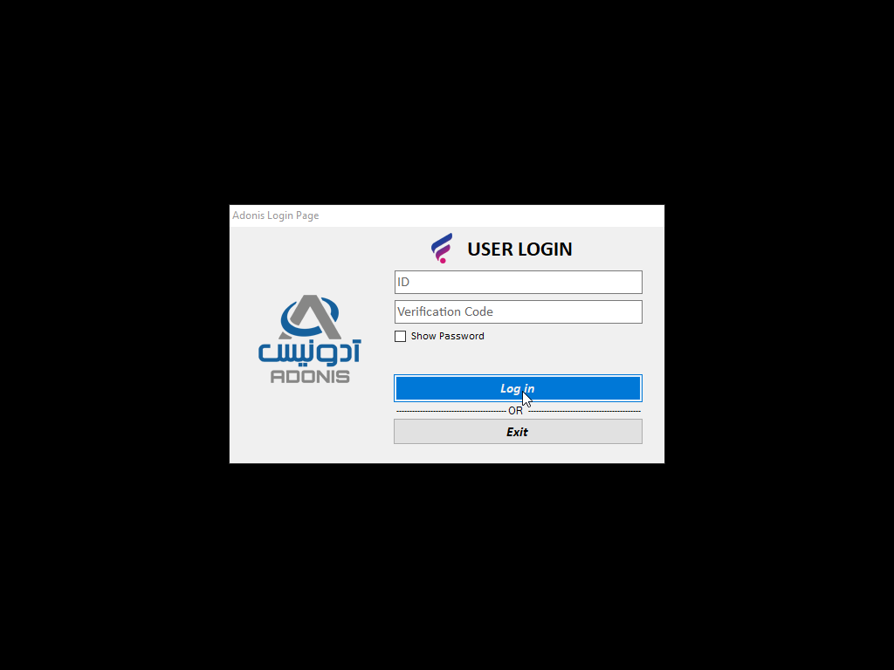

**Image analysis**

```json
{
 "image_name": "image31.png",
 "rId": "rId44",
 "image_path": "img_folder/image_030_image31.png",
 "caption": "اسکرین شات صفحه ورود کاربر نرم افزار Adonis با فیلدهای ID و کد تایید",
 "ocr_text": "Adonis Login Page\nUSER LOGIN\nID\nVerification Code\nShow Password\nLog in\nOR\nExit\nآدنیس\nADONIS",
 "visual_description": [
 "پنجره با عنوان «Adonis Login Page» نمایش داده شده است",
 "تیتر «USER LOGIN» در بالای فرم ورود قرار دارد",
 "دو کادر ورودی با برچسب های «ID» و «Verification Code» وجود دارد",
 "یک چک باکس با متن «Show Password» زیر فیلدها دیده می شود",
 "دکمه «Log in» به رنگ آبی و دکمه «Exit» به رنگ خاکستری وجود دارد و بین آن ها متن «OR» قرار دارد",
 "لوگوی «آدنیس / ADONIS» در سمت چپ پنجره دیده می شود"
 ],
 "image_type": "screenshot"
}
```

2. **تنظیمات سخت افزار:** در پنجره ی زیر، جهت نصب کانفیگ سخت افزاری مناسب دستگاه، گزینه ی 2-EastCom Config را انتخاب کنید:

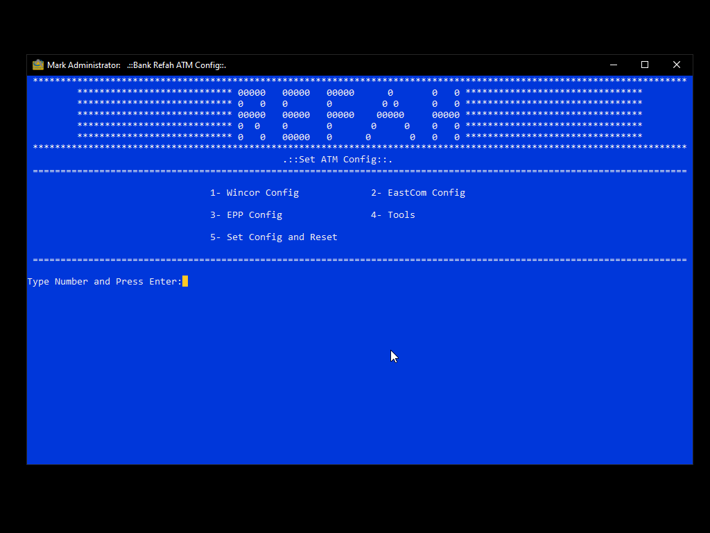

**Image analysis**

```json
{
 "image_name": "image32.png",
 "rId": "rId45",
 "image_path": "img_folder/image_031_image32.png",
 "caption": "منوی تنظیمات ATM بانک رفاه با گزینه های Wincor، EastCom، EPP و ابزارها",
 "ocr_text": "Mark Administrator ::Bank Refah ATM Config::\n\n:::Set ATM Config::\n\n1- Wincor Config 2- EastCom Config\n\n3- EPP Config 4- Tools\n\n5- Set Config and Reset\n\nType Number and Press Enter:",
 "visual_description": [
 "پنجره کنسول با پس زمینه آبی و متن سفید نمایش داده شده است",
 "عنوان پنجره: Mark Administrator ::Bank Refah ATM Config::",
 "سربرگ منو: :::Set ATM Config:::",
 "گزینه های منو شامل 1- Wincor Config، 2- EastCom Config، 3- EPP Config، 4- Tools، 5- Set Config and Reset است",
 "در پایین صفحه پیام ورودی: Type Number and Press Enter: نمایش داده می شود"
 ],
 "image_type": "screenshot"
}
```

در ادامه این قسمت، هر جا عبارت «منوی اول» آورده شده است، منظور منوی فوق می باشد. در هر مرحله، با فشار کلیدX روی کیبورد می توانید به مرحله قبل برگردید.

3. از بین گزینه های یک تا چهار، گزینه ی مناسب را با توجه به سخت افزار نصب شده روی دستگاه، جهت نصب کانفیگ نرم افزاری انتخاب کنید:

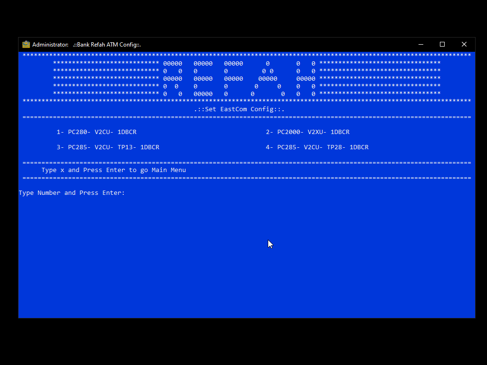

**Image analysis**

```json
{
 "image_name": "image33.png",
 "rId": "rId46",
 "image_path": "img_folder/image_032_image33.png",
 "caption": "صفحه تنظیمات EastCom در ابزار Bank Refah ATM Config با گزینه های انتخاب مدل و پورت",
 "ocr_text": "Administrator - ::Bank Refah ATM Config::\n\n:::Set EastCom Config:::\n\n1- PC280- V2CU- 1DBCR 2- PC2000- V2XU- 1DBCR\n\n3- PC285- V2CU- TP13- 1DBCR 4- PC285- V2CU- TP28- 1DBCR\n\nType x and Press Enter to go Main Menu\n\nType Number and Press Enter:",
 "visual_description": [
 "پنجره کنسولی با عنوان «Administrator - ::Bank Refah ATM Config::» نمایش داده شده است",
 "بخش «:::Set EastCom Config:::» چهار گزینه شماره دار برای انتخاب پیکربندی (PC280/PC2000/PC285) دارد",
 "دستور متنی «Type x and Press Enter to go Main Menu» برای بازگشت به منوی اصلی دیده می شود",
 "در پایین پیام ورودی «Type Number and Press Enter:» برای دریافت انتخاب کاربر نمایش داده شده است",
 "پس زمینه آبی با متن سفید و جداکننده های کاراکتری خطی در صفحه وجود دارد"
 ],
 "image_type": "screenshot"
}
```

عملیات نصب آغاز خواهد شد:

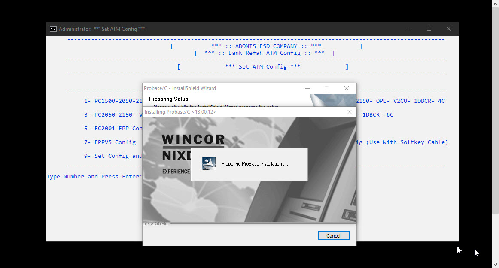

**Image analysis**

```json
{
 "image_name": "image34.jpg",
 "rId": "rId47",
 "image_path": "img_folder/image_033_image34.jpg",
 "caption": "پنجره InstallShield برای Probase/C در حال آماده سازی نصب روی صفحه تنظیمات ATM",
 "ocr_text": "Administrator: *** Set ATM Config ***\n[ *** :: ADONIS ESD COMPANY :: *** ]\n[ *** :: Bank Refah ATM Config :: *** ]\n[ *** Set ATM Config *** ]\nProbase/C - InstallShield Wizard\nPreparing Setup\nInstalling Probase/C <13.00.12>\nWINCOR\nNIXD\nEXPERIENCE\nPreparing ProBase Installation ....\nInstalled\nCancel\n1- PC1500-2050-21\n3- PC2050-2150-\n5- EC2001 EPP Con\n7- EPPV5 Config\n9- Set Config and\nType Number and Press Enter:",
 "visual_description": [
 "نمایش کنسول/پنجره با عنوان Set ATM Config و منوی گزینه ها",
 "پنجره InstallShield Wizard برای نصب Probase/C نسخه <13.00.12>",
 "لوگوی WINCOR NIXD و پیام وضعیت «Preparing ProBase Installation ....»",
 "دکمه «Cancel» در پنجره نصب قابل مشاهده است"
 ],
 "image_type": "screenshot"
}
```

4. **راه اندازی EPP :** پس از پایان عملیات نصب، جهت راه اندازیEPP دستگاه، به منوی اول برگردید.
5. گزینه ی 3-EPP Config را انتخاب کنید.
6. در پنجره ی زیر، باتوجه به نوع صفحه کلید دستگاه، از بین گزینه های 1 تا 4 گزینه مناسب را انتخاب کنید.

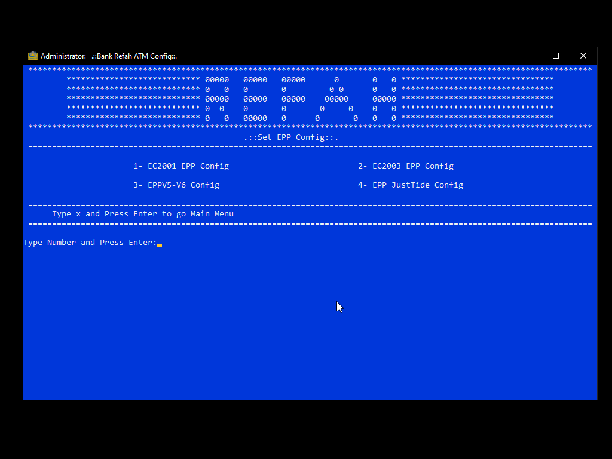

**Image analysis**

```json
{
 "image_name": "image35.png",
 "rId": "rId48",
 "image_path": "img_folder/image_034_image35.png",
 "caption": "صفحه تنظیمات EPP در Bank Refah ATM Config با گزینه های EC2001، EC2003، EPPV5-V6 و JustTide",
 "ocr_text": "Administrator - Bank Refah ATM Config:\n\n:::Set EPP Config:::\n\n1- EC2001 EPP Config 2- EC2003 EPP Config\n\n3- EPPV5-V6 Config 4- EPP JustTide Config\n\nType x and Press Enter to go Main Menu\n\nType Number and Press Enter:",
 "visual_description": [
 "پنجره کنسولی با عنوان «Administrator - Bank Refah ATM Config:» نمایش داده شده است",
 "بخش منو با عنوان «:::Set EPP Config:::» وجود دارد",
 "چهار گزینه شماره دار برای پیکربندی EPP نمایش داده شده اند: EC2001، EC2003، EPPV5-V6، EPP JustTide",
 "راهنمای بازگشت به منوی اصلی با متن «Type x and Press Enter to go Main Menu» نمایش داده شده است",
 "ورودی کاربر با متن «Type Number and Press Enter:» درخواست شده است"
 ],
 "image_type": "screenshot"
}
```

در صورت استفاده از EPP مدل Sunson لازم است پس از نصب پکیج، عملیات نصب درایور را انجام دهید.

در EPP نوع Sunson، باید Softkey ها را به EPP متصل کنید.

7. **تنظیمات شبکه:** جهت انجام تنظیمات شبکه دستگاه، از منوی اول، گزینه ی 4-Tools را انتخاب کنید.
8. گزینه ی 1- Windows IP Config را انتخاب نمایید:

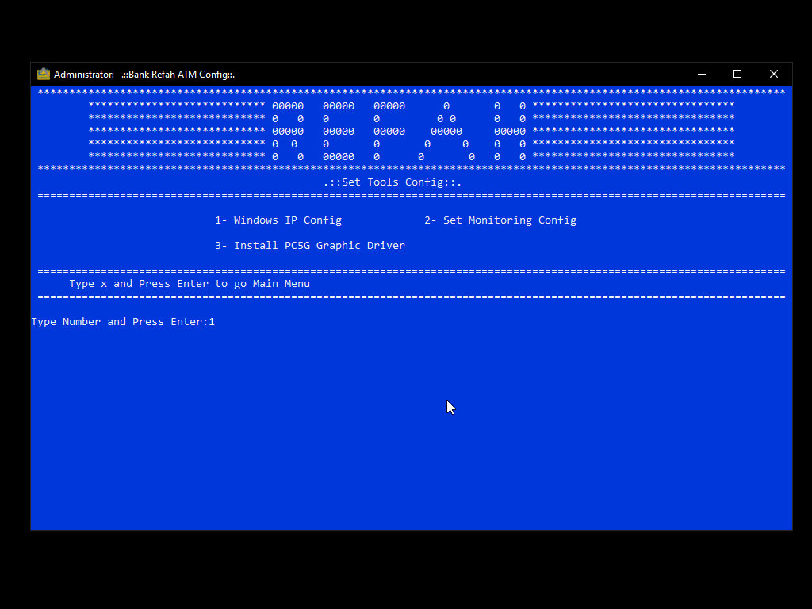

**Image analysis**

```json
{
 "image_name": "image36.png",
 "rId": "rId49",
 "image_path": "img_folder/image_035_image36.png",
 "caption": "صفحه تنظیمات ابزارهای ATM با منوی پیکربندی IP، مانیتورینگ و نصب درایور گرافیک",
 "ocr_text": "Administrator - ::Bank Refah ATM Config::\n\n:::Set Tools Config:::\n\n1- Windows IP Config 2- Set Monitoring Config\n\n3- Install PC5G Graphic Driver\n\nType x and Press Enter to go Main Menu\n\nType Number and Press Enter:1",
 "visual_description": [
 "پنجره کنسول با پس زمینه آبی و متن سفید نمایش داده شده است",
 "عنوان پنجره: Administrator - ::Bank Refah ATM Config::",
 "بخش منو با عنوان :::Set Tools Config::: وجود دارد",
 "گزینه های منو شامل: 1- Windows IP Config، 2- Set Monitoring Config، 3- Install PC5G Graphic Driver",
 "پیام راهنما: Type x and Press Enter to go Main Menu",
 "خط ورودی: Type Number and Press Enter:1 نشان می دهد عدد 1 وارد شده است"
 ],
 "image_type": "screenshot"
}
```

* **Perferred DNS Server : 10.15.0.100**
* **Alternate DNS Server : 10.15.0.101**

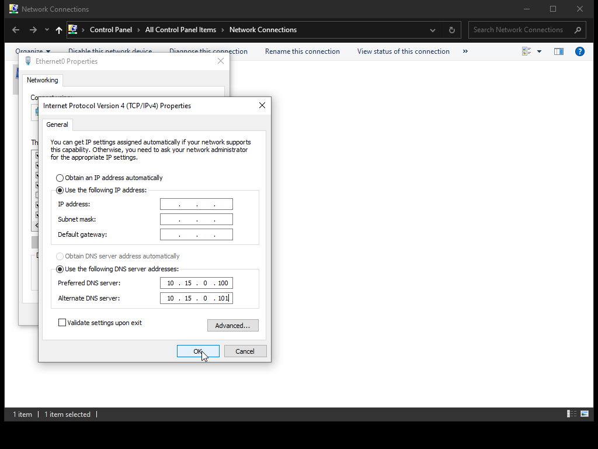

**Image analysis**

```json
{
 "image_name": "image37.png",
 "rId": "rId50",
 "image_path": "img_folder/image_036_image37.png",
 "caption": "پنجره تنظیمات IPv4 ویندوز با تنظیم دستی DNS و نمایش آدرس های DNS",
 "ocr_text": "Network Connections\nControl Panel > All Control Panel Items > Network Connections\nSearch Network Connections\nEthernet0 Properties\nNetworking\nInternet Protocol Version 4 (TCP/IPv4) Properties\nGeneral\nYou can get IP settings assigned automatically if your network supports this capability. Otherwise, you need to ask your network administrator for the appropriate IP settings.\nObtain an IP address automatically\nUse the following IP address:\nIP address:\nSubnet mask:\nDefault gateway:\nObtain DNS server address automatically\nUse the following DNS server addresses:\nPreferred DNS server:\n10 . 15 . 0 . 100\nAlternate DNS server:\n10 . 15 . 0 . 101\nValidate settings upon exit\nAdvanced...\nOK\nCancel",
 "visual_description": [
 "اسکرین شات پنجره Internet Protocol Version 4 (TCP/IPv4) Properties در ویندوز",
 "گزینه Use the following IP address انتخاب شده اما فیلدهای IP/Subnet/Gateway خالی هستند",
 "گزینه Use the following DNS server addresses فعال است",
 "Preferred DNS server برابر 10.15.0.100 وارد شده است",
 "Alternate DNS server برابر 10.15.0.101 وارد شده است",
 "دکمه های Advanced..., OK و Cancel قابل مشاهده اند"
 ],
 "image_type": "screenshot"
}
```

DNS در تمام دستگاه ها ثابت است.

9. **مانیتورینگ:** برای راه اندازی نرم افزار مانیتورینگ آدونیس، از منوی اول، گزینه 4-Tools را انتخاب کنید.
10. در پنجره ی بعد، گزینه ی 2-Set Monitoring Config را انتخاب نمایید تا پنجره ی زیر به نمایش گذاشته شود. امکان اعمال تنظیمات مانیتورینگ از طریق پنجره ی زیر فراهم می آید:

در نرم افزار مانیتورینگ، Client IP و Terminal ID انحصاری و مختص همان دستگاه و Server IP مقداری ثابت و معادل 10.15.45.10 می باشد.

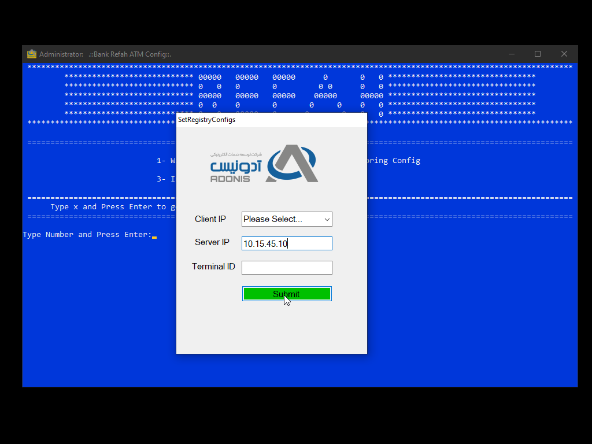

**Image analysis**

```json
{
 "image_name": "image38.png",
 "rId": "rId51",
 "image_path": "img_folder/image_037_image38.png",
 "caption": "پنجره تنظیم رجیستری با فیلدهای IP کلاینت، IP سرور و شناسه ترمینال",
 "ocr_text": "Administrator: \"Bank Refah ATM Config::\nSetRegistryConfigs\nشرکت توسعه خدمات انفورماتیک\nآدونیس\nADONIS\nClient IP\nPlease Select...\nServer IP\n10.15.45.10\nTerminal ID\nSubmit\nType x and Press Enter to g\nType Number and Press Enter:",
 "visual_description": [
 "اسکرین شات محیط ویندوز با یک پنجره برنامه SetRegistryConfigs روی پس زمینه کنسول آبی",
 "فرم شامل فیلدهای Client IP (لیست کشویی)، Server IP (مقدار 10.15.45.10) و Terminal ID (خالی) است",
 "دکمه سبز رنگ با برچسب Submit در پایین فرم قرار دارد",
 "نوار عنوان پنجره اصلی شامل متن Administrator: \"Bank Refah ATM Config:: است"
 ],
 "image_type": "screenshot"
}
```

در هر ترمینال این اطلاعات متقاوت می باشد.

11. پس از اعمال تنظیمات، با کلیک روی دکمه ی Submit این پنجره پس از 5 ثانیه بسته خواهد شد:

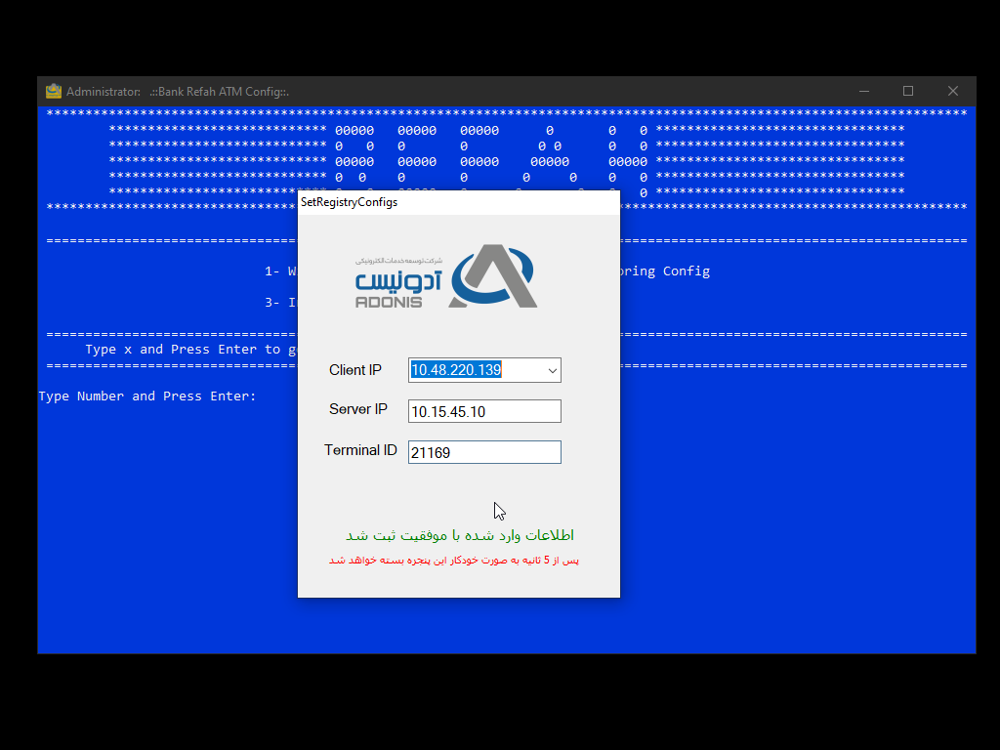

**Image analysis**

```json
{
 "image_name": "image39.png",
 "rId": "rId52",
 "image_path": "img_folder/image_038_image39.png",
 "caption": "پنجره SetRegistryConfigs برای تنظیم IP کلاینت، IP سرور و شناسه ترمینال در نرم افزار ADONIS",
 "ocr_text": "Administrator: \"Bank Refah ATM Config...\"\nSetRegistryConfigs\nشرکت مهندسی داده پردازی\nآدونیس\nADONIS\nClient IP\n10.48.220.139\nServer IP\n10.15.45.10\nTerminal ID\n21169\nاطلاعات وارد شده با موفقیت ثبت شد\nپس از 5 ثانیه به صورت خودکار این پنجره بسته خواهد شد",
 "visual_description": [
 "اسکرین شات یک محیط شبیه کنسول آبی با پنجره تنظیمات روی آن",
 "عنوان پنجره: SetRegistryConfigs",
 "لوگوی ADONIS و متن فارسی «شرکت مهندسی داده پردازی آدونیس» نمایش داده شده است",
 "سه فیلد ورودی با برچسب های Client IP، Server IP و Terminal ID وجود دارد",
 "مقادیر فیلدها: Client IP=10.48.220.139، Server IP=10.15.45.10، Terminal ID=21169",
 "پیام وضعیت سبز/قرمز در پایین پنجره درباره ثبت موفق اطلاعات و بسته شدن خودکار پس از 5 ثانیه"
 ],
 "image_type": "screenshot"
}
```

12. جهت اخذ تاییدیه عملکرد، با همکاران مانتیورینگ آدونیس مستقر در بانک رفاه با شماره تماس های زیر تماس بگیرید:

**02178437515**

**09196329285**

13. **کارت گرافیک:** درصورتی که PC دستگاه از نوع 5G (285DZ) می باشد، به منظور نصب درایور کارت گرافیک، در منوی اول، گزینه ی4-Tools و سپس 3-Install PC5G Graphic Driveرا انتخاب کنید، **در غیر این صورت به مرحله ی بعد بروید**:


**Image analysis**

```json
{
 "image_name": "image36.png",
 "rId": "rId49",
 "image_path": "img_folder/image_035_image36.png",
 "caption": "صفحه تنظیمات ابزارهای ATM با منوی پیکربندی IP، مانیتورینگ و نصب درایور گرافیک",
 "ocr_text": "Administrator - ::Bank Refah ATM Config::\n\n:::Set Tools Config:::\n\n1- Windows IP Config 2- Set Monitoring Config\n\n3- Install PC5G Graphic Driver\n\nType x and Press Enter to go Main Menu\n\nType Number and Press Enter:1",
 "visual_description": [
 "پنجره کنسول با پس زمینه آبی و متن سفید نمایش داده شده است",
 "عنوان پنجره: Administrator - ::Bank Refah ATM Config::",
 "بخش منو با عنوان :::Set Tools Config::: وجود دارد",
 "گزینه های منو شامل: 1- Windows IP Config، 2- Set Monitoring Config، 3- Install PC5G Graphic Driver",
 "پیام راهنما: Type x and Press Enter to go Main Menu",
 "خط ورودی: Type Number and Press Enter:1 نشان می دهد عدد 1 وارد شده است"
 ],
 "image_type": "screenshot"
}
```

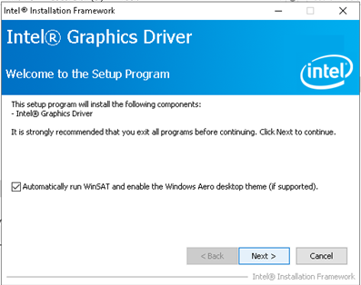

**Image analysis**

```json
{
 "image_name": "image40.png",
 "rId": "rId53",
 "image_path": "img_folder/image_039_image40.png",
 "caption": "پنجره نصب درایور گرافیک اینتل با گزینه اجرای WinSAT و دکمه های Next و Cancel",
 "ocr_text": "Intel® Installation Framework\nIntel® Graphics Driver\nWelcome to the Setup Program\nThis setup program will install the following components:\n- Intel® Graphics Driver\nIt is strongly recommended that you exit all programs before continuing. Click Next to continue.\nAutomatically run WinSAT and enable the Windows Aero desktop theme (if supported).\n< Back\nNext >\nCancel\nIntel® Installation Framework",
 "visual_description": [
 "پنجره نصب با عنوان Intel® Installation Framework نمایش داده شده است",
 "صفحه خوش آمدگویی نصب Intel® Graphics Driver دیده می شود",
 "چک باکس گزینه «Automatically run WinSAT…» وجود دارد",
 "دکمه های ناوبری < Back (غیرفعال)، Next > و Cancel در پایین پنجره هستند"
 ],
 "image_type": "screenshot"
}
```

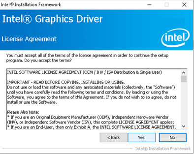

**Image analysis**

```json
{
 "image_name": "image41.png",
 "rId": "rId54",
 "image_path": "img_folder/image_040_image41.png",
 "caption": "پنجره نصب درایور گرافیک اینتل برای پذیرش توافق نامه مجوز با گزینه های Yes و No",
 "ocr_text": "Intel® Installation Framework\nIntel® Graphics Driver\nLicense Agreement\nintel\nYou must accept all of the terms of the license agreement in order to continue the setup program. Do you accept the terms?\nINTEL SOFTWARE LICENSE AGREEMENT (OEM / IHV / ISV Distribution & Single User)\nIMPORTANT - READ BEFORE COPYING, INSTALLING OR USING.\nDo not use or load this software and any associated materials (collectively, the \"Software\") until you have carefully read the following terms and conditions. By loading or using the Software, you agree to the terms of this Agreement. If you do not wish to so agree, do not install or use the Software.\nPlease Also Note:\n• If you are an Original Equipment Manufacturer (OEM), Independent Hardware Vendor (IHV), or Independent Software Vendor (ISV), this complete LICENSE AGREEMENT applies;\n• If you are an End-User, then only Exhibit A, the INTEL SOFTWARE LICENSE AGREEMENT,\n< Back\nNo\nYes\nIntel® Installation Framework",
 "visual_description": [
 "پنجره نصب Intel® Graphics Driver با عنوان License Agreement نمایش داده شده است",
 "لوگوی intel در سمت راست بالای پنجره قرار دارد",
 "یک کادر متنی اسکرول دار شامل متن توافق نامه مجوز نمایش داده می شود",
 "سه دکمه در پایین: «< Back»، «No»، «Yes»"
 ],
 "image_type": "screenshot"
}
```

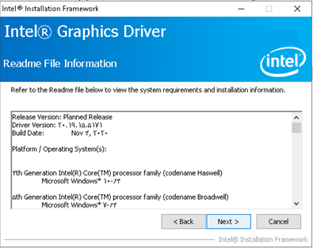

**Image analysis**

```json
{
 "image_name": "image42.png",
 "rId": "rId55",
 "image_path": "img_folder/image_041_image42.png",
 "caption": "پنجره نصب Intel Graphics Driver با اطلاعات نسخه و سیستم عامل های پشتیبانی شده",
 "ocr_text": "Intel® Installation Framework\nIntel® Graphics Driver\nReadme File Information\nRefer to the Readme file below to view the system requirements and installation information.\nRelease Version: Planned Release\nDriver Version: ١٥.٣٣.١٠.٤٠٣١\nBuild Date: Nov ٢, ٢٠١٤\nPlatform / Operating System(s):\n4th Generation Intel(R) Core(TM) processor family (codename Haswell)\nMicrosoft Windows* 10-64\n4th Generation Intel(R) Core(TM) processor family (codename Broadwell)\nMicrosoft Windows* 7-64\n< Back\nNext >\nCancel\nIntel® Installation Framework",
 "visual_description": [
 "پنجره «Intel® Graphics Driver» با عنوان «Readme File Information» نمایش داده شده است",
 "کادر متنی اسکرول دار شامل نسخه انتشار، نسخه درایور و تاریخ بیلد است",
 "دکمه های «< Back»، «Next >» و «Cancel» در پایین پنجره دیده می شوند",
 "فهرست پلتفرم/سیستم عامل ها شامل نسل چهارم Intel Core با نام های Haswell و Broadwell است",
 "لوگوی Intel در گوشه بالا-راست قرار دارد"
 ],
 "image_type": "screenshot"
}
```

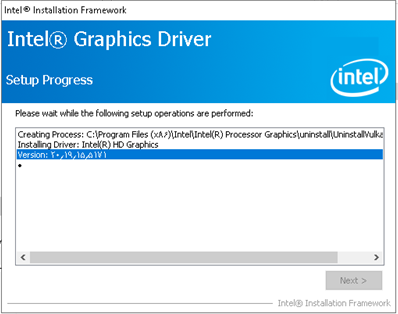

**Image analysis**

```json
{
 "image_name": "image43.png",
 "rId": "rId56",
 "image_path": "img_folder/image_042_image43.png",
 "caption": "پنجره نصب درایور Intel Graphics با نمایش روند نصب و نسخه درایور",
 "ocr_text": "Intel® Installation Framework\nIntel® Graphics Driver\nSetup Progress\nPlease wait while the following setup operations are performed:\nCreating Process: C:\\Program Files (x86)\\Intel\\Intel(R) Processor Graphics\\uninstall\\Uninstall\\setup.exe\nInstalling Driver: Intel(R) HD Graphics\nVersion: 1.0.1.9 (1.0.1.9)\nNext >\nIntel® Installation Framework",
 "visual_description": [
 "پنجره Intel Installation Framework با عنوان Intel® Graphics Driver و بخش Setup Progress نمایش داده شده است",
 "مسیر فایل setup.exe در C:\\Program Files (x86)\\Intel\\Intel(R) Processor Graphics\\uninstall\\Uninstall\\setup.exe نمایش داده می شود",
 "در حال نصب Intel(R) HD Graphics است و نسخه 1.0.1.9 (1.0.1.9) نمایش داده شده",
 "دکمه Next > در پایین سمت راست غیرفعال است و نوار پیشرفت در پنجره دیده می شود"
 ],
 "image_type": "screenshot"
}
```

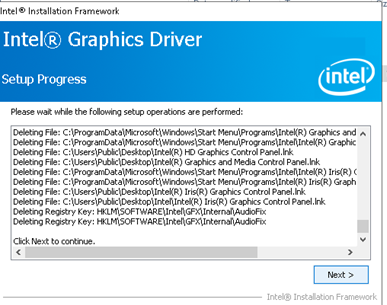

**Image analysis**

```json
{
 "image_name": "image44.png",
 "rId": "rId57",
 "image_path": "img_folder/image_043_image44.png",
 "caption": "پنجره نصب درایور گرافیک اینتل با نمایش عملیات حذف فایل ها",
 "ocr_text": "Intel® Installation Framework\nIntel® Graphics Driver\nSetup Progress\nintel\nPlease wait while the following setup operations are performed:\nDeleting File: C:\\ProgramData\\Microsoft\\Windows\\Start Menu\\Programs\\Intel(R) Graphics and ...\nDeleting File: C:\\ProgramData\\Microsoft\\Windows\\Start Menu\\Programs\\Intel(R) Rapid ...\nDeleting File: C:\\Users\\Public\\Desktop\\Intel(R) Graphics Control Panel.lnk\nDeleting File: C:\\Users\\Public\\Desktop\\Intel(R) Graphics and Media Control Panel.lnk\nDeleting File: C:\\ProgramData\\Microsoft\\Windows\\Start Menu\\Programs\\Intel(R) iRST(R) ...\nDeleting File: C:\\ProgramData\\Microsoft\\Windows\\Start Menu\\Programs\\Intel(R) Rapid ...\nDeleting File: C:\\Users\\Public\\Desktop\\Intel(R) Graphics and Media Control Panel.lnk\nDeleting File: C:\\Users\\Public\\Desktop\\Intel(R) iRST(R) Graphics Control Panel.lnk\nDeleting File: C:\\Users\\Public\\Desktop\\Intel(R) iRST(R) Graphics Control Panel.lnk\nDeleting File: C:\\ProgramData\\Microsoft\\Windows\\Start Menu\\Programs\\Intel(R) Graphics Control Panel.lnk\nDeleting File: C:\\ProgramData\\Microsoft\\Windows\\Start Menu\\Programs\\Intel(R) Graphics Control Panel.lnk\nDeleting File: C:\\Users\\Public\\Desktop\\Intel(R) Graphics Control Panel.lnk\nDeleting Fix: directory Key: HKLM\\SOFTWARE\\Intel\\GFX\\Internal\\AudioFix\nClick Next to continue.\n<\nNext >\nIntel® Installation Framework",
 "visual_description": [
 "پنجره Intel® Installation Framework برای Intel® Graphics Driver با عنوان Setup Progress نمایش داده شده است",
 "یک ناحیه لاگ متنی شامل مسیرهای فایل در ویندوز (C:\\ProgramData و C:\\Users\\Public\\Desktop) و پیام های Deleting File دیده می شود",
 "یک دکمه «Next >» در پایین سمت راست و نماد «intel» در بالای راست وجود دارد"
 ],
 "image_type": "screenshot"
}
```

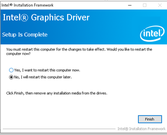

**Image analysis**

```json
{
 "image_name": "image45.png",
 "rId": "rId58",
 "image_path": "img_folder/image_044_image45.png",
 "caption": "پنجره نصب درایور گرافیک اینتل با پیام اتمام نصب و گزینه های راه اندازی مجدد",
 "ocr_text": "Intel® Installation Framework\nIntel® Graphics Driver\nSetup Is Complete\nYou must restart this computer for the changes to take effect. Would you like to restart the computer now?\nYes, I want to restart this computer now.\nNo, I will restart this computer later.\nClick Finish, then remove any installation media from the drives.\nFinish\nIntel® Installation Framework",
 "visual_description": [
 "پنجره نصب Intel Graphics Driver با وضعیت Setup Is Complete نمایش داده شده است",
 "پیام نیاز به راه اندازی مجدد برای اعمال تغییرات وجود دارد",
 "دو گزینه رادیویی برای Restart now و Restart later دیده می شود",
 "دکمه Finish در پایین سمت راست قرار دارد",
 "نوار عنوان Intel® Installation Framework و لوگوی intel در بالای پنجره دیده می شود"
 ],
 "image_type": "screenshot"
}
```

گزینه دوم را انتخاب نمایید.

14. در منوی اول، با انتخاب گزینه 5-Set Config and Reset تنظیمات را ذخیره و دستگاه را Restart نمایید:


**Image analysis**

```json
{
 "image_name": "image32.png",
 "rId": "rId45",
 "image_path": "img_folder/image_031_image32.png",
 "caption": "منوی تنظیمات ATM بانک رفاه با گزینه های Wincor، EastCom، EPP و ابزارها",
 "ocr_text": "Mark Administrator ::Bank Refah ATM Config::\n\n:::Set ATM Config::\n\n1- Wincor Config 2- EastCom Config\n\n3- EPP Config 4- Tools\n\n5- Set Config and Reset\n\nType Number and Press Enter:",
 "visual_description": [
 "پنجره کنسول با پس زمینه آبی و متن سفید نمایش داده شده است",
 "عنوان پنجره: Mark Administrator ::Bank Refah ATM Config::",
 "سربرگ منو: :::Set ATM Config:::",
 "گزینه های منو شامل 1- Wincor Config، 2- EastCom Config، 3- EPP Config، 4- Tools، 5- Set Config and Reset است",
 "در پایین صفحه پیام ورودی: Type Number and Press Enter: نمایش داده می شود"
 ],
 "image_type": "screenshot"
}
```

- در صورت نیاز به استفاده از کلید ترکیبی ALT+Tab، به جای کلید ALT باید

از کلید F12 استفاده نمایید؛ بدین صورت F12+TAB

- جهت فعال نمودن ماوس توسط کیبورد باید از ترکیب کلیدهای
 F12 + Left Shift + Num Lock استفاده نمایید. در این صورت برای حرکت
 دادن مکان نما از کلیدهای زیر استفاده کنید:

8 = Up

K = Down

U = Left

O = Right

برای انجام عملیات انتخاب نیز از کلید I استفاده نمایید.

.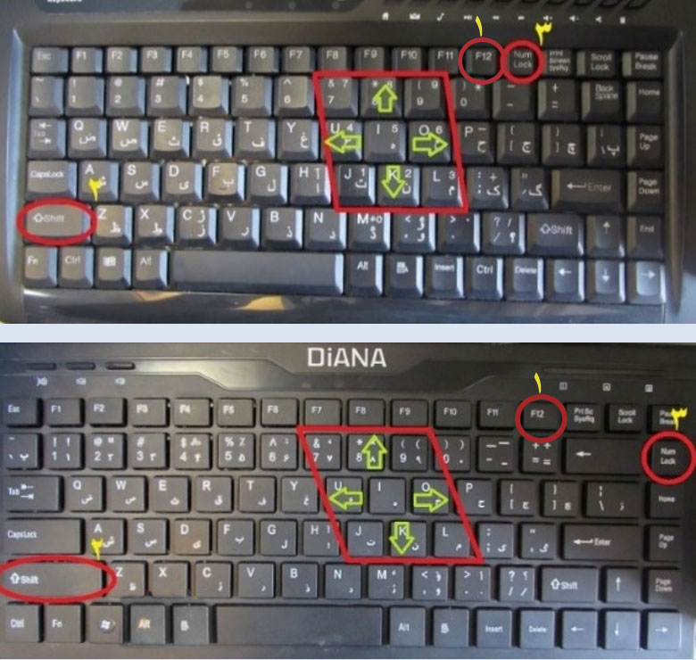

**Image analysis**

```json
{
 "image_name": "image46.jpg",
 "rId": "rId59",
 "image_path": "img_folder/image_045_image46.jpg",
 "caption": "تصویر دو کیبورد با مشخص سازی کلیدهای جهت و کلیدهای Shift، F12 و Num Lock",
 "ocr_text": "DIANA\nEsc\nF1\nF2\nF3\nF4\nF5\nF6\nF7\nF8\nF9\nF10\nF11\nF12\nPrtSc\nSysRq\nScroll\nLock\nPause\nBreak\nNum\nLock\nHome\nPage\nUp\nPage\nDown\nEnd\nInsert\nDelete\nEnter\nCapsLock\nShift\nCtrl\nAlt\ntab",
 "visual_description": [
 "دو تصویر از کیبورد با قاب های قرمز دور ناحیه کلیدهای I/J/K/L و فلش های سبز جهت نما روی آنها",
 "دایره های قرمز روی کلیدهای Shift سمت چپ در هر دو کیبورد",
 "دایره قرمز روی کلید F12 در هر دو کیبورد",
 "دایره قرمز روی کلید Num Lock در کیبورد پایینی",
 "وجود نوشته برند «DIANA» در قسمت بالای کیبورد پایینی"
 ],
 "image_type": "photo"
}
```

- در زمان ورود به ویندوز می توانید از کلیدهای میانبر Ctrl+ESC جهت ورود به
 منوی استارت استفاده نمایید.

# اطلاعات حساب کاربری در ویندوز

پس از بالا آمدن نرم افزار ProCash، جهت دسترسی به محیط ویندوز باید از طریق منوهای اپراتوری و از مسیر زیر از نرم افزار Log off کنید:

**50 Vendor Menu>06 Shutdown>02 Log Off**

سپس برای ورود از نام کاربری[[1]](#footnote-1) و کلمه عبور[[2]](#footnote-2) زیر استفاده نمایید:

<!-- TABLE_START -->
| | |
| --- | --- |
| **Operation** | **Username** |
| **Atm@Supp0rt** | **Password** |
<!-- TABLE_END -->

**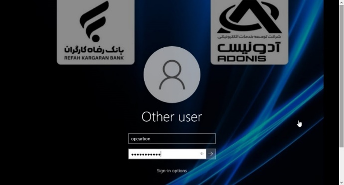

**Image analysis**

```json
{
 "image_name": "image47.jpeg",
 "rId": "rId60",
 "image_path": "img_folder/image_046_image47.jpg",
 "caption": "صفحه ورود کاربر با نام کاربری operation و لوگوهای سازمانی",
 "ocr_text": "بانک رفاه کارگران\nREFAH KARGARAN BANK\nشرکت توسعه خدمات الکترونیکی\nآدونیس\nADONIS\nOther user\noperation\nSign-in options",
 "visual_description": [
 "صفحه ورود سیستم با عنوان \"Other user\" نمایش داده شده است.",
 "فیلد نام کاربری با مقدار \"operation\" قابل مشاهده است.",
 "فیلد گذرواژه به صورت نقطه ای (پنهان) نمایش داده شده است.",
 "گزینه \"Sign-in options\" در پایین فرم ورود دیده می شود.",
 "دو لوگو/برند در بالای تصویر: \"REFAH KARGARAN BANK\" و \"ADONIS\"."
 ],
 "image_type": "screenshot"
}
```**

# تنظیم مانیتور در دستگاه285DY و 285DZ

در منوی START، کلمه یDisplay settings را تایپ و آن را اجرا کنید و یا در صورت وجود ماوس، روی صفحه دسکتاپ راست کلیک و از منویی که گشوده می شود Display settings را انتخاب نمایید:

<!-- TABLE_START -->
| | |
| --- | --- |
|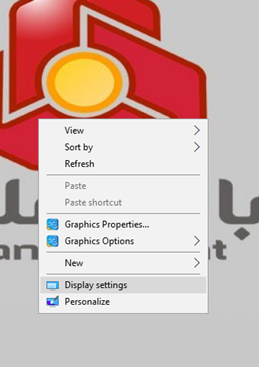

**Image analysis**

```json
{
 "image_name": "image48.png",
 "rId": "rId61",
 "image_path": "img_folder/image_047_image48.png",
 "caption": "منوی راست کلیک ویندوز روی دسکتاپ با گزینه های گرافیک و تنظیمات نمایش",
 "ocr_text": "View\nSort by\nRefresh\nPaste\nPaste shortcut\nGraphics Properties...\nGraphics Options\nNew\nDisplay settings\nPersonalize",
 "visual_description": [
 "منوی زمینه دسکتاپ ویندوز نمایش داده شده است",
 "گزینه های View، Sort by و Refresh در بالای منو دیده می شوند",
 "گزینه های Paste و Paste shortcut غیرفعال (خاکستری) هستند",
 "گزینه های Graphics Properties... و Graphics Options وجود دارد",
 "زیرمنوی New با فلش سمت راست نمایش داده شده است",
 "گزینه های Display settings و Personalize در پایین منو هستند"
 ],
 "image_type": "screenshot"
}
``` |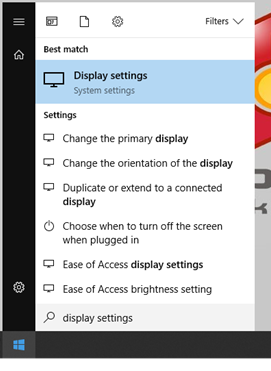

**Image analysis**

```json
{
 "image_name": "image49.png",
 "rId": "rId62",
 "image_path": "img_folder/image_048_image49.png",
 "caption": "نتیجه جست وجوی ویندوز برای Display settings با فهرست گزینه های تنظیمات نمایش",
 "ocr_text": "Filters\nBest match\nDisplay settings\nSystem settings\nSettings\nChange the primary display\nChange the orientation of the display\nDuplicate or extend to a connected display\nChoose when to turn off the screen when plugged in\nEase of Access display settings\nEase of Access brightness setting\ndisplay settings",
 "visual_description": [
 "نمای پنجره جست وجوی ویندوز با بخش Filters و Best match",
 "آیتم انتخاب شده: Display settings (System settings)",
 "فهرست گزینه های تنظیمات نمایش شامل تغییر نمایشگر اصلی، جهت نمایش، Duplicate/Extend، زمان خاموشی صفحه هنگام اتصال برق",
 "نمایش گزینه های Ease of Access مرتبط با نمایش و روشنایی"
 ],
 "image_type": "screenshot"
}
``` |
<!-- TABLE_END -->

در پنجره ی زیر، روی دکمه یIdentify کلیک کنید تا شماره مانیتور به نمایش گذاشته شود:

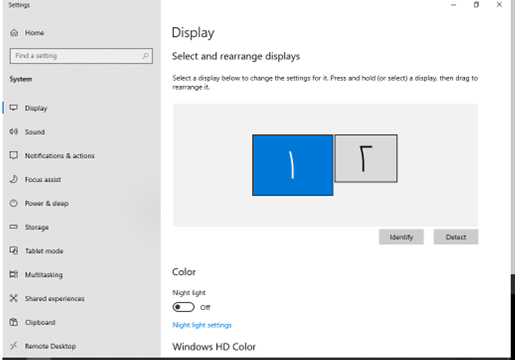

**Image analysis**

```json
{
 "image_name": "image50.png",
 "rId": "rId63",
 "image_path": "img_folder/image_049_image50.png",
 "caption": "صفحه تنظیمات Display ویندوز با گزینه های Identify و Detect و تنظیم Night light",
 "ocr_text": "Settings\nHome\nFind a setting\nSystem\nDisplay\nSound\nNotifications & actions\nFocus assist\nPower & sleep\nStorage\nTablet mode\nMultitasking\nShared experiences\nClipboard\nRemote Desktop\nDisplay\nSelect and rearrange displays\nSelect a display below to change the settings for it. Press and hold (or select) a display, then drag to rearrange it.\nIdentify\nDetect\nColor\nNight light\nOff\nNight light settings\nWindows HD Color",
 "visual_description": [
 "اسکرین شات از Windows Settings در بخش System > Display",
 "بخش «Select and rearrange displays» با دو نمایشگر شماره گذاری شده 1 و 2 نمایش داده شده است",
 "دو دکمه «Identify» و «Detect» در سمت راست پایین ناحیه نمایشگرها دیده می شود",
 "در بخش «Color» گزینه «Night light» با وضعیت «Off» و لینک «Night light settings» وجود دارد",
 "گزینه «Windows HD Color» در پایین صفحه دیده می شود",
 "منوی سمت چپ شامل آیتم های Display، Sound، Notifications & actions، Focus assist، Power & sleep، Storage، Tablet mode، Multitasking، Shared experiences، Clipboard و Remote Desktop است"
 ],
 "image_type": "screenshot"
}
```

مانیتورSOP باید مانیتور شماره 2 باشد:

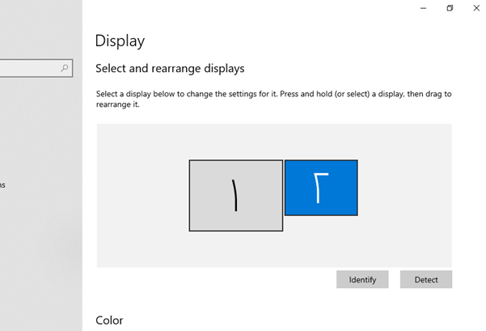

**Image analysis**

```json
{
 "image_name": "image51.png",
 "rId": "rId64",
 "image_path": "img_folder/image_050_image51.png",
 "caption": "پنجره تنظیمات نمایش ویندوز برای چیدمان دو نمایشگر و دکمه های Identify و Detect",
 "ocr_text": "Display\nSelect and rearrange displays\nSelect a display below to change the settings for it. Press and hold (or select) a display, then drag to rearrange it.\n1\n2\nIdentify\nDetect\nColor",
 "visual_description": [
 "اسکرین شات از بخش Display در تنظیمات ویندوز",
 "نمایش گزینه Select and rearrange displays با توضیح جابه جایی نمایشگرها",
 "دو مستطیل نمایشگر با برچسب های 1 و 2 کنار هم نمایش داده شده اند",
 "نمایشگر 2 با رنگ آبی انتخاب شده و نمایشگر 1 خاکستری است",
 "دو دکمه Identify و Detect در پایین سمت راست دیده می شود",
 "عنوان Color در پایین صفحه قابل مشاهده است"
 ],
 "image_type": "screenshot"
}
```

پس از انتخاب مانیتور شماره 2 (SOP)،گزینه ی Make my main dispaly را فعال کنید (تیک آن را بزنید):

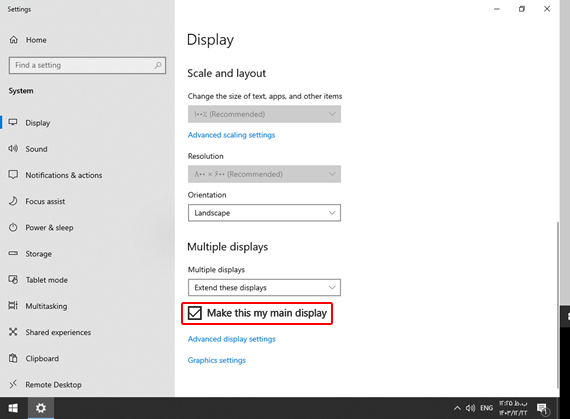

**Image analysis**

```json
{
 "image_name": "image52.png",
 "rId": "rId65",
 "image_path": "img_folder/image_051_image52.png",
 "caption": "صفحه تنظیمات Display ویندوز با گزینه Make this my main display",
 "ocr_text": "Settings\nHome\nFind a setting\nSystem\nDisplay\nSound\nNotifications & actions\nFocus assist\nPower & sleep\nStorage\nTablet mode\nMultitasking\nShared experiences\nClipboard\nRemote Desktop\nDisplay\nScale and layout\nChange the size of text, apps, and other items\n1¼× (Recommended)\nAdvanced scaling settings\nResolution\n1x× 5x (Recommended)\nOrientation\nLandscape\nMultiple displays\nMultiple displays\nExtend these displays\nMake this my main display\nAdvanced display settings\nGraphics settings",
 "visual_description": [
 "اسکرین شات تنظیمات Windows در مسیر System > Display",
 "بخش Multiple displays با منوی کشویی روی Extend these displays",
 "چک باکس Make this my main display نمایش داده شده و تیک خورده است",
 "یک کادر قرمز دور گزینه Make this my main display کشیده شده است",
 "لینک های Advanced display settings و Graphics settings قابل مشاهده اند",
 "گزینه Orientation روی Landscape تنظیم شده است"
 ],
 "image_type": "screenshot"
}
```

# راه اندازی صفحه کلید (EPP)

**در صورت تعویض EPP نیازی به نصب درایور نخواهد بود** **و تنها لازم است از طریق منوهای SOP، به قرار زیر، اقدام به تعیین نوع ماژول نمایید**:

**50 VENDOR MENU🡪 00 EPP FCTS 🡪 01 CHANGE EPP**

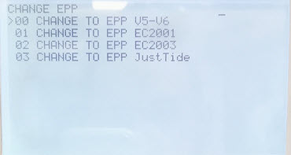

**Image analysis**

```json
{
 "image_name": "image53.jpg",
 "rId": "rId66",
 "image_path": "img_folder/image_052_image53.jpg",
 "caption": "منوی CHANGE EPP با چهار گزینه برای تغییر به نسخه ها و مدل های مختلف",
 "ocr_text": "CHANGE EPP\n0) CHANGE TO EPP U5-V6\n01 CHANGE TO EPP EC2001\n02 CHANGE TO EPP EC2003\n03 CHANGE TO EPP JustTide",
 "visual_description": [
 "نمایشگر تک رنگ با پس زمینه روشن و متن تیره",
 "عنوان صفحه: CHANGE EPP",
 "فهرست گزینه ها با شماره گذاری 0)، 01، 02، 03 برای تغییر به U5-V6، EC2001، EC2003 و JustTide"
 ],
 "image_type": "screenshot"
}
```

جهت نصب EPP مدل های SunSon و Justide باید از کابل SUNSONFDK استفاده نمایید.

درصورتی که EPP جدید از نوع Sunson است لازم است جهت نصب درایور به قسمت بعد (نصب درایور EPP SunSon ) مراجعه کنید.

# نصب درایور EPP SUNSON

پس از ورود به محیط ویندوز، درصورتی که EPP دستگاه از نوعSunson می باشد لازم است با مراجعه به دستورالعمل مربوطه، آخرین نسخه را نصب نمایید:

نکته مهم: توجه داشته باشید که EPP مدل SunSon حتماً باید از طریق
کابل EPP to Softkey به Softkey متصل گردد چراکه در غیر این صورت عملکرد آن با اشکال مواجه خواهد شد.

تنظیم Computer Name

با انجام مراحل زیر، Computer Name را تنظیم نمایید:

1. به Control Panel بروید.
2. روی آیکون System کلیک کنید:

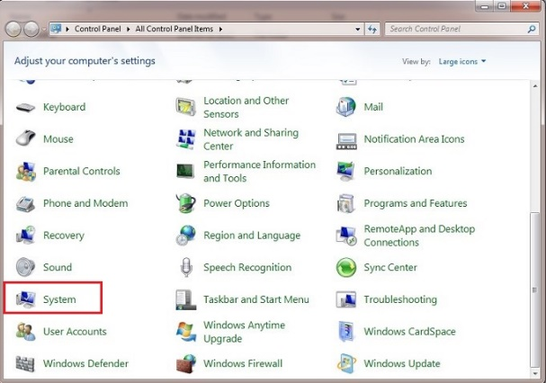

**Image analysis**

```json
{
 "image_name": "image54.jpeg",
 "rId": "rId67",
 "image_path": "img_folder/image_053_image54.jpg",
 "caption": "نمایی از کنترل پنل ویندوز با گزینه System مشخص شده.",
 "ocr_text": "Control Panel > All Control Panel Items\nSearch Control Panel\nAdjust your computer's settings\nView by: Large icons\nKeyboard\nMouse\nParental Controls\nPhone and Modem\nRecovery\nSound\nSystem\nUser Accounts\nWindows Defender\nLocation and Other Sensors\nNetwork and Sharing Center\nPerformance Information and Tools\nPower Options\nRegion and Language\nSpeech Recognition\nTaskbar and Start Menu\nWindows Anytime Upgrade\nWindows Firewall\nMail\nNotification Area Icons\nPersonalization\nPrograms and Features\nRemoteApp and Desktop Connections\nSync Center\nTroubleshooting\nWindows CardSpace\nWindows Update",
 "visual_description": [
 "پنجره Control Panel در حالت All Control Panel Items نمایش داده شده است.",
 "گزینه View by روی Large icons قرار دارد.",
 "آیتم System با یک کادر قرمز مشخص شده است.",
 "کادر جستجو با متن Search Control Panel در بالا سمت راست دیده می شود."
 ],
 "image_type": "screenshot"
}
```

3. در پنجره ای که گشوده می شود، رویRename This PC کلیک کنید:

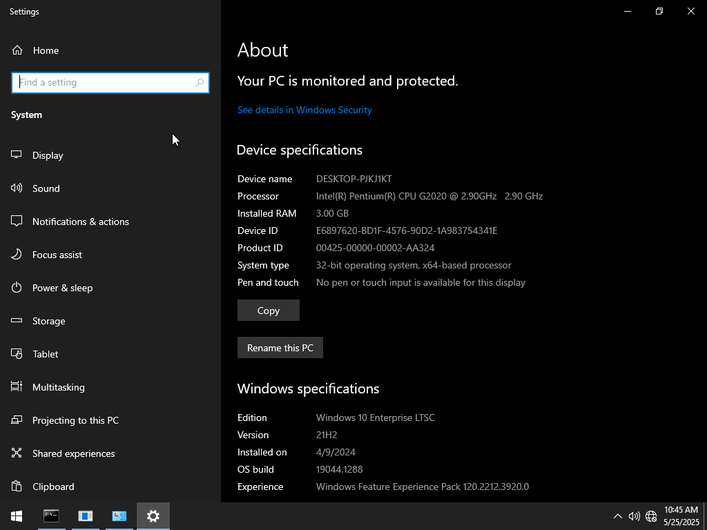

**Image analysis**

```json
{
 "image_name": "image55.png",
 "rId": "rId68",
 "image_path": "img_folder/image_054_image55.png",
 "caption": "صفحه About در تنظیمات ویندوز با مشخصات دستگاه و نسخه Windows 10",
 "ocr_text": "Settings\nHome\nFind a setting\nSystem\nDisplay\nSound\nNotifications & actions\nFocus assist\nPower & sleep\nStorage\nTablet\nMultitasking\nProjecting to this PC\nShared experiences\nClipboard\nAbout\nYour PC is monitored and protected.\nSee details in Windows Security\nDevice specifications\nDevice name\nDESKTOP-PJKJ1KT\nProcessor\nIntel(R) Pentium(R) CPU G2020 @ 2.90GHz 2.90 GHz\nInstalled RAM\n3.00 GB\nDevice ID\nE6897620-BD1F-4576-90D2-1A983754341E\nProduct ID\n00425-00000-00002-AA324\nSystem type\n32-bit operating system, x64-based processor\nPen and touch\nNo pen or touch input is available for this display\nCopy\nRename this PC\nWindows specifications\nEdition\nWindows 10 Enterprise LTSC\nVersion\n21H2\nInstalled on\n4/9/2024\nOS build\n19044.1288\nExperience\nWindows Feature Experience Pack 120.2212.3920.0\n10:45 AM\n4/15/2024",
 "visual_description": [
 "اسکرین شات صفحه Settings > System > About در ویندوز",
 "مشخصات پردازنده: Intel(R) Pentium(R) CPU G2020 @ 2.90GHz",
 "حافظه RAM نصب شده: 3.00 GB",
 "نوع سیستم: 32-bit operating system, x64-based processor",
 "نسخه ویندوز: Windows 10 Enterprise LTSC، Version 21H2، OS build 19044.1288",
 "نمایش Device ID و Product ID به صورت رشته های متنی",
 "وجود دکمه های Copy و Rename this PC"
 ],
 "image_type": "screenshot"
}
```

4. طبق قالب زیر، Computer Name را درج نمایید:

ATM- شماره ترمینال دستگاه

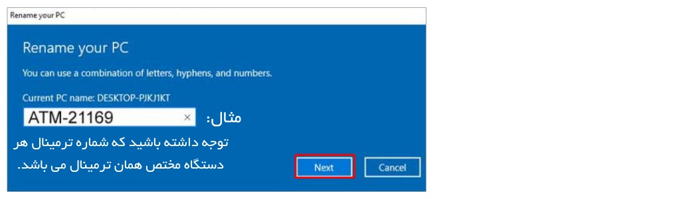

**Image analysis**

```json
{
 "image_name": "image56.jpg",
 "rId": "rId69",
 "image_path": "img_folder/image_055_image56.jpg",
 "caption": "صفحه تغییر نام رایانه با نمونه نام گذاری ترمینال و دکمه Next مشخص شده",
 "ocr_text": "Rename your PC\nYou can use a combination of letters, hyphens, and numbers.\nCurrent PC name: DESKTOP-PIJKJKT\nATM-21169\nمثال:\nتوجه داشته باشید که شماره ترمینال هر دستگاه مختص همان ترمینال می باشد.\nNext\nCancel",
 "visual_description": [
 "پنجره تنظیمات ویندوز برای تغییر نام رایانه نمایش داده شده است",
 "فیلد نام جدید شامل مقدار «ATM-21169» است",
 "نام فعلی رایانه به صورت «DESKTOP-PIJKJKT» نمایش داده شده است",
 "دکمه «Next» با کادر قرمز برجسته شده و دکمه «Cancel» کنار آن قرار دارد",
 "متن فارسی توضیح می دهد شماره ترمینال هر دستگاه مختص همان ترمینال است"
 ],
 "image_type": "screenshot"
}
```

توجه داشته باشید که شماره ترمینال هر دستگاه مختص همان ترمینال می باشد.

مثال:

5. روی دکمه ی Next و سپس Restart later کلیک کنید:

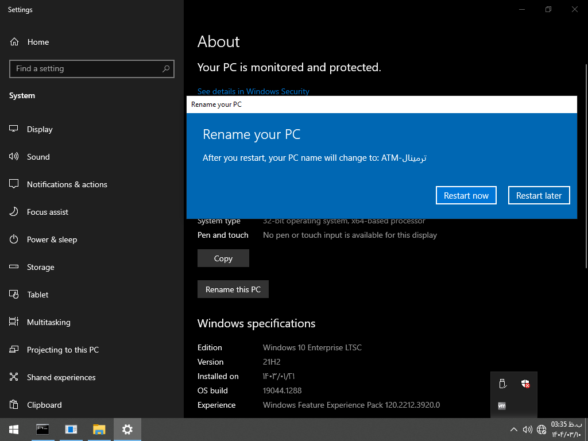

**Image analysis**

```json
{
 "image_name": "image57.png",
 "rId": "rId70",
 "image_path": "img_folder/image_056_image57.png",
 "caption": "صفحه About تنظیمات ویندوز با پیام تغییر نام رایانه و دکمه های Restart",
 "ocr_text": "Settings\nHome\nFind a setting\nSystem\nDisplay\nSound\nNotifications & actions\nFocus assist\nPower & sleep\nStorage\nTablet\nMultitasking\nProjecting to this PC\nShared experiences\nClipboard\nAbout\nYour PC is monitored and protected.\nSee details in Windows Security\nRename your PC\nRename your PC\nAfter you restart, your PC name will change to: ATM-ترمینال\nRestart now\nRestart later\nSystem type\n32-bit operating system, x64-based processor\nPen and touch\nNo pen or touch input is available for this display\nCopy\nRename this PC\nWindows specifications\nEdition\nWindows 10 Enterprise LTSC\nVersion\n21H2\nInstalled on\n۱۴۰۳/۰۱/۲۱\nOS build\n19044.1288\nExperience\nWindows Feature Experience Pack 120.2212.3920.0\n03:35 ب.ظ",
 "visual_description": [
 "اسکرین شات از برنامه Settings ویندوز در بخش System > About",
 "پنجره پاپ آپ «Rename your PC» نمایش داده شده و نام جدید «ATM-ترمینال» را پس از ری استارت اعلام می کند",
 "دو دکمه در پاپ آپ: «Restart now» و «Restart later»",
 "مشخصات سیستم نمایش داده شده: «32-bit operating system, x64-based processor»",
 "Windows specifications شامل: Windows 10 Enterprise LTSC، Version 21H2، OS build 19044.1288"
 ],
 "image_type": "screenshot"
}
```

# بررسی تاریخ و ساعت

به کنترل پنل بروید و روی Date and Time کلیک کنید:

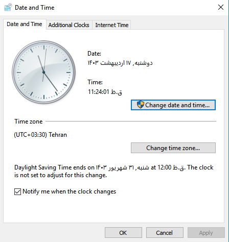

**Image analysis**

```json
{
 "image_name": "image58.tmp",
 "rId": "rId71",
 "image_path": "img_folder/image_057_image58.png",
 "caption": "پنجره تنظیمات Date and Time ویندوز با تاریخ و ساعت فارسی و منطقه زمانی تهران",
 "ocr_text": "Date and Time\nDate and Time Additional Clocks Internet Time\nDate:\nدوشنبه، ۱۷ اردیبهشت ۱۴۰۳\nTime:\n11:24:01 ق.ظ\nChange date and time...\nTime zone\n(UTC+03:30) Tehran\nChange time zone...\nDaylight Saving Time ends on ۱۴۰۳ فروردین ۳۱, شنبه at 12:00 ق.ظ. The clock\nis not set to adjust for this change.\nNotify me when the clock changes\nOK Cancel Apply",
 "visual_description": [
 "پنجره تنظیمات ویندوز با عنوان Date and Time و تب های Date and Time، Additional Clocks و Internet Time",
 "نمایش تاریخ به فارسی: دوشنبه، ۱۷ اردیبهشت ۱۴۰۳",
 "نمایش زمان: 11:24:01 ق.ظ",
 "نمایش منطقه زمانی: (UTC+03:30) Tehran",
 "وجود دکمه های Change date and time... و Change time zone...",
 "متن مربوط به Daylight Saving Time و عدم تنظیم ساعت برای این تغییر",
 "گزینه تیک دار Notify me when the clock changes",
 "دکمه های OK، Cancel و Apply (Apply غیرفعال)"
 ],
 "image_type": "screenshot"
}
```

# ساخت درایو D

از کل ظرفیت هارددیسک، 105 گیگابایت می باید به درایو C و مابقی به درایو D - محل ذخیره سازی تصاویر و ... - اختصاص داده شده باشد.

**ساخت درایو D در این مرحله و قبل از نصب نرم افزار دوربین ضروری است.**

درصورتی که ظرفیت هارددیسک، همانند آنچه گفته شد تقسیم بندی نشده است، مراحل زیر را انجام دهید:

1. روی My Computer راست کلیک کنید و از منویی که گشوده می شود، Manage را برگزینید:

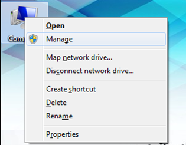

**Image analysis**

```json
{
 "image_name": "image59.png",
 "rId": "rId72",
 "image_path": "img_folder/image_058_image59.png",
 "caption": "منوی راست کلیک ویندوز با گزینه های مدیریت و نگاشت درایو شبکه",
 "ocr_text": "Open\nManage\nMap network drive...\nDisconnect network drive...\nCreate shortcut\nDelete\nRename\nProperties",
 "visual_description": [
 "منوی زمینه ای ویندوز نمایش داده شده است.",
 "گزینه Manage با پس زمینه آبی هایلایت شده است.",
 "گزینه های Map network drive... و Disconnect network drive... در فهرست دیده می شوند.",
 "گزینه های Create shortcut، Delete، Rename و Properties قابل مشاهده اند."
 ],
 "image_type": "screenshot"
}
```

2. در سمت چپ پنجره ای که باز می شود همانند شکل زیر روی Disk Management کلیک کنید:

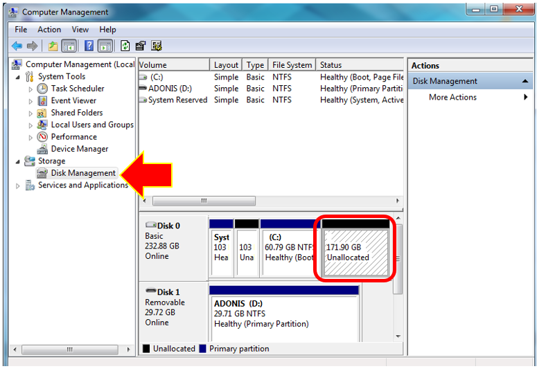

**Image analysis**

```json
{
 "image_name": "image60.tmp",
 "rId": "rId73",
 "image_path": "img_folder/image_059_image60.png",
 "caption": "پنجره Disk Management با فضای Unallocated مشخص شده روی دیسک ۰",
 "ocr_text": "Computer Management\nFile Action View Help\nComputer Management (Local)\nSystem Tools\nTask Scheduler\nEvent Viewer\nShared Folders\nLocal Users and Groups\nPerformance\nDevice Manager\nStorage\nDisk Management\nServices and Applications\nVolume\nLayout\nType\nFile System\nStatus\n(C:)\nADONIS (D:)\nSystem Reserved\nSimple\nBasic\nNTFS\nHealthy (Boot, Page Fi\nHealthy (Primary Partiti\nHealthy (System, Active\nActions\nDisk Management\nMore Actions\nDisk 0\nBasic\n232.88 GB\nOnline\nSyst\n103\n103\nUna\n(C:)\n60.79 GB NT\nHealthy (Boot\n171.90 GB\nUnallocated\nDisk 1\nRemovable\n29.72 GB\nOnline\nADONIS (D:)\n29.71 GB NTFS\nHealthy (Primary Partition)\nUnallocated\nPrimary partition",
 "visual_description": [
 "اسکرین شات از Windows Computer Management در بخش Storage > Disk Management",
 "یک فلش قرمز بزرگ به گزینه Disk Management در پنل چپ اشاره می کند",
 "یک کادر قرمز دور یک ناحیه پارتیشن با برچسب 171.90 GB Unallocated روی Disk 0 کشیده شده است",
 "Disk 0 با ظرفیت 232.88 GB و وضعیت Online نمایش داده می شود",
 "پارتیشن (C:) با اندازه 60.79 GB و فایل سیستم NTFS نمایش داده شده است",
 "Disk 1 به صورت Removable با ظرفیت 29.72 GB و برچسب ADONIS (D:) با NTFS نمایش داده می شود"
 ],
 "image_type": "screenshot"
}
```

3. سپس فضای Unallocated مربوط به هارد را انتخاب کنید.
4. از منویAction، گزینه All Tasks>New Simple Volume را انتخاب کنید:

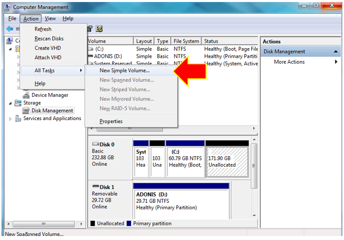

**Image analysis**

```json
{
 "image_name": "image61.tmp",
 "rId": "rId74",
 "image_path": "img_folder/image_060_image61.png",
 "caption": "اسکرین شات Disk Management در ویندوز با منوی All Tasks و گزینه New Simple Volume.",
 "ocr_text": "Computer Management\nFile Action View Help\nRefresh\nRescan Disks\nCreate VHD\nAttach VHD\nAll Tasks >\nHelp\nDevice Manager\nStorage\nDisk Management\nServices and Applications\nVolume\nLayout\nType\nFile System\nStatus\nActions\nDisk Management\nMore Actions\nNew Simple Volume...\nNew Spanned Volume...\nNew Striped Volume...\nNew Mirrored Volume...\nNew RAID-5 Volume...\nProperties\nDisk 0\nBasic\n232.88 GB\nOnline\nDisk 1\nRemovable\n297.20 GB\nOnline\nADONIS (D:)\n29.71 GB NTFS\nHealthy (Primary Partition)\n(C:)\n60.79 GB NTFS\nHealthy (Boot,\n171.90 GB\nUnallocated\nUnallocated\nPrimary partition\nSystem Reserv...\nADONIS (D:)\n(C:)",
 "visual_description": [
 "پنجره Computer Management با انتخاب Disk Management نمایش داده شده است.",
 "منوی Action باز است و زیرمنوی All Tasks گزینه های New Simple Volume و سایر Volumeها را نشان می دهد.",
 "یک فلش قرمز بزرگ به گزینه «New Simple Volume...» اشاره می کند.",
 "در لیست بالا ستون های Volume، Layout، Type، File System و Status قابل مشاهده اند.",
 "Disk 0 با ظرفیت 232.88 GB و وضعیت Online نمایش داده شده است.",
 "روی Disk 0 یک بخش «171.90 GB Unallocated» دیده می شود.",
 "پارتیشن (C:) با 60.79 GB و فایل سیستم NTFS نمایش داده شده است.",
 "Disk 1 به صورت Removable با 297.20 GB و وضعیت Online نمایش داده شده است.",
 "پارتیشن ADONIS (D:) با 29.71 GB NTFS و وضعیت Healthy (Primary Partition) دیده می شود."
 ],
 "image_type": "screenshot"
}
```

5. روی دکمه ی Next کلیک کنید:

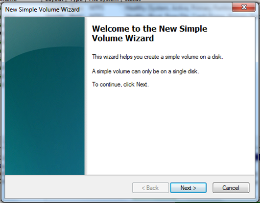

**Image analysis**

```json
{
 "image_name": "image62.png",
 "rId": "rId75",
 "image_path": "img_folder/image_061_image62.png",
 "caption": "صفحه خوش آمدگویی «New Simple Volume Wizard» برای ایجاد یک ولوم ساده روی دیسک",
 "ocr_text": "New Simple Volume Wizard\nWelcome to the New Simple\nVolume Wizard\nThis wizard helps you create a simple volume on a disk.\nA simple volume can only be on a single disk.\nTo continue, click Next.\n< Back\nNext >\nCancel",
 "visual_description": [
 "پنجره جادوی ایجاد ولوم ساده با عنوان New Simple Volume Wizard نمایش داده شده است",
 "متن توضیح می دهد ولوم ساده فقط روی یک دیسک می تواند باشد و برای ادامه باید Next کلیک شود",
 "دکمه های ناوبری < Back، Next > و Cancel در پایین پنجره وجود دارند"
 ],
 "image_type": "screenshot"
}
```

6. در این مرحله نیز بدون تغییر اطلاعات موجود، فقط روی Next کلیک کنید:

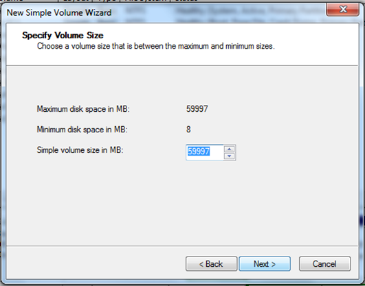

**Image analysis**

```json
{
 "image_name": "image63.png",
 "rId": "rId76",
 "image_path": "img_folder/image_062_image63.png",
 "caption": "پنجره New Simple Volume Wizard برای تعیین اندازه ولوم در ویندوز",
 "ocr_text": "New Simple Volume Wizard\nSpecify Volume Size\nChoose a volume size that is between the maximum and minimum sizes.\n\nMaximum disk space in MB: 59997\nMinimum disk space in MB: 8\nSimple volume size in MB: 59997\n\n< Back\nNext >\nCancel",
 "visual_description": [
 "پنجره ویزارد «New Simple Volume Wizard» در مرحله «Specify Volume Size» نمایش داده شده است.",
 "حداکثر فضای دیسک 59997 مگابایت و حداقل 8 مگابایت نشان داده می شود.",
 "فیلد ورودی «Simple volume size in MB» مقدار 59997 دارد و کنترل افزایشی/کاهشی دارد.",
 "دکمه های «< Back»، «Next >» و «Cancel» در پایین پنجره موجود است."
 ],
 "image_type": "screenshot"
}
```

7. در پنجره ی زیر، همانند شکل زیر از منوی Assign the following drive letter، حرف D را به عنوان نام درایو انتخاب و سپس روی دکمه ی Next کلیک نمایید:

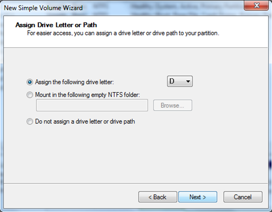

**Image analysis**

```json
{
 "image_name": "image64.png",
 "rId": "rId77",
 "image_path": "img_folder/image_063_image64.png",
 "caption": "پنجره New Simple Volume Wizard برای تعیین حرف درایو یا مسیر پارتیشن",
 "ocr_text": "New Simple Volume Wizard\nAssign Drive Letter or Path\nFor easier access, you can assign a drive letter or drive path to your partition.\nAssign the following drive letter:\nD\nMount in the following empty NTFS folder:\nBrowse...\nDo not assign a drive letter or drive path\n< Back\nNext >\nCancel",
 "visual_description": [
 "پنجره ویزارد «New Simple Volume Wizard» در مرحله «Assign Drive Letter or Path» نمایش داده شده است",
 "گزینه «Assign the following drive letter» انتخاب شده و حرف درایو روی D تنظیم است",
 "دو گزینه دیگر شامل «Mount in the following empty NTFS folder» با دکمه Browse و «Do not assign a drive letter or drive path» وجود دارد",
 "دکمه های ناوبری پایین شامل «< Back»، «Next >» و «Cancel» هستند"
 ],
 "image_type": "screenshot"
}
```

8. در مرحله ی بعدی تنظیمات زیر را انجام دهید و روی دکمه ی Next کلیک کنید:

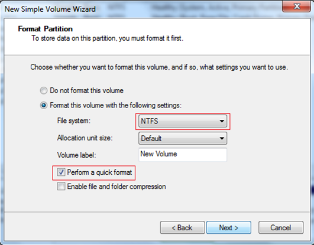

**Image analysis**

```json
{
 "image_name": "image65.png",
 "rId": "rId78",
 "image_path": "img_folder/image_064_image65.png",
 "caption": "پنجره تنظیمات فرمت پارتیشن در New Simple Volume Wizard با انتخاب فایل سیستم NTFS",
 "ocr_text": "New Simple Volume Wizard\nFormat Partition\nTo store data on this partition, you must format it first.\n\nChoose whether you want to format this volume, and if so, what settings you want to use.\n\nDo not format this volume\nFormat this volume with the following settings:\nFile system:\nNTFS\nAllocation unit size:\nDefault\nVolume label:\nNew Volume\nPerform a quick format\nEnable file and folder compression\n\n< Back\nNext >\nCancel",
 "visual_description": [
 "پنجره New Simple Volume Wizard در مرحله Format Partition نمایش داده شده است.",
 "گزینه «Format this volume with the following settings:» انتخاب شده است.",
 "فهرست کشویی File system روی NTFS قرار دارد.",
 "Allocation unit size روی Default تنظیم شده است.",
 "Volume label برابر New Volume است.",
 "گزینه Perform a quick format تیک خورده است.",
 "گزینه Enable file and folder compression بدون تیک است.",
 "دکمه های < Back، Next > و Cancel در پایین پنجره موجود هستند."
 ],
 "image_type": "screenshot"
}
```

9. در آخر روی دکمه ی Finish کلیک نمایید:

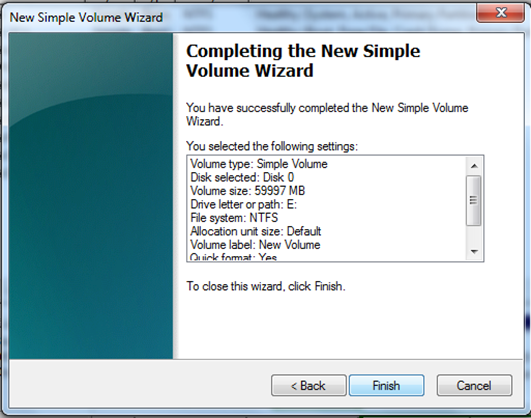

**Image analysis**

```json
{
 "image_name": "image66.png",
 "rId": "rId79",
 "image_path": "img_folder/image_065_image66.png",
 "caption": "پایان ویزارد ساخت Simple Volume با درایو E: و فایل سیستم NTFS",
 "ocr_text": "New Simple Volume Wizard\n\nCompleting the New Simple\nVolume Wizard\n\nYou have successfully completed the New Simple Volume\nWizard.\n\nYou selected the following settings:\n\nVolume type: Simple Volume\nDisk selected: Disk 0\nVolume size: 59997 MB\nDrive letter or path: E:\nFile system: NTFS\nAllocation unit size: Default\nVolume label: New Volume\n\nTo close this wizard, click Finish.\n\n< Back\nFinish\nCancel",
 "visual_description": [
 "پنجره New Simple Volume Wizard در مرحله Completing نمایش داده شده است",
 "تنظیمات نمایش داده شده: Disk 0، حجم 59997 MB، حرف درایو E:\\، فایل سیستم NTFS، Allocation unit size پیش فرض، برچسب New Volume",
 "دکمه های < Back، Finish و Cancel در پایین پنجره دیده می شوند"
 ],
 "image_type": "screenshot"
}
```

# نصب SP دوربین

جهت نصب SP دوربین به آدرس C:\Program Files\Adonis\Camera بروید و فایل
Camera Configuration.exe را برای دوربین های USB و BNC اجرا نمایید. سپس از قسمت
 Camera Config File فایل مربوط به Refah\_USB\_Full\_PAN و Refah\_BNC\_Full\_PAN را
آدرسی دهی کنید.

با مراجعه به مسیر زیر، فایل کانفیگ را مسیردهی و بر اساس نوع دوربین انتخاب نمایید:

C:\Program Files\Adonis\Camera\CameraConfiguration

# اجرای فایل های KMS

1. به آدرس زیر بروید:

**Flash or Hard:\Software\ATM\Refah\KMSWindows**

2. فایل های KMS.bat و KmsWindows.bat را کپی و در درایو C ذخیره کنید.
3. روی فایل KMS.bat - در درایو C - راست کلیک و از منویی که نمایان می شود
 Run As Administrator را انتخاب نمایید.
4. صبر کنید تا پیغام Successfully به نمایش درآید؛ روی دکمه ی OK کلیک کنید.
5. روی فایل KmsWindows.bat - در درایو C - راست کلیک و از منویی که گشوده می شود
 Run As Administrator را انتخاب کنید.
6. صبر کنید تا پیغام Successfully به نمایش درآید؛ روی دکمه ی OK کلیک کنید:

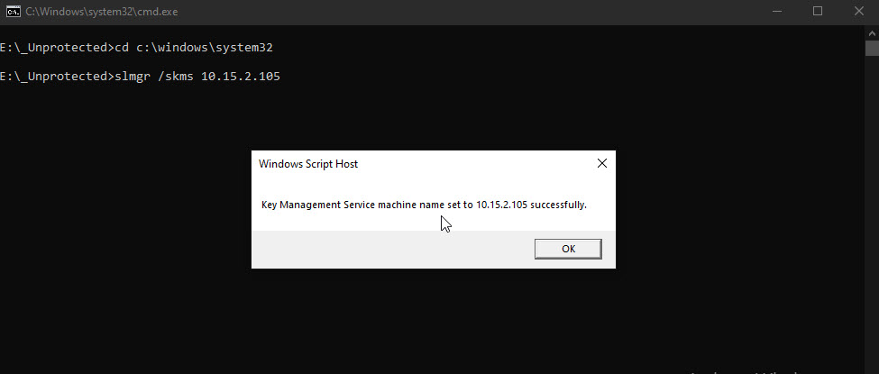

**Image analysis**

```json
{
 "image_name": "image67.jpg",
 "rId": "rId80",
 "image_path": "img_folder/image_066_image67.jpg",
 "caption": "تنظیم آدرس سرور KMS با دستور slmgr و نمایش پیام موفقیت",
 "ocr_text": "C:\\Windows\\system32\\cmd.exe\n\nE:\\_Unprotected>cd c:\\windows\\system32\n\nE:\\_Unprotected>slmgr /skms 10.15.2.105\n\nWindows Script Host\n\nKey Management Service machine name set to 10.15.2.105 successfully.\n\nOK",
 "visual_description": [
 "پنجره Command Prompt در مسیر E:\\_Unprotected نمایش داده شده است",
 "دستور cd c:\\windows\\system32 اجرا شده است",
 "دستور slmgr /skms 10.15.2.105 برای تنظیم KMS اجرا شده است",
 "کادر Windows Script Host پیام موفقیت تنظیم نام ماشین KMS به 10.15.2.105 را نشان می دهد",
 "در کادر پیام یک دکمه OK وجود دارد"
 ],
 "image_type": "screenshot"
}
```

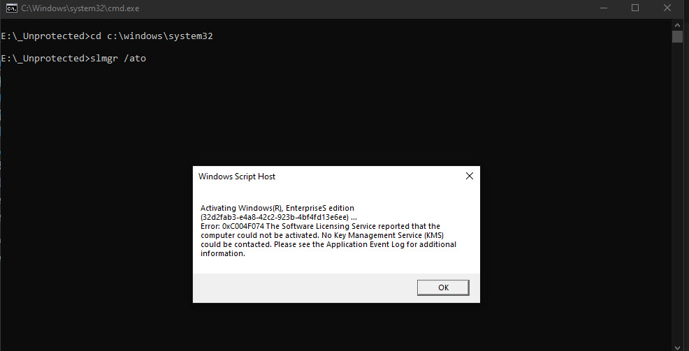

**Image analysis**

```json
{
 "image_name": "image68.jpg",
 "rId": "rId81",
 "image_path": "img_folder/image_067_image68.jpg",
 "caption": "نمایش خطای فعال سازی ویندوز با slmgr /ato و عدم دسترسی به KMS",
 "ocr_text": "C:\\Windows\\system32\\cmd.exe\n\nE:\\_Unprotected>cd c:\\windows\\system32\n\nE:\\_Unprotected>slmgr /ato\n\nWindows Script Host\n\nActivating Windows(R), EnterpriseS edition\n(32df2ab3-e4a8-42c2-923b-4bf4fd13e6ee) ...\nError: 0xC004F074 The Software Licensing Service reported that the\ncomputer could not be activated. No Key Management Service (KMS)\ncould be contacted. Please see the Application Event Log for additional\ninformation.\n\nOK",
 "visual_description": [
 "پنجره Command Prompt مسیر C:\\Windows\\system32 را باز کرده و دستور slmgr /ato اجرا شده است.",
 "پنجره Windows Script Host خطای 0xC004F074 را نمایش می دهد: عدم امکان فعال سازی و عدم دسترسی به KMS.",
 "یک دکمه OK در پنجره خطا وجود دارد."
 ],
 "image_type": "screenshot"
}
```

در صورت دریافت پیغام خطا، ابتدا اتصال شبکه خودپرداز را بررسی و با استفاده از دستور زیر وضعیت باز بودن پورت KMS را بررسی نمایید:

Telnet 10.15.2.105 1688

در صورت برقرار بودن ارتباط شبکه و دریافت خطا، با شماره تلفن 02178437421 تماس بگیرید.

# تنظیمات NDCSecure

به درایو C و پوشه ی NDCSecure بروید، ابتدا با مراجعه به هارد یا فلش، فایل ndcSecure.jar با حجم 61 کیلوبایت در آدرس C:\NDCSecure کپی نمایید. سپس فایلSequence.bat را اجرا کنید (یک پنجره ی CMD باز و بسته خواهد شد). سپس از فایل PooyaForwardServer.properties شماره سریال را (بدون در نظر گرفتن حرف N) به شرکت خدمات نوین اعلام نمایید:

سریال NDCSecure، انحصاری و مختص همان دستگاه است و در دستگاه های مختلف، متفاوت می باشد.


**Image analysis**

```json
{
 "image_name": "image5.png",
 "rId": "rId18",
 "image_path": "img_folder/image_004_image5.png",
 "caption": "نمایش فایل تنظیمات PooyaForwardServer با پورت ها، آدرس سرور و مسیر لاگ",
 "ocr_text": "ListenerPort = 9005\n\nServer = 10.15.0.66:9600\nProtocolHeader = 2B\n\nLogFile = c:/ndcsecure/log/ndcSecure\n\nAgentPropertiesServiceAddress = http://10.15.45.100:9600/atmAgent/properties\nAgentGetLastVersionServiceAddress = http://10.15.45.100:9600/atmAgent/getLastVersion\nSerialNumber = 994429903926 N",
 "visual_description": [
 "اسکرین شات Notepad++ از فایل PooyaForwardServer.properties با 12 خط",
 "پارامتر ListenerPort برابر 9005 تنظیم شده است",
 "پارامتر Server برابر 10.15.0.66:9600 است",
 "ProtocolHeader مقدار 2B دارد",
 "مسیر LogFile برابر c:/ndcsecure/log/ndcSecure است",
 "دو URL سرویس Agent با آدرس 10.15.45.100:9600 مشخص شده اند",
 "SerialNumber مقدار 994429903926 N دارد"
 ],
 "image_type": "screenshot"
}
```

در صورت عدم برقراری ارتباط دستگاه (Out of Service ماندن) قبل از تماس با انفورماتیک بانک، فایل NDCSecure\_Permission\_v1.0.0.1 را جهت اشتراک گذاری و ایجاد دسترسی به پوشه یNDCSecure اجرا نمایید.

لازم به ذکر است دسترسی ایجاد شده به صورت اتوماتیک پس از یک ساعت از دسترس خارج خواهد شد، لذا در هر زمان که نیاز به اشتراک گذاری این فولدر با انفورماتیک بانک می باشد باید فایل فوق رااجرا نمایید

در صورت بروز هرگونه اشکال در NDCSecure با شماره زیر تماس بگیرید:

300-02178437298

# *بررسی و اعمال تنظیمات ارزش گذاری کاست*

به منظور انجام تنظیمات مربوط به کاست 000/000/1 ریالی و 000/000/2 ریالی، فایل
 Change Value V 1.0.0.2 را اجرا نمایید. سپس تنظیمات لازم را با توجه به پروفایل انتخابی، اعمال نمایید:

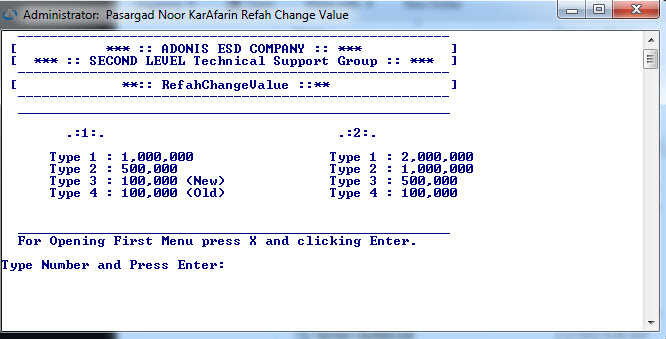

**Image analysis**

```json
{
 "image_name": "image69.jpg",
 "rId": "rId82",
 "image_path": "img_folder/image_068_image69.jpg",
 "caption": "اسکرین شات پنجره RefahChangeValue با فهرست انواع و مقادیر عددی و دستور ورود",
 "ocr_text": "Administrator: Pasargad Noor KarAfarin Refah Change Value\n\n[ *** :: ADONIS ESD COMPANY :: *** ]\n[ *** :: SECOND LEVEL Technical Support Group :: *** ]\n\n***:: RefahChangeValue ::***\n\n\n.:1:. .:2:.\n\nType 1 : 1,000,000 Type 1 : 2,000,000\nType 2 : 500,000 Type 2 : 1,000,000\nType 3 : 100,000 (New) Type 3 : 500,000\nType 4 : 100,000 (Old) Type 4 : 100,000\n\n\nFor Opening First Menu press X and clicking Enter.\n\nType Number and Press Enter:",
 "visual_description": [
 "پنجره کنسولی با عنوان Administrator: Pasargad Noor KarAfarin Refah Change Value نمایش داده شده است",
 "هدر شامل نام شرکت ADONIS ESD COMPANY و SECOND LEVEL Technical Support Group است",
 "دو ستون با برچسب های .:1:. و .:2:. شامل Type 1 تا Type 4 و مقادیر عددی متفاوت هستند",
 "برای Type 3 و Type 4 در ستون اول برچسب های (New) و (Old) دیده می شود",
 "دستورهای متنی برای باز کردن منوی اول با کلید X و Enter و همچنین ورود شماره نوع و فشردن Enter نمایش داده شده است"
 ],
 "image_type": "screenshot"
}
```

# نصب آنتی ویروس Kaspersky

## الف) مراحل انجام عملیات نصب

1. با مراجعه به مسیر زیر، با توجه به محل نصب دستگاه (تهران یا شهرستان) و توضیحاتی که در ادامه می آید، فایل آنتی ویروس مناسب را انتخاب، کپی و در درایو C ذخیره نمایید:

**Flash or HDD:\Software\Antivirus\Refah**

در این مرحله لازم است با توجه به محل نصب دستگاه (تهران یا شهرستان) و اطلاعات IP به پوشه ی مربوطه بروید:

الف: دستگاه های نصب شده در تهران: فایل ها بر اساس رنج IP دستگاه ها
 دسته بندی شده اند (10.48.x.x , 10.49.x.x, 10.54.x.x).

ب: دستگاه های نصب شده در شهرستان: فایل نصبی در پوشه هایی به نام هر استان
 تفکیک شده اند.

2. روی فایل آنتی ویروس با نام installer.exe که در درایو D کپی نموده اید، دوکلیک کنید.
3. در پنجره ای که گشوده می شود، Start Installation را با زدن کلیدSpace انتخاب نمایید:

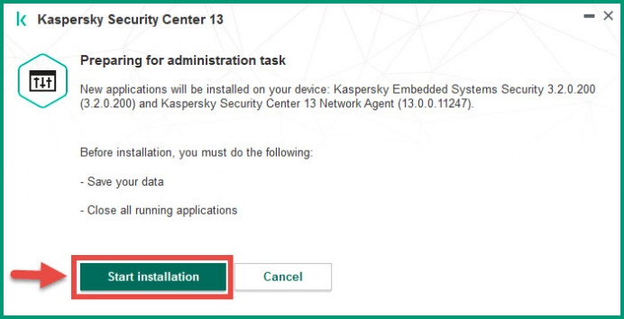

**Image analysis**

```json
{
 "image_name": "image70.jpeg",
 "rId": "rId83",
 "image_path": "img_folder/image_069_image70.jpg",
 "caption": "پنجره نصب Kaspersky Security Center 13 با دکمه Start installation مشخص شده",
 "ocr_text": "Kaspersky Security Center 13\nPreparing for administration task\nNew applications will be installed on your device: Kaspersky Embedded Systems Security 3.2.0.200\n(3.2.0.200) and Kaspersky Security Center 13 Network Agent (13.0.0.11247).\nBefore installation, you must do the following:\n- Save your data\n- Close all running applications\nStart installation\nCancel",
 "visual_description": [
 "اسکرین شات پنجره Kaspersky Security Center 13 با عنوان Preparing for administration task",
 "متن اعلام نصب دو برنامه: Kaspersky Embedded Systems Security 3.2.0.200 و Network Agent 13.0.0.11247",
 "دو مورد پیش نیاز نصب به صورت بولت: Save your data و Close all running applications",
 "دو دکمه پایین: Start installation (هایلایت با کادر قرمز) و Cancel",
 "یک فلش قرمز به سمت دکمه Start installation اشاره می کند"
 ],
 "image_type": "screenshot"
}
```

منتظر شوید تا تمامی مراحل نصب تیک سبز را دریافت کنند:

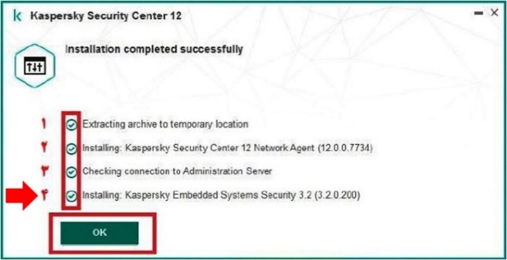

**Image analysis**

```json
{
 "image_name": "image71.jpeg",
 "rId": "rId84",
 "image_path": "img_folder/image_070_image71.jpg",
 "caption": "صفحه نصب Kaspersky Security Center 12 با پیام اتمام موفق و دکمه OK",
 "ocr_text": "Kaspersky Security Center 12\nInstallation completed successfully\nExtracting archive to temporary location\nInstalling: Kaspersky Security Center 12 Network Agent (12.0.0.7734)\nChecking connection to Administration Server\nInstalling: Kaspersky Embedded Systems Security 3.2 (3.2.0.200)\nOK",
 "visual_description": [
 "پنجره نصب «Kaspersky Security Center 12» نمایش داده شده است",
 "پیام «Installation completed successfully» در بالای پنجره دیده می شود",
 "فهرست مراحل نصب با آیکون های تیک سبز کنار هر مرحله نمایش دارد",
 "مراحل شامل استخراج آرشیو، نصب Network Agent با نسخه 12.0.0.7734، بررسی اتصال به Administration Server و نصب Embedded Systems Security 3.2 با نسخه 3.2.0.200 است",
 "دکمه «OK» در پایین پنجره وجود دارد",
 "یک فلش قرمز و کادر قرمز برای تاکید روی بخش مراحل و دکمه OK ترسیم شده اند"
 ],
 "image_type": "screenshot"
}
```

4. روی دکمه ی OK کلیک کنید.

در صورت وقوع خطای The SHA-256 (SHA-2) digital signature support is missing… که در قالب پنجره ی زیر اعلام می شود، لازم است نصب نرم افزار کامل را انجام دهید:

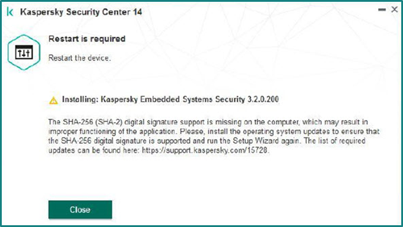

**Image analysis**

```json
{
 "image_name": "image72.png",
 "rId": "rId85",
 "image_path": "img_folder/image_071_image72.png",
 "caption": "پنجره نصب کسپرسکی با پیام نیاز به ری استارت و مشکل پشتیبانی امضای SHA-256",
 "ocr_text": "Kaspersky Security Center 14\nRestart is required\nRestart the device.\n\nInstalling: Kaspersky Embedded Systems Security 3.2.0.200\n\nThe SHA-256 (SHA-2) digital signature support is missing on the computer, which may result in\nimproper functioning of the application. Please, install the operating system updates to ensure that\nthe SHA-256 digital signature is supported and run the Setup Wizard again. The list of required\nupdates can be found here: https://support.kaspersky.com/15728.\n\nClose",
 "visual_description": [
 "پنجره نرم افزار با عنوان «Kaspersky Security Center 14» نمایش داده شده است",
 "پیام «Restart is required» و «Restart the device.» در بالای پنجره دیده می شود",
 "وضعیت نصب: «Installing: Kaspersky Embedded Systems Security 3.2.0.200» نمایش داده شده است",
 "هشدار درباره نبود پشتیبانی امضای دیجیتال SHA-256 (SHA-2) و نیاز به نصب آپدیت های سیستم عامل درج شده است",
 "لینک «https://support.kaspersky.com/15728.» برای فهرست به روزرسانی های لازم نمایش داده شده است",
 "دکمه «Close» در پایین پنجره وجود دارد"
 ],
 "image_type": "screenshot"
}
```

## ب) اطمینان از برقراری ارتباط پایانه بانکی با سرور

به منظور حصول اطمینان از برقراری ارتباط پایانه بانکی با سرور پس از انجام نصب آنتی ویروس مراحل زیر را انجام دهید:

1. در پوشه ی مربوط به آنتی ویروس، با توجه به محل نصب دستگاه، روی فایل KLMover-32bit راست کلیک کنید و از منویی که گشوده می شود، Run as administrator را انتخاب کنید تا فایل مذکور اجرا گردد و تنظیمات مربوطه اعمال شوند:

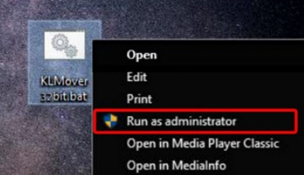

**Image analysis**

```json
{
 "image_name": "image73.jpeg",
 "rId": "rId86",
 "image_path": "img_folder/image_072_image73.jpg",
 "caption": "منوی راست کلیک ویندوز با گزینه «Run as administrator» مشخص شده",
 "ocr_text": "KLMover\n32bit.bat\nOpen\nEdit\nPrint\nRun as administrator\nOpen in Media Player Classic\nOpen in MediaInfo",
 "visual_description": [
 "آیکون فایل batch با نام KLMover 32bit.bat دیده می شود",
 "منوی راست کلیک شامل گزینه های Open، Edit، Print و Run as administrator است",
 "گزینه «Run as administrator» با کادر قرمز هایلایت شده است",
 "گزینه های «Open in Media Player Classic» و «Open in MediaInfo» در منو دیده می شوند"
 ],
 "image_type": "screenshot"
}
```

2. جهت بررسی ارتباط پایانه بانکی با سرور آنتی ویروس، روی فایل RunChecker-32bit راست کلیک و گزینه ی Run as administrator را انتخاب نمایید:

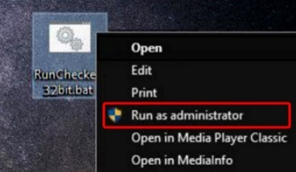

**Image analysis**

```json
{
 "image_name": "image74.jpeg",
 "rId": "rId87",
 "image_path": "img_folder/image_073_image74.jpg",
 "caption": "منوی راست کلیک ویندوز با گزینه Run as administrator روی فایل bat",
 "ocr_text": "RunChecker\n32-bit.bat\nOpen\nEdit\nPrint\nRun as administrator\nOpen in Media Player Classic\nOpen in MediaInfo",
 "visual_description": [
 "آیکون فایل با نام RunChecker 32-bit.bat روی دسکتاپ دیده می شود",
 "منوی زمینه ویندوز باز است و گزینه Run as administrator با کادر قرمز مشخص شده",
 "گزینه های قابل مشاهده شامل Open، Edit، Print، Open in Media Player Classic و Open in MediaInfo هستند"
 ],
 "image_type": "screenshot"
}
```

حدوداً پس از گذشت **یک دقیقه**، پنجره ی زیر به نمایش گذاشته خواهد شد:

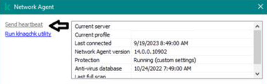

**Image analysis**

```json
{
 "image_name": "image75.tmp",
 "rId": "rId88",
 "image_path": "img_folder/image_074_image75.png",
 "caption": "پنجره Network Agent با گزینه های Send heartbeat و Run diagnostics و اطلاعات نسخه و پایگاه آنتی ویروس",
 "ocr_text": "Network Agent\nSend heartbeat\nRun diagnostics utility\nCurrent server\nCurrent profile\nLast connected\n9/19/2023 8:49:00 AM\nNetwork Agent version\n14.0.0.10902\nProtection\nRunning (custom settings)\nAnti-virus database\n10/24/2022 7:49:00 AM",
 "visual_description": [
 "پنجره نرم افزار با عنوان «Network Agent» نمایش داده شده است",
 "در سمت چپ گزینه های «Send heartbeat» و «Run diagnostics utility» دیده می شود",
 "یک فلش سیاه به سمت عبارت «Send heartbeat» اشاره می کند",
 "در بخش اطلاعات، فیلد «Network Agent version» با مقدار 14.0.0.10902 نمایش داده شده است",
 "در بخش اطلاعات، فیلد «Anti-virus database» با زمان 10/24/2022 7:49:00 AM نمایش داده شده است",
 "فیلد «Protection» وضعیت «Running (custom settings)» را نشان می دهد",
 "آیتم «Last connected» زمان 9/19/2023 8:49:00 AM را نشان می دهد"
 ],
 "image_type": "screenshot"
}
```

3. در پنجره ی فوق روی لینک آبی رنگ Send heartbeat کلیک کنید تا رنگ آن به طوسی تغییر نماید. چند ثانیه صبر کنید تا رنگ این لینک مجدداً آبی شود؛ در سمت راست پنجره، تاریخ و ساعت موجود در مقابل عبارت Last Connected به روز خواهند شد. وقوع این وضعیت بدون نمایش پیغام خطا، بیانگر این موضوع است که نصب آنتی ویروس به درستی انجام شده است و ارتباط آن با سرور برقرار می باشد.

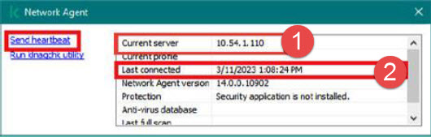

**Image analysis**

```json
{
 "image_name": "image76.jpg",
 "rId": "rId89",
 "image_path": "img_folder/image_075_image76.jpg",
 "caption": "پنجره Network Agent با گزینه های Send heartbeat و اطلاعات سرور و زمان آخرین اتصال",
 "ocr_text": "Network Agent\nSend heartbeat\nRun diagnostic utility\nCurrent server 10.54.1.110\nCurrent profile\nLast connected 3/11/2023 1:08:24 PM\nNetwork Agent version: 14.0.0.10902\nProtection:\nSecurity application is not installed.\nAnti-virus database\nLast full scan",
 "visual_description": [
 "پنجره نرم افزار با عنوان «Network Agent» نمایش داده شده است.",
 "در سمت چپ لینک های «Send heartbeat» و «Run diagnostic utility» دیده می شود.",
 "در بخش اطلاعات، فیلد «Current server» مقدار «10.54.1.110» را نشان می دهد.",
 "فیلد «Last connected» زمان «3/11/2023 1:08:24 PM» را نمایش می دهد.",
 "خط «Network Agent version: 14.0.0.10902» قابل مشاهده است.",
 "دو دایره شماره گذاری شده قرمز با اعداد «1» و «2» روی تصویر قرار دارند.",
 "کادرهای قرمز دور «Send heartbeat» و دور ناحیه «Last connected» کشیده شده است."
 ],
 "image_type": "screenshot"
}
```

در پنجره ی فوق:

* Current Server : آی پی مربوط به Agent آنتی ویروس را نمایش می دهد.
* Last Connected : آخرین وضعیت ارتباط با Agent آنتی ویروس است و باید تاریخ و زمان جاری را نمایش دهد.

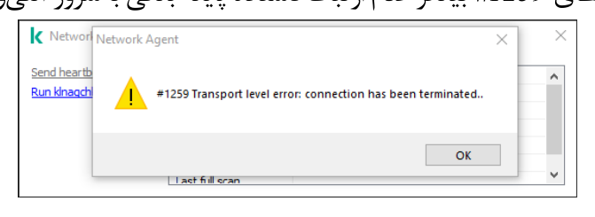

**Image analysis**

```json
{
 "image_name": "image77.emf",
 "rId": "rId90",
 "image_path": "img_folder/image_076_image77.png",
 "caption": "پنجره خطای Network Agent با پیام قطع شدن اتصال در سطح انتقال",
 "ocr_text": "Network Agent\n#1259 Transport level error: connection has been terminated..\nOK\nSend heartb\nRun knaqch",
 "visual_description": [
 "پنجره محاوره ای با عنوان «Network Agent» نمایش داده شده است",
 "آیکون هشدار مثلث زرد در کنار متن خطا وجود دارد",
 "متن خطا شامل «#1259 Transport level error: connection has been terminated..» است",
 "یک دکمه «OK» در پایین سمت راست پنجره دیده می شود",
 "در پس زمینه لینک های «Send heartb» و «Run knaqch» قابل مشاهده اند"
 ],
 "image_type": "screenshot"
}
```همچنین نمایش پیام خطای #1259 بیانگر عدم ارتباط دستگاه پایانه بانکی با سرور آنتی ویروس می باشد:

این خطا عموماً در دستگاه های با ارتباط بی سیم (سیم کارتی یا ماهواره) رخ می دهد. جهت برقراری ارتباط این نوع دستگاه ها با سرور آنتی ویروس بسته به نوع سیستم عامل باید از یکی از دو فایل 32bit.bat-کانفیگ جایگزین یا 64bit.bat-کانفیگ جایگزین که در پوشه ی حاوی فایل های نصب آنتی ویروس قرار دارند استفاده نمایید. بسته به نوع سیستم عامل (64 بیتی یا 32 بیتی) یک از فایل های فوق را اجرا نمایید با انجام این کار یک صفحه ی CMD به سرعت باز و بسته خواهد شد. حال جهت بررسی ارتباط پایانه بانکی با سرور آنتی ویروس(بسته به 32 یا 64 بیتی بودن سیستم عامل) روی فایل Run Checker مربوطه راست کلیک کنید و از منویی که گشوده می شود Run as administrator را انتخاب کنید:

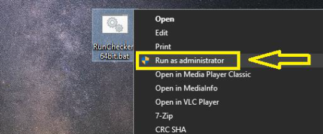

**Image analysis**

```json
{
 "image_name": "image78.tmp",
 "rId": "rId91",
 "image_path": "img_folder/image_077_image78.png",
 "caption": "منوی راست کلیک ویندوز با گزینه Run as administrator هایلایت شده",
 "ocr_text": "Open\nEdit\nPrint\nRun as administrator\nOpen in Media Player Classic\nOpen in MediaInfo\nOpen in VLC Player\n7-Zip\nCRC SHA\nRunChecker\n64bit.bat",
 "visual_description": [
 "منوی زمینه ویندوز نمایش داده شده است",
 "گزینه \"Run as administrator\" با کادر زرد برجسته شده است",
 "یک فلش زرد به گزینه \"Run as administrator\" اشاره می کند",
 "فایل \"RunChecker 64bit.bat\" در سمت چپ منو دیده می شود"
 ],
 "image_type": "screenshot"
}
```

پس از گذشت چند ثانیه (حدود 10 الی 40 ثانیه) پنجره ی زیر گشوده خواهد شد:

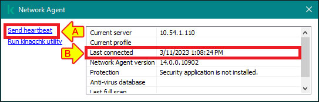

**Image analysis**

```json
{
 "image_name": "image79.jpg",
 "rId": "rId92",
 "image_path": "img_folder/image_078_image79.jpg",
 "caption": "اسکرین شات Network Agent با برجسته سازی گزینه Send heartbeat و زمان Last connected",
 "ocr_text": "Network Agent\nSend heartbeat\nRun klnagchk utility\nA\nB\nCurrent server\n10.54.1.110\nCurrent profile\nLast connected\n3/11/2023 1:08:24 PM\nNetwork Agent version\n14.0.0.10902\nProtection status\nSecurity application is not installed.\nAnti-virus database\nLast full scan",
 "visual_description": [
 "پنجره برنامه با عنوان Network Agent نمایش داده شده است.",
 "گزینه های متنی «Send heartbeat» و «Run klnagchk utility» در پنل چپ دیده می شوند.",
 "فلش ها و برچسب های زرد A و B به نواحی مختلف اشاره می کنند.",
 "کادر قرمز دور «Send heartbeat» و کادر قرمز دور ردیف «Last connected» قرار دارد.",
 "فیلد «Current server» مقدار 10.54.1.110 را نشان می دهد.",
 "فیلد «Last connected» مقدار 3/11/2023 1:08:24 PM را نشان می دهد.",
 "فیلد «Network Agent version» مقدار 14.0.0.10902 را نشان می دهد.",
 "فیلد «Protection status» عبارت «Security application is not installed.» را نشان می دهد."
 ],
 "image_type": "screenshot"
}
```

در پنجره ی فوق روی Send Heartbeat که با حرفA مشخص شده است کلیک کنید تا به رنگ طوسی تغییر کند. چند ثانیه صبر کنید تا عبارت Send Heartbeatمجدداً آبی رنگ شود. درصورتی که با انجام این کار ساعت و تاریخ در قسمت Last Connected به روز شود، ارتباط دستگاه با سرور برقرار می باشد.

در صورت عدم نمایش Last connected بدون پیغام خطا، فایل sim\_card\_anti virus را اجرا و مجدداً Last Connected را بررسی نمایید.

# کپی کردن Screen ها

به منظور کپی کردن Screen ها، ابتدا به مسیر زیر بروید :

**HDD or Flash :\Software\ATM\Refah**

سپس فایل Refah\_Screen را از حالت فشرده خارج و محتویات آن را در مسیر C:\Protopas\BITMAPS جایگزین نمایید.

# تنظیم پارامترهای شبکه بانکی

همان طور که در مراحل قبل گفته شد هنگام Load شدن Application، ماژول ها Initialize می شوند.

پس از اتمام این عملیات، SOP محتوای زیر را به نمایش خواهد گذاشت:

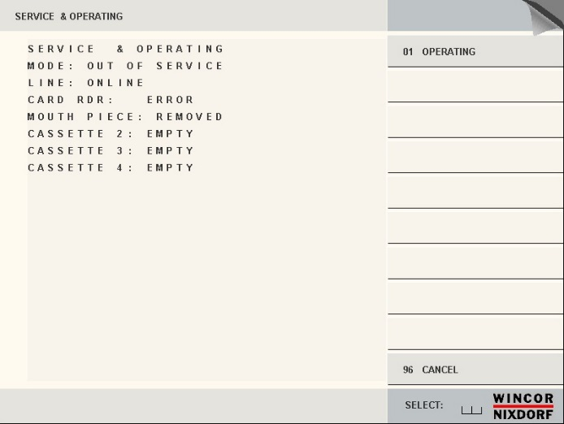

**Image analysis**

```json
{
 "image_name": "image80.jpeg",
 "rId": "rId93",
 "image_path": "img_folder/image_079_image80.jpg",
 "caption": "صفحه وضعیت سرویس و عملیات با خطاهای کارت خوان و خالی بودن کاست ها",
 "ocr_text": "SERVICE & OPERATING\n\nSERVICE & OPERATING\nMODE: OUT OF SERVICE\nLINE: ONLINE\nCARD RDR: ERROR\nMOUTH PIECE: REMOVED\nCASSETTE 2: EMPTY\nCASSETTE 3: EMPTY\nCASSETTE 4: EMPTY\n\n01 OPERATING\n\n96 CANCEL\n\nSELECT:\n\nWINCOR\nNIXDORF",
 "visual_description": [
 "نمایش وضعیت: MODE: OUT OF SERVICE و LINE: ONLINE",
 "پیغام خطا: CARD RDR: ERROR",
 "وضعیت قطعه: MOUTH PIECE: REMOVED",
 "وضعیت کاست ها: CASSETTE 2/3/4: EMPTY",
 "گزینه های منو در سمت راست: 01 OPERATING و 96 CANCEL",
 "لوگوی WINCOR NIXDORF در پایین سمت راست"
 ],
 "image_type": "screenshot"
}
```

نکته بسیار مهم: در هر شرایطی که نیاز به نصب مجدد نرم افزار باشد و این اقدام انجام شود، درصورتی که ماژول EPP تعویض نشود، نیازی به انجام مراحل EPP Init نخواهد بود و فقط لازم است بعد از اولین بالا آمدن کامل نرم افزار به مدت ۵ دقیقه صبر کنید و پس از تغییر رمز اپراتوری از عدد ۰۰۰۰ به ۱۱۱۱ وارد منوهای سوپروایزر شوید و درنهایت از منوها خارج شوید؛ دستگاه پس از حدود ۲ دقیقه در حالت عملیاتی قرار خواهد گرفت. با انجام چند تراکنش با کارت شتابی و محلی (کارت های بانک رفاه) از صحت عملکرد صحیح اطمینان حاصل نمایید.

در حال حاضر Mode همچنان Out of service است و ازاین رو دستگاه آماده انجام تراکنش نخواهد بود. برای In service نمودن دستگاه - در شرایط Online بودن Line - باید از منوهایSOP استفاده نمایید. برای این منظور، دکمه 01 Operating را انتخاب و Password را که به صورت پیش فرض 4 عدد صفر می باشد، وارد نمایید.

در این مرحله از شما خواسته می شود تا رمز را تغییر دهید؛ رمز جدید را 1111 تعیین کنید.

صفحه SOP همانند زیرنمایان خواهد شد:

SELECT

04 REPLENISH

05 CONFIGURE

06 ACCESS

07 DIAGNOSTIC

08 TRANSFER

09 EXIT

20 START TSOP

50 VENDOR MENU

99 SOH

حال مراحل زیر را به ترتیب انجام دهید:

**الف) EPP Init**

وارد 50 VENDOR MENU شوید و به ترتیب زیر عمل کنید:

00 EPP FCTS > 00 INIT EPP > 01 YES

**ب) واردکردن اطلاعات مربوط به KEY A**

1. در منوی 06 ACCESS، گزینه 08 ENTER A را اجرا نمایید:

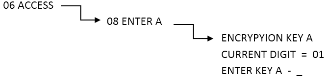

**Image analysis**

```json
{
 "image_name": "image81.png",
 "rId": "rId94",
 "image_path": "img_folder/image_080_image81.png",
 "caption": "نمودار مرحله ای ورود کلید رمزنگاری A با نمایش رقم جاری و فرمان های ACCESS و ENTER A",
 "ocr_text": "06 ACCESS\n08 ENTER A\nENCRYPYION KEY A\nCURRENT DIGIT = 01\nENTER KEY A - _",
 "visual_description": [
 "سه برچسب متنی با پیکان های پله ای به ترتیب «06 ACCESS» سپس «08 ENTER A» و سپس متن تنظیم کلید",
 "بخش نهایی شامل خطوط: «ENCRYPYION KEY A»، «CURRENT DIGIT = 01»، و «ENTER KEY A - _»",
 "پیکان ها جهت جریان از چپ به راست را نشان می دهند"
 ],
 "image_type": "diagram"
}
```

2. مقدار Key A را به ترتیب زیر وارد نمایید(هشت بار عدد شصت ویک را تایپ کنید):

6161616161616161

پس از واردکردن KEY A، مقدار kvv:5FF6 روی صفحه به نمایش گذاشته خواهد شد.

3. با اجرای مسیر زیر، KEY A را ذخیره کنید:

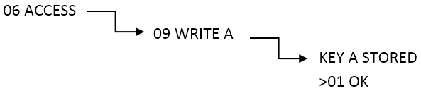

**Image analysis**

```json
{
 "image_name": "image82.tmp",
 "rId": "rId95",
 "image_path": "img_folder/image_081_image82.png",
 "caption": "نمودار پله ای با پیکان ها برای دسترسی و نوشتن کلید A و پیام موفقیت",
 "ocr_text": "06 ACCESS\n09 WRITE A\nKEY A STORED\n>01 OK",
 "visual_description": [
 "سه پله با پیکان های رو به راست بین مراحل «06 ACCESS»، «09 WRITE A» و «KEY A STORED» نمایش داده شده است",
 "متن خروجی «>01 OK» زیر عبارت «KEY A STORED» دیده می شود"
 ],
 "image_type": "diagram"
}
```

پس از اتمام مراحل فوق، با استفاده از دکمه Cancel از منوهای SOP خارج شوید.

اگر همه ی مراحل را به درستی انجام داده باشید و مشکل سخت افزاری هم وجود نداشته باشد، همانند شکل زیر، Mode در وضعیت Out of service و Line در وضعیت Online قرار خواهند گرفت:

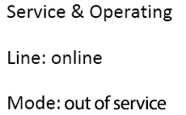

**Image analysis**

```json
{
 "image_name": "image83.jpeg",
 "rId": "rId96",
 "image_path": "img_folder/image_082_image83.jpg",
 "caption": "نمایش وضعیت سرویس و عملکرد با خط آنلاین و حالت خارج از سرویس",
 "ocr_text": "Service & Operating\n\nLine: online\n\nMode: out of service",
 "visual_description": [
 "متن شامل عنوان «Service & Operating» و دو خط وضعیت «Line: online» و «Mode: out of service» است.",
 "پس زمینه سفید با نوشته های مشکی، بدون آیکون یا نمودار."
 ],
 "image_type": "screenshot"
}
```

نکته بسیار مهم: با توجه به نصب نرم افزار NDC-secure و اعمال تنظیمات شبکه خاص، وضعیت Line در صفحه ی SOP همیشه Online می باشد. لذا تنها راه بررسی برقراری ارتباط شبکه، استفاده از دستور زیر می باشد:

Telnet 10.15.0.66 9600

ازاین رو حتماً قبل از انجام بررسی زیرساخت شبکه، اقدام به گرفتن پینگ IP اعلام شده نمایید.

پس از اتمام کار از مسئول انفورماتیک بخواهید دسترسی به پوشه ژورنال و تصاویر را با همان یوزر و پسورد Bankuser - Bank1234 فراهم نماید.

# تنظیمات دیسپنسر

همان طور که گفته شد، پس از پایان مراحل قبلی، با استفاده از دکمه Cancel از منوهای SOP خارج شوید. اگر همه کارها به درستی انجام گرفته باشد و مشکل سخت افزاری هم وجود نداشته باشد، صفحه زیرنمایان می گردد که در آن Mode در وضعیت In Service است؛ دستگاه آماده تراکنش خواهد بود:

**Service & Operating**

**Line: Online**

**Mode: In Service**

**…**

**…**

اما اگر دستگاه خودپرداز برای اولین بار است که وارد شبکه بانکی می شود، دیسپنسر قطعاً نیاز به انجام یکسری تنظیمات خواهد داشت؛ تنظیماتی نظیر تعریف Type پول برای کاست ها - Reference کردن کاست ها - تعریف تعداد اسکناس برای هر کاست(Add Cash) و ... .

در صورت نصب نرم افزار بر روی دستگاهی که از قبل عملیاتی بوده است، تنظیمات دیسپنسر تنها در صورت نیاز باید انجام شود.

تنظیمات فوق می باید قبل از شروع سرویس دهی به مشتری انجام گیرد، در غیر این صورت دستگاه در زمان پرداخت اسکناس با مشکل مواجه خواهد شد.

برای انجام این کار ابتدا وارد منوهای SOP شوید تا دستگاه Out of Service شود. سپس تنظیمات دیسپنسر را به ترتیب زیر اجرا نمایید:

1. **Cassette init (تعریف Type پول برای کاست ها):**

این کار باید زمانی انجام شود که کاست ها داخل Dispenser جاخورده باشند؛ وارد منوهای SOP شوید و از منوی 50 VENDOR MENU شماره 02 CASSETTE INIT را انتخاب کنید.

در حال حاضر دستگاه های رفاه دارای دو نوع پروفایل هستند که با توجه به پروفایل قبلی دستگاه یا نوع اسکناس موجود در کاست ها لازم است یکی از موارد زیر را انتخاب نمایید:

* **پروفایل 1**

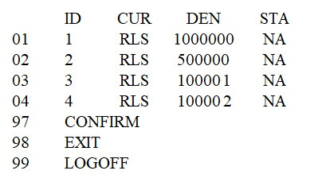

**Image analysis**

```json
{
 "image_name": "image84.jpg",
 "rId": "rId97",
 "image_path": "img_folder/image_083_image84.jpg",
 "caption": "نمایش فهرست گزینه ها با ستون های ID، CUR، DEN و STA و گزینه های CONFIRM/EXIT/LOGOFF",
 "ocr_text": "ID CUR DEN STA\n01 1 RLS 1000000 NA\n02 2 RLS 500000 NA\n03 3 RLS 100001 NA\n04 4 RLS 100002 NA\n97 CONFIRM\n98 EXIT\n99 LOGOFF",
 "visual_description": [
 "یک جدول متنی با سرستون های ID، CUR، DEN، STA نمایش داده شده است",
 "چهار ردیف داده با شناسه های 01 تا 04 و مقادیر CUR=RLS و STA=NA وجود دارد",
 "مقادیر DEN در ردیف ها: 1000000، 500000، 100001، 100002",
 "گزینه های منو با شناسه های 97 CONFIRM، 98 EXIT، 99 LOGOFF در پایین دیده می شود"
 ],
 "image_type": "screenshot"
}
```

* **پروفایل 2**

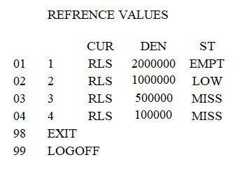

**Image analysis**

```json
{
 "image_name": "image85.jpg",
 "rId": "rId98",
 "image_path": "img_folder/image_084_image85.jpg",
 "caption": "جدول مقادیر مرجع با ستون های CUR، DEN و ST و گزینه های خروج",
 "ocr_text": "REFRENCE VALUES\n\nCUR DEN ST\n\n01 1 RLS 2000000 EMPT\n02 2 RLS 1000000 LOW\n03 3 RLS 500000 MISS\n04 4 RLS 100000 MISS\n\n98 EXIT\n99 LOGOFF",
 "visual_description": [
 "عنوان «REFRENCE VALUES» در بالای تصویر دیده می شود",
 "سه ستون با برچسب های «CUR»، «DEN» و «ST» نمایش داده شده اند",
 "چهار ردیف داده شامل واحد «RLS» و مقادیر 2000000، 1000000، 500000 و 100000 است",
 "وضعیت های ستون ST شامل «EMPT»، «LOW» و «MISS» (دو بار) است",
 "گزینه های منو «98 EXIT» و «99 LOGOFF» در پایین صفحه وجود دارد"
 ],
 "image_type": "screenshot"
}
```

با انتخاب هر یک از شماره های01 تا 04 کاست های 1 تا 4 انتخاب می شوند و شما می توانید ارزش و واحد پول مربوط به آن کاست را طبق دستورالعمل بانک تنظیم نمایید. پس ازاینکه پارامترهای مربوط به هر کاست تنظیم شد باید گزینه 97 CONFIRM را انتخاب کنید تا تنظیمات مربوط به همه کاست ها اعمال شوند. با انتخاب شماره 97 پیغام زیر نمایش داده می شود:

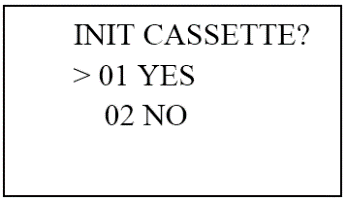

**Image analysis**

```json
{
 "image_name": "image86.png",
 "rId": "rId99",
 "image_path": "img_folder/image_085_image86.png",
 "caption": "صفحهٔ منو برای مقداردهی اولیهٔ کاست با گزینه های YES و NO",
 "ocr_text": "INIT CASSETTE?\n> 01 YES\n02 NO",
 "visual_description": [
 "نمایشگر تک رنگ با کادر مستطیلی و متن منو",
 "سؤال «INIT CASSETTE?» با دو گزینه «01 YES» و «02 NO»",
 "علامت «>» کنار گزینه «01 YES» نشانگر انتخاب فعلی است"
 ],
 "image_type": "screenshot"
}
```

در این حالت با انتخاب گزینه 01YES، پارامترهای فوق در EEPROM کاست ها ذخیره می شوند.

سپس شکل زیر نمایش داده می شود :

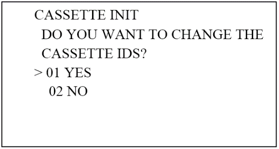

**Image analysis**

```json
{
 "image_name": "image87.png",
 "rId": "rId100",
 "image_path": "img_folder/image_086_image87.png",
 "caption": "صفحه پیام CASSETTE INIT با گزینه های تغییر شناسه کاست",
 "ocr_text": "CASSETTE INIT\nDO YOU WANT TO CHANGE THE\nCASSETTE IDS?\n> 01 YES\n 02 NO",
 "visual_description": [
 "متن نمایشی شامل عنوان «CASSETTE INIT» و پرسش درباره تغییر «CASSETTE IDS» است",
 "دو گزینه منو «01 YES» و «02 NO» نمایش داده شده اند",
 "نشانگر انتخاب به صورت «>» کنار گزینه «01 YES» قرار دارد",
 "یک کادر مستطیلی دور متن صفحه را احاطه کرده است"
 ],
 "image_type": "screenshot"
}
```

در پیغام فوق در مورد تغییر شماره شناسایی کاست ها سؤال می شود؛

با انتخاب گزینه ی Yes مطابق شکل زیر ID کاست ها را تغییر دهید:

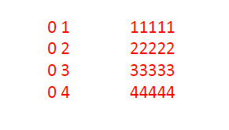

**Image analysis**

```json
{
 "image_name": "image88.jpg",
 "rId": "rId101",
 "image_path": "img_folder/image_087_image88.jpg",
 "caption": "چهار ردیف متن قرمز با دو ستون عددی روی پس زمینه سفید",
 "ocr_text": "0 1 11111\n0 2 22222\n0 3 33333\n0 4 44444",
 "visual_description": [
 "پس زمینه سفید با متن قرمز",
 "دو ستون عددی دیده می شود؛ ستون چپ شامل «0 1»، «0 2»، «0 3»، «0 4»",
 "ستون راست شامل «11111»، «22222»، «33333»، «44444»",
 "چهار ردیف متن با فاصله افقی بین دو ستون"
 ],
 "image_type": "unknown"
}
```

2. **انجام عملیات ADD CASH توسط اپراتور :**

پس از پول گذاری کاست ها به صورت فیزیکی، می باید تعداد اسکناس های هر کاست را به صورت نرم افزاری نیز تعریف کنید.

برای انجام ADD CASH قرار داشتن کاست ها در جای خود ضرورت دارد. در غیر این صورت عملیات ADD CASH مربوط به آن کاست انجام نخواهد شد.

جهت انجام ADD CASH مطابق مسیر زیر به منوی 04 REPLENISH بروید و در آنجا گزینه
 08 ADD CASH را انتخاب کنید. صفحه زیر ظاهر می شود.

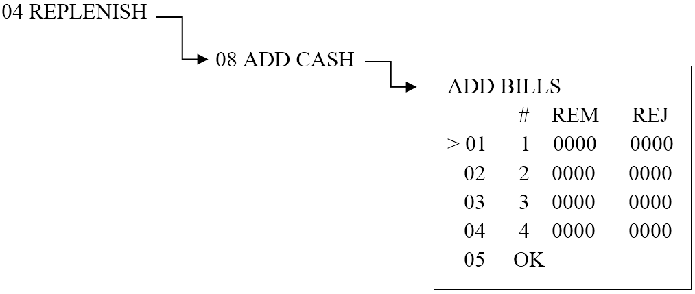

**Image analysis**

```json
{
 "image_name": "image89.png",
 "rId": "rId102",
 "image_path": "img_folder/image_088_image89.png",
 "caption": "مسیر منویی برای افزودن پول و صفحه «ADD BILLS» با ستون های REM و REJ",
 "ocr_text": "04 REPLENISH\n08 ADD CASH\nADD BILLS\n# REM REJ\n> 01 1 0000 0000\n02 2 0000 0000\n03 3 0000 0000\n04 4 0000 0000\n05 OK",
 "visual_description": [
 "فلش ها مسیر «04 REPLENISH» به «08 ADD CASH» و سپس به جعبه «ADD BILLS» را نشان می دهند.",
 "در پنجره «ADD BILLS» ستون های «#»، «REM»، «REJ» نمایش داده شده اند.",
 "سطرهای 01 تا 04 با مقادیر REM=0000 و REJ=0000 فهرست شده اند.",
 "نشانگر انتخاب «>» کنار «01» قرار دارد.",
 "گزینه «05 OK» در انتهای فهرست دیده می شود."
 ],
 "image_type": "diagram"
}
```

با انتخاب هریک از گزینه های 01 تا 04 کاست مربوطه را انتخاب و تعداد اسکناس مربوط به آن کاست را وارد کنید. عدد واردشده به مقدار قبلی اضافه می شود. سپس دکمه Enter را بزنید و کاست بعدی را انتخاب کنید.

پس از اتمام کار، با انتخاب گزینه 05 OK تغییرات انجام شده ذخیره خواهند شد و اطلاعات مربوط به اسکناس ها بلافاصله در پرینتر ژورنال و رسید چاپ می شود.

3. **Reference Value (شناساندن ضخامت و عرض اسکناس به Dispenser) :**

برای انجام این کار وارد منوی 50 VENDOR MENU شوید و در آنجا گزینه ی 01 REF. VALUES را انتخاب کنید. با توجه به پروفایل دستگاه یکی از موارد زیر را انجام دهید:

* دستگاه های پروفایل 1:


**Image analysis**

```json
{
 "image_name": "image84.jpg",
 "rId": "rId97",
 "image_path": "img_folder/image_083_image84.jpg",
 "caption": "نمایش فهرست گزینه ها با ستون های ID، CUR، DEN و STA و گزینه های CONFIRM/EXIT/LOGOFF",
 "ocr_text": "ID CUR DEN STA\n01 1 RLS 1000000 NA\n02 2 RLS 500000 NA\n03 3 RLS 100001 NA\n04 4 RLS 100002 NA\n97 CONFIRM\n98 EXIT\n99 LOGOFF",
 "visual_description": [
 "یک جدول متنی با سرستون های ID، CUR، DEN، STA نمایش داده شده است",
 "چهار ردیف داده با شناسه های 01 تا 04 و مقادیر CUR=RLS و STA=NA وجود دارد",
 "مقادیر DEN در ردیف ها: 1000000، 500000، 100001، 100002",
 "گزینه های منو با شناسه های 97 CONFIRM، 98 EXIT، 99 LOGOFF در پایین دیده می شود"
 ],
 "image_type": "screenshot"
}
```

* دستگاه های پروفایل 2:


**Image analysis**

```json
{
 "image_name": "image85.jpg",
 "rId": "rId98",
 "image_path": "img_folder/image_084_image85.jpg",
 "caption": "جدول مقادیر مرجع با ستون های CUR، DEN و ST و گزینه های خروج",
 "ocr_text": "REFRENCE VALUES\n\nCUR DEN ST\n\n01 1 RLS 2000000 EMPT\n02 2 RLS 1000000 LOW\n03 3 RLS 500000 MISS\n04 4 RLS 100000 MISS\n\n98 EXIT\n99 LOGOFF",
 "visual_description": [
 "عنوان «REFRENCE VALUES» در بالای تصویر دیده می شود",
 "سه ستون با برچسب های «CUR»، «DEN» و «ST» نمایش داده شده اند",
 "چهار ردیف داده شامل واحد «RLS» و مقادیر 2000000، 1000000، 500000 و 100000 است",
 "وضعیت های ستون ST شامل «EMPT»، «LOW» و «MISS» (دو بار) است",
 "گزینه های منو «98 EXIT» و «99 LOGOFF» در پایین صفحه وجود دارد"
 ],
 "image_type": "screenshot"
}
```

با انتخاب شماره هر یک از کاست ها و فشار دکمه Enter، پیغام فوق نمایان می شود.

با انتخاب گزینه 01، پیغام های زیر به نمایش گذاشته خواهند شد:

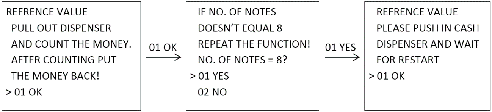

**Image analysis**

```json
{
 "image_name": "image90.png",
 "rId": "rId103",
 "image_path": "img_folder/image_089_image90.png",
 "caption": "نمودار متنی بررسی تعداد اسکناس و دستور بیرون آوردن و برگرداندن پول در دیسپنسر",
 "ocr_text": "REFRENCE VALUE\nPULL OUT DISPENSER\nAND COUNT THE MONEY.\nAFTER COUNTING PUT\nTHE MONEY BACK!\n\n> 01 OK\n\n01 OK\n\nIF NO. OF NOTES\nDOESN’T EQUAL 8\nREPEAT THE FUNCTION!\nNO. OF NOTES = 8?\n> 01 YES\n 02 NO\n\n01 YES\n\nREFRENCE VALUE\nPLEASE PUSH IN CASH\nDISPENSER AND WAIT\nFOR RESTART\n> 01 OK",
 "visual_description": [
 "سه کادر مستطیلی با متن های انگلیسی به صورت مراحل پشت سر هم نمایش داده شده اند",
 "بین کادر اول و دوم یک پیکان رو به راست با برچسب «01 OK» وجود دارد",
 "بین کادر دوم و سوم یک پیکان رو به راست با برچسب «01 YES» وجود دارد",
 "کادر اول دستور Pull out dispenser و شمارش پول و سپس قرار دادن پول به عقب را نشان می دهد",
 "کادر دوم شرط «NO. OF NOTES = 8?» با گزینه های «01 YES» و «02 NO» را نمایش می دهد",
 "کادر سوم دستور Push in cash dispenser و انتظار برای restart را نمایش می دهد"
 ],
 "image_type": "diagram"
}
```

بهتر است در هنگام انجام عملیات Reference، بدون توجه به پیغام های فوق، Dispenser داخل گاوصندوق قرار داشته باشد.

هنگام Reference شدن هر کاست، دیسپنسر از کاست مربوطه هشت اسکناس و یا بیشتر می کشد و داخل Clamp نگه می دارد. سپس دیسپنسر Reset می گردد و اسکناس های داخل کلمپ Reject می شوند.
این روند را برای بقیه کاست ها نیز تکرار کنید.

اگر در زمان Reference کردن هریک از کاست ها، کاست خالی از اسکناس باشد یا تعداد اسکناس ها کافی نباشد و یا کاست در جای خود قرار نداشته باشد با پیغام خطای مواجه خواهید شد:

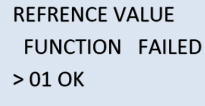

**Image analysis**

```json
{
 "image_name": "image91.jpg",
 "rId": "rId104",
 "image_path": "img_folder/image_090_image91.jpg",
 "caption": "متن نمایشگر درباره مقدار مرجع، عملکرد و وضعیت خطا",
 "ocr_text": "REFRENCE VALUE\nFUNCTION FAILED\n> 01 OK",
 "visual_description": [
 "نمایشگر تک رنگ با سه خط متن و یک خط وضعیت شامل علامت >",
 "کلمات FUNCTION و FAILED در یک خط کنار هم دیده می شوند"
 ],
 "image_type": "photo"
}
```

در هنگام انجام عملیات Reference و در زمان انتخاب یک کاست، اگر درب گاوصندوق بسته باشد با پیغام زیر مواجه خواهید شد؛ درب گاوصندوق را بازکنید تا عملیات Reference انجام شود.

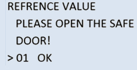

**Image analysis**

```json
{
 "image_name": "image92.jpg",
 "rId": "rId105",
 "image_path": "img_folder/image_091_image92.jpg",
 "caption": "نمایش پیام مرجع و درخواست باز کردن درِ گاوصندوق با گزینه OK",
 "ocr_text": "REFRENCE VALUE\nPLEASE OPEN THE SAFE\nDOOR!\n> 01 OK",
 "visual_description": [
 "نمایشگر تک رنگ با متن چندخطی",
 "وجود نشانگر انتخاب به شکل \">\" قبل از گزینه 01",
 "وجود گزینه تایید با متن \"OK\""
 ],
 "image_type": "screenshot"
}
```

نکات بسیار مهم

در بانک رفاه، 3 فولدر با اسامی Journal، Campic و Bitmap می باید Share شده باشند؛ دسترسی به فولدرهای Journal و Campic می باید فقط Read باشد. فقط پوشه ی Bitmap می باید به طور کامل در دسترس (Read/Write) باشد. یوزرهای Administrator و Bankuser می باید به هر سه فولدر دسترسی داشته باشند؛ این دسترسی ها را بررسی و در صورت مشاهده مغایرت، مراحل زیر را جهت اصلاح آنها انجام دهید:

1. پس از پایان مراحل نصب، حتماً می باید از Share بودن فولدرهای مربوطه اطمینان حاصل کنید و در صورت نبودن یوزرهای موردنیاز، دسترسی ها را با انجام مراحل بعدی تنظیم نمایید:
 1. به منظور مشاهده یوزرها و میزان دسترسی تعیین شده برای آنها، روی فولدر موردنظر راست کلیک کنید و از منویی که گشوده می شود Properties را انتخاب کنید.
 2. در قسمت فوقانی پنجره ای که گشوده می شود روی تب Sharing و سپس دکمه ی Advanced Sharing کلیک کنید:

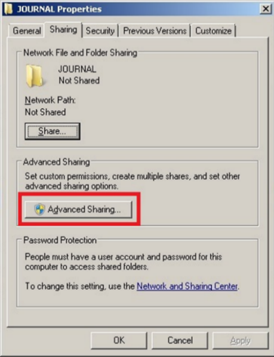

**Image analysis**

```json
{
 "image_name": "image93.png",
 "rId": "rId106",
 "image_path": "img_folder/image_092_image93.png",
 "caption": "پنجره Properties پوشه JOURNAL در ویندوز، تب Sharing با دکمه Advanced Sharing مشخص شده است.",
 "ocr_text": "JOURNAL Properties\nGeneral Sharing Security Previous Versions Customize\nNetwork File and Folder Sharing\nJOURNAL\nNot Shared\nNetwork Path:\nNot Shared\nShare...\nAdvanced Sharing\nSet custom permissions, create multiple shares, and set other\nadvanced sharing options.\nAdvanced Sharing...\nPassword Protection\nPeople must have a user account and password for this\ncomputer to access shared folders.\nTo change this setting, use the Network and Sharing Center.\nOK Cancel Apply",
 "visual_description": [
 "پنجره JOURNAL Properties با تب Sharing باز است.",
 "بخش Network File and Folder Sharing نشان می دهد پوشه JOURNAL در وضعیت Not Shared است.",
 "فیلد Network Path مقدار Not Shared را نمایش می دهد.",
 "دکمه Share... در بخش اشتراک گذاری شبکه وجود دارد.",
 "بخش Advanced Sharing شامل دکمه Advanced Sharing... است که با کادر قرمز هایلایت شده.",
 "بخش Password Protection توضیح نیاز به حساب کاربری و رمز عبور برای دسترسی به پوشه های اشتراک گذاری شده را نشان می دهد.",
 "لینک Network and Sharing Center در متن پایین نمایش داده شده است.",
 "دکمه های OK، Cancel و Apply در پایین پنجره قرار دارند."
 ],
 "image_type": "screenshot"
}
```

* 1. در پنجره Advanced Sharing، همانند شکل زیر روی دکمه ی Permissions کلیک کنید:

در پنجره ی زیر و در قسمت Share name، برای فولدر دوربین باید عبارت VideoArchive درج شده باشد؛ در صورتیکه چنین نیست، عبارت موجود را اصلاح نمایید.

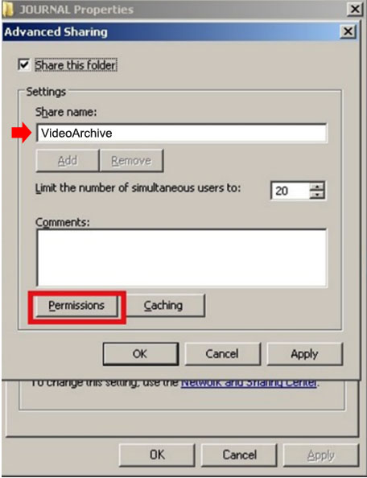

**Image analysis**

```json
{
 "image_name": "image94.jpg",
 "rId": "rId107",
 "image_path": "img_folder/image_093_image94.jpg",
 "caption": "پنجره Advanced Sharing ویندوز با نام اشتراک VideoArchive و دکمه Permissions مشخص شده",
 "ocr_text": "JOURNAL Properties\nAdvanced Sharing\nShare this folder\nSettings\nShare name:\nVideoArchive\nAdd\nRemove\nLimit the number of simultaneous users to:\n20\nComments:\nPermissions\nCaching\nOK\nCancel\nApply\nTo change these settings, use the Network and Sharing Center.",
 "visual_description": [
 "اسکرین شات پنجره Advanced Sharing در Properties یک پوشه در ویندوز",
 "گزینه Share this folder فعال است",
 "فیلد Share name مقدار VideoArchive دارد",
 "محدودیت کاربران همزمان روی 20 تنظیم شده است",
 "دکمه Permissions با کادر قرمز هایلایت شده است",
 "یک فلش قرمز به فیلد Share name اشاره می کند",
 "دکمه های OK، Cancel و Apply در پایین پنجره دیده می شوند",
 "گزینه های Add و Remove غیرفعال/خاکستری نمایش داده شده اند"
 ],
 "image_type": "screenshot"
}
```

در پنجره ای که گشوده می شود می باید دو یوزر (Administrator و Bankuser) وجود داشته باشند؛ با کلیک بر روی هر یک از این یوزرها، دسترسی های آن در قسمت پایینی قابل بررسی خواهد بود.

تصویر زیر مربوط به پوشه Bitmap است که دسترسی کامل به یوزر Administrator داده شده است:

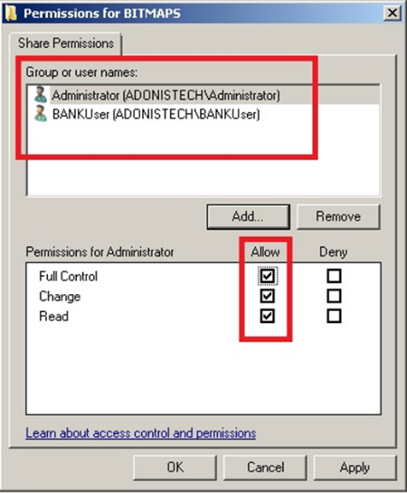

**Image analysis**

```json
{
 "image_name": "image95.png",
 "rId": "rId108",
 "image_path": "img_folder/image_094_image95.png",
 "caption": "پنجره تنظیم مجوزهای اشتراک پوشه BITMAPS با کاربران Administrator و BANKUser",
 "ocr_text": "Permissions for BITMAPS\nShare Permissions\nGroup or user names:\nAdministrator [ADONISTECH\\Administrator]\nBANKUser [ADONISTECH\\BANKUser]\nAdd...\nRemove\nPermissions for Administrator\nAllow\nDeny\nFull Control\nChange\nRead\nLearn about access control and permissions\nOK\nCancel\nApply",
 "visual_description": [
 "اسکرین شات پنجره Windows با عنوان «Permissions for BITMAPS» و تب «Share Permissions»",
 "بخش «Group or user names» شامل Administrator [ADONISTECH\\Administrator] و BANKUser [ADONISTECH\\BANKUser]",
 "در بخش «Permissions for Administrator»، گزینه های Full Control، Change و Read در ستون Allow تیک خورده اند",
 "ستون Deny برای این مجوزها خالی است",
 "دکمه های Add..., Remove, OK, Cancel, Apply و لینک Learn about access control and permissions قابل مشاهده اند",
 "دو کادر مستطیلی قرمز برای برجسته سازی لیست کاربران و چک باکس های Allow نمایش داده شده اند"
 ],
 "image_type": "screenshot"
}
```

تصویر زیر نیز مربوط به پوشه Journal است که دسترسی فقط خواندن (Read) برای یوزر Administrator تعیین شده است:

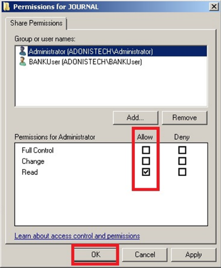

**Image analysis**

```json
{
 "image_name": "image96.png",
 "rId": "rId109",
 "image_path": "img_folder/image_095_image96.png",
 "caption": "پنجره تنظیم مجوزهای Share برای JOURNAL و انتخاب گزینه Allow برای Read",
 "ocr_text": "Permissions for JOURNAL\nShare Permissions\nGroup or user names:\nAdministrator [ADONISTECH\\Administrator]\nBANKUser [ADONISTECH\\BANKUser]\nAdd...\nRemove\nPermissions for Administrator\nAllow\nDeny\nFull Control\nChange\nRead\nLearn about access control and permissions\nOK\nCancel\nApply",
 "visual_description": [
 "اسکرین شات پنجره «Permissions for JOURNAL» در ویندوز",
 "فهرست کاربران/گروه ها شامل Administrator و BANKUser نمایش داده شده است",
 "جدول مجوزها با ستون های Allow و Deny و ردیف های Full Control، Change، Read وجود دارد",
 "چک باکس Allow برای گزینه Read تیک خورده است",
 "دکمه های Add..., Remove, OK, Cancel, Apply قابل مشاهده هستند",
 "کادر قرمز دور ستون Allow و دکمه OK کشیده شده است"
 ],
 "image_type": "screenshot"
}
```

* 1. درصورتی که هریک از یوزرهای لازم در کادر بالایی وجود ندارد روی گزینه Add کلیک کنید:

<!-- TABLE_START -->
| | |
| --- | --- |
|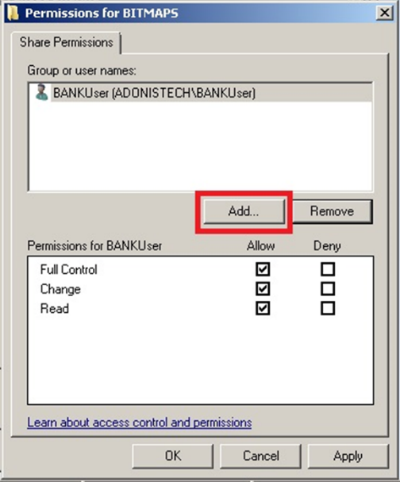

**Image analysis**

```json
{
 "image_name": "image97.png",
 "rId": "rId110",
 "image_path": "img_folder/image_096_image97.png",
 "caption": "پنجره تنظیم مجوزهای پوشه BITMAPS و مجوزهای کاربر BANKUser با گزینه Add",
 "ocr_text": "Permissions for BITMAPS\nShare Permissions\nGroup or user names:\nBANKUser (ADONISTECH\\BANKUser)\nAdd...\nRemove\nPermissions for BANKUser\nAllow\nDeny\nFull Control\nChange\nRead\nLearn about access control and permissions\nOK\nCancel\nApply",
 "visual_description": [
 "پنجره Windows برای تنظیم Permissions با عنوان «Permissions for BITMAPS» نمایش داده شده است.",
 "در بخش Group or user names کاربر «BANKUser (ADONISTECH\\BANKUser)» فهرست شده است.",
 "دکمه «Add...» با کادر قرمز برجسته شده است.",
 "جدول مجوزها شامل ردیف های «Full Control»، «Change»، «Read» و ستون های «Allow» و «Deny» است.",
 "چک باکس های Allow برای Full Control، Change و Read فعال هستند و چک باکس های Deny خالی اند.",
 "دکمه های پایین پنجره شامل «OK»، «Cancel»، «Apply» است."
 ],
 "image_type": "screenshot"
}
``` |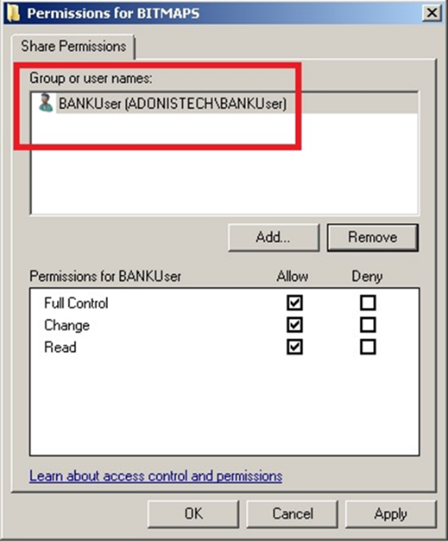

**Image analysis**

```json
{
 "image_name": "image98.png",
 "rId": "rId111",
 "image_path": "img_folder/image_097_image98.png",
 "caption": "پنجره تنظیم مجوزهای پوشه BITMAPS و دسترسی های کاربر BANKUser",
 "ocr_text": "Permissions for BITMAPS\nShare Permissions\nGroup or user names:\nBANKUser (ADONISTECH\\BANKUser)\nAdd...\nRemove\nPermissions for BANKUser\nAllow\nDeny\nFull Control\nChange\nRead\nLearn about access control and permissions\nOK\nCancel\nApply",
 "visual_description": [
 "اسکرین شات پنجره Windows Permissions برای BITMAPS با تب Share Permissions",
 "در بخش Group or user names کاربر BANKUser (ADONISTECH\\BANKUser) نمایش داده شده و با کادر قرمز مشخص شده است",
 "دکمه های Add... و Remove برای مدیریت کاربران/گروه ها وجود دارد",
 "در جدول Permissions for BANKUser گزینه های Full Control، Change و Read در ستون Allow تیک خورده اند",
 "ستون Deny برای گزینه های نمایش داده شده بدون تیک است",
 "لینک Learn about access control and permissions و دکمه های OK، Cancel، Apply در پایین پنجره دیده می شود"
 ],
 "image_type": "screenshot"
}
``` |
<!-- TABLE_END -->

* 1. در قسمت Enter the object name … نام یوزر موردنظر را تایپ کنید.
 3. روی دکمه ی Check Name کلیک نمایید؛ درصورتی که یوزر درج شده وجود داشته باشد، نام کامل آن به نمایش گذاشته خواهد شد:

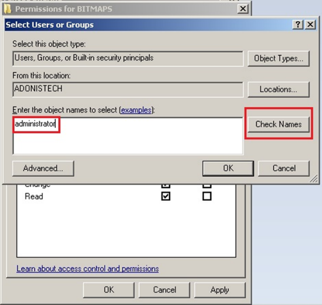

**Image analysis**

```json
{
 "image_name": "image99.png",
 "rId": "rId112",
 "image_path": "img_folder/image_098_image99.png",
 "caption": "پنجره انتخاب کاربر/گروه در ویندوز برای تعیین مجوزها و بررسی نام کاربری administrator",
 "ocr_text": "Permissions for BITMAPS\nSelect Users or Groups\nSelect this object type:\nUsers, Groups, or Built-in security principals\nObject Types...\nFrom this location:\nADONISTECH\nLocations...\nEnter the object names to select (examples):\nadministrator\nCheck Names\nAdvanced...\nOK\nCancel\nChange\nRead\nLearn about access control and permissions\nOK\nCancel\nApply",
 "visual_description": [
 "پنجره Windows با عنوان «Select Users or Groups» روی «Permissions for BITMAPS» نمایش داده شده است.",
 "فیلد «From this location» مقدار «ADONISTECH» را نشان می دهد.",
 "در کادر ورود نام، متن «administrator» وارد شده است.",
 "دکمه «Check Names» با کادر قرمز برجسته شده است.",
 "دکمه های «Object Types...»، «Locations...»، «Advanced...»، «OK» و «Cancel» قابل مشاهده اند.",
 "در پنجره پس زمینه بخش مجوزها با گزینه های «Change» و «Read» و چک باکس ها دیده می شود."
 ],
 "image_type": "screenshot"
}
```

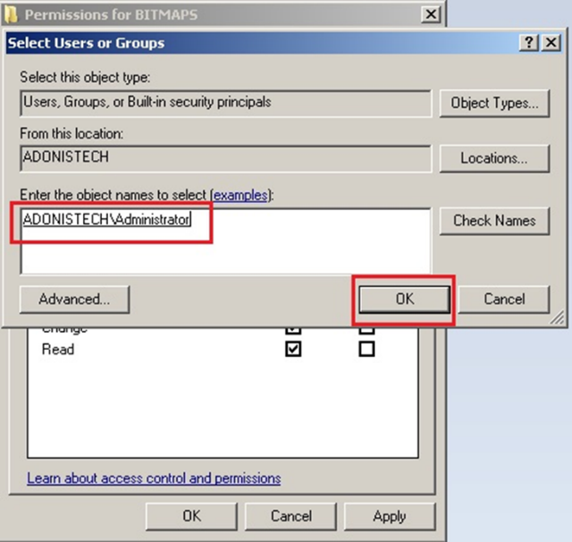

**Image analysis**

```json
{
 "image_name": "image100.png",
 "rId": "rId113",
 "image_path": "img_folder/image_099_image100.png",
 "caption": "پنجره Select Users or Groups برای تنظیم دسترسی پوشه BITMAPS و انتخاب کاربر Administrator",
 "ocr_text": "Permissions for BITMAPS\nSelect Users or Groups\nSelect this object type:\nUsers, Groups, or Built-in security principals\nObject Types...\nFrom this location:\nADONISTECH\nLocations...\nEnter the object names to select (examples):\nADONISTECH\\Administrator\nCheck Names\nAdvanced...\nOK\nCancel\nLearn about access control and permissions\nOK\nCancel\nApply",
 "visual_description": [
 "اسکرین شات پنجره ویندوز برای انتخاب Users/Groups در تنظیمات Permissions for BITMAPS",
 "فیلد location مقدار ADONISTECH را نشان می دهد",
 "فیلد object names شامل ADONISTECH\\Administrator است",
 "دکمه های Object Types..., Locations..., Check Names, Advanced..., OK و Cancel قابل مشاهده اند",
 "پشت پنجره، بخشی از پنجره Permissions با گزینه های OK/Cancel/Apply دیده می شود",
 "دو کادر قرمز اطراف متن ADONISTECH\\Administrator و دکمه OK قرار دارد"
 ],
 "image_type": "screenshot"
}
```

* 1. در پایان روی دکمه ی OK کلیک کنید.
 4. در صفحه Permissions میزان دسترسی یوزر مذکور را تعیین نمایید:

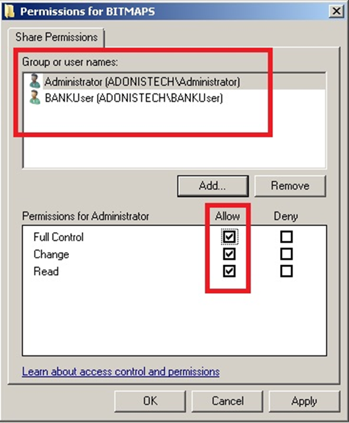

**Image analysis**

```json
{
 "image_name": "image101.png",
 "rId": "rId114",
 "image_path": "img_folder/image_100_image101.png",
 "caption": "پنجره تنظیم مجوزهای Share برای BITMAPS با کاربران و گزینه های Allow/Deny",
 "ocr_text": "Permissions for BITMAPS\nShare Permissions\nGroup or user names:\nAdministrator (ADONISTECH\\Administrator)\nBANKUser (ADONISTECH\\BANKUser)\nAdd...\nRemove\nPermissions for Administrator\nAllow\nDeny\nFull Control\nChange\nRead\nLearn about access control and permissions\nOK\nCancel\nApply",
 "visual_description": [
 "پنجره Windows با عنوان «Permissions for BITMAPS» و تب «Share Permissions» نمایش داده شده است.",
 "در بخش «Group or user names» دو کاربر/گروه لیست شده اند: «Administrator (ADONISTECH\\Administrator)» و «BANKUser (ADONISTECH\\BANKUser)».",
 "دکمه های «Add...» و «Remove» در کنار لیست کاربران وجود دارد.",
 "بخش «Permissions for Administrator» سه مجوز «Full Control»، «Change»، «Read» را نشان می دهد.",
 "ستون «Allow» برای هر سه مجوز دارای تیک است و ستون «Deny» خالی است.",
 "لینک «Learn about access control and permissions» و دکمه های پایین «OK»، «Cancel»، «Apply» قابل مشاهده هستند.",
 "دو کادر قرمز برای برجسته سازی لیست کاربران و ستون تیک های «Allow» وجود دارد."
 ],
 "image_type": "screenshot"
}
```

* 1. روی دکمه ی Apply و سپس OK کلیک کنید.
 5. پس از اتمام مراحل فوق و بررسی هر سه فولدر از اپراتور دستگاه و همچنین انفورماتیک بانک بخواهید دسترسی یوزرهایشان به فولدرهای مذکور را بررسی و از صحت عملکردشان مطمئن شوند.

پس از نصب کامل پکیج، جهت دستیابی به اطلاعات هارد و اشتراک گذاری پوشه تصاویر، می باید نام پارتیشن هارد قبلی را به E تغییر دهید و جهت جلوگیری از بروز اختلال در عملکرد ویندوز، ویندوز هارد قبلی را حذف کنید.

# پیوست 1 : *چک لیست نصب نرم افزار*

<!-- TABLE_START -->
| | | |
| --- | --- | --- |
| 1 | انجام اقدامات لازم قبل از شروع عملیات نصب نرم افزار | 🞏 |
| 2 | جمع آوری اطلاعات لازم | 🞏 |
| 3 | انجام تنظیمات نرم افزاری در راه اندازی اولیه | 🞏 |
| 4 | نصب پکیج با استفاده از نرم افزار آکرونیس | 🞏 |
| 5 | ورود به محیط ویندوز با درج اطلاعات حساب کاربری | 🞏 |
| 6 | تنظیم مانیتور در دستگاه 285DY و 285DZ | 🞏 |
| 7 | راه اندازی صفحه کلید (EPP) | 🞏 |
| 8 | نصب درایور EPP SUNSON (در صورت لزوم) | 🞏 |
| 9 | تنظیم Computer Name | 🞏 |
| 10 | تنظیم تاریخ و ساعت | 🞏 |
| 11 | ساخت درایو D | 🞏 |
| 12 | نصب SP دوربین | 🞏 |
| 13 | اجرای فایل های KMS | 🞏 |
| 14 | انجام تنظیمات NDCSecure | 🞏 |
| 15 | بررسی و اعمال تنظیمات ارزش گذاری کاست | 🞏 |
| 16 | نصب آنتی ویروس Kaspersky | 🞏 |
| 17 | کپی کردن Screen ها | 🞏 |
| 18 | نصب نرم افزار دوربین | 🞏 |
| 19 | انجام تنظیمات مانیتورینگ | 🞏 |
| 20 | تنظیم پارامترهای شبکه بانکی | 🞏 |
| 21 | انجام تنظیمات دیسپنسر | 🞏 |
| 22 | بررسی وضعیت Sharing پوشه ها | 🞏 |
| 23 | انجام تراکنش های تستی | 🞏 |
<!-- TABLE_END -->

# واحد مانیتورینگ بانک رفاه

<!-- TABLE_START -->
| | |
| --- | --- |
| **78437489-021** | **آقای میرشکار** |
| **78437490-021** | **آقـای کاظمی** |
| **78437494-021** | **آقـای صـدیق** |
| **78437495-021** | **آقـای مجیدی** |
| **78437496-021** | **آقـای جعفری** |
| **78437292-021** | **آقـای گلـدار** |
<!-- TABLE_END -->

<!-- TABLE_START -->
| | | | | | | | | | | |
| --- | --- | --- | --- | --- | --- | --- | --- | --- | --- | --- |
| **گروه** | **نام و نام خانوادگی** | **مدیریت های شعب استان ها و ادارات تحت پوشش** | | | | | | **امور محوله** | **داخلی** | **تلفن** |
| **1** | **ابوذر مجیدی** | **شعب مستقل** 0 | | **خراسان رضوی** 500 | | **آذربایجان شرقی** 501 | **اصفهان** 502 | **جابجایی دستگاه ها** | **495** | **78437** |
| **2** | **حامد گلدار** | **اداره خزانه** 21 | | **فارس** 503 | | **گیلان** 504 | **کرمانشاه** 505 | **تنظیم کشیک داخلی** | **491** | **78437** |
| **تنظیم تاریخچه خودپرداز** |
| **3** | **هومن جعفری** | **خوزستان** 506 | مازندران 507 | **مرکزی** 508 | | **کرمان** 509 | **سه تهران** 510 | | **292** | **78437** |
| **4** | **محمد میرشکار** | **سیستان و بلوچستان** 512 | | **یزد** 513 | | **آذربایجان غربی** 514 | **یک تهران** 515 | **جابجایی دستگاه ها** | **489** | **78437** |
| **5** | **علی کاظمی** | **دو تهران** 516 | | **سمنان** 517 | | **اردبیل** 518 | **گلستان** 519 | **کیوسک بانکی** | **490** | **78437** |
| **قزوین** 520 | | **کردستان** 521 | | **همدان** 522 | **لرستان** 523 |
| 6 | **حجت اله صدیق** | **هرمزگان** 524 | **زنجان** 525 | **البرز** 526 | **قم** 527 | **چهارمحال** 528 | **کهگیلویه** 529 | **فاکتورهای خسارتی** | **494** | **78437** |
| **خراسان شمالی** 622 | | **خراسان جنوبی** 624 | | **بوشهر** 642 | **ایلام** 750 |
<!-- TABLE_END -->

# پیوست 1

#### چک لیست نصب نرم افزار

<!-- TABLE_START -->
| | | |
| --- | --- | --- |
| 1 | انجام اقدامات لازم قبل از شروع عملیات نصب نرم افزار | 🞏 |
| 2 | جمع آوری اطلاعات لازم | 🞏 |
| 3 | انجام تنظیمات نرم افزاری در راه اندازی اولیه | 🞏 |
| 4 | نصب پکیج با استفاده از نرم افزار آکرونیس | 🞏 |
| 5 | ورود به محیط ویندوز با درج اطلاعات حساب کاربری | 🞏 |
| 6 | تنظیم مانیتور در دستگاه 285DY و 285DZ | 🞏 |
| 7 | راه اندازی صفحه کلید (EPP) | 🞏 |
| 8 | نصب درایور EPP SUNSON (در صورت لزوم) | 🞏 |
| 9 | تنظیم Computer Name | 🞏 |
| 10 | تنظیم تاریخ و ساعت | 🞏 |
| 11 | ساخت درایو D | 🞏 |
| 12 | نصب SP دوربین | 🞏 |
| 13 | اجرای فایل های KMS | 🞏 |
| 14 | انجام تنظیمات NDCSecure | 🞏 |
| 15 | بررسی و اعمال تنظیمات ارزش گذاری کاست | 🞏 |
| 16 | نصب آنتی ویروس Kaspersky | 🞏 |
| 17 | کپی کردن Screen ها | 🞏 |
| 18 | نصب نرم افزار دوربین | 🞏 |
| 19 | انجام تنظیمات مانیتورینگ | 🞏 |
| 20 | تنظیم پارامترهای شبکه بانکی | 🞏 |
| 21 | انجام تنظیمات دیسپنسر | 🞏 |
| 22 | بررسی وضعیت Sharing پوشه ها | 🞏 |
| 23 | انجام تراکنش های تستی | 🞏 |
<!-- TABLE_END -->

6. Username [↑](#footnote-ref-1)
7. Password [↑](#footnote-ref-2)